# Configure a business event {#configure-a-business-event}

Unlike unitary events, business events are not linked to a specific profile. The event ID type is always rule-based. Read more on business events in [this section](../event/about-events.md). 

Read segment based journeys can be triggered in one-shot, by a scheduler on a regular basis or by a business event, when the event occurs.

Business events can be "a product is back in stock", "the stock price of a company reaches a certain value”, etc.

## Important notes

* The event schema must contain a primary identity.
* Business events can only be dropped as the first step of a journey.
* When dropping a business event as the first step of a journey, the scheduler type of the journey will be "business event".
* Only a read segment activity can be dropped after a business event. It is automatically added as the next step.
* Business events cannot be triggered more frequently than one hour.
* After a business event is triggered, there will be a delay to have the segment exported from 15 minutes to up to one hour.
* When testing a business event, you have to pass the event parameters and the identifier of the test profile that will enter the journey in test. Also, when testing a business event based journey, you can only trigger single profile entrance. See [this section](../building-journeys/testing-the-journey.md#test-business). In test mode, there is no "Code view" mode available.
* What happens to individuals that are currently in the journey if a new business event arrives? It behaves the same way as when individuals are still in a recurring journey when a new recurrence happens. Their path is ended. As a result, marketers must pay attention to avoid building too long journeys if they expect frequent business events.

## Get started with business events

Here are the first steps to configure a business event:

1. From the left menu, click the **[!UICONTROL Admin]** icon, then click **[!UICONTROL Events]**. The list of events is displayed. 

   

1. Click **[!UICONTROL Add]** to create a new event. The event configuration pane opens on the right side of the screen.

   

1. Enter the name of your event. You can also add a description.

   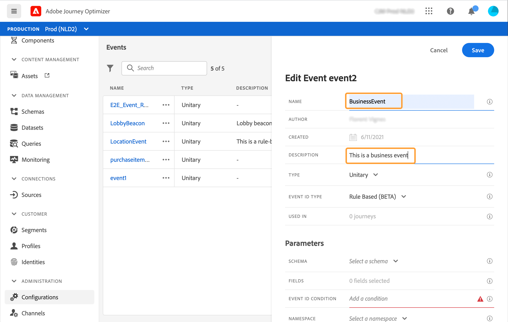

    >[!NOTE]
    >
    >Do not use spaces or special characters. Do not use more than 30 characters.

1. In the **[!UICONTROL Type]** field, choose **Business**.

   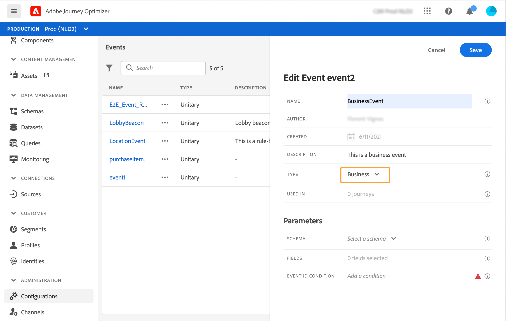

1. The number of journeys that use this event is displayed in the **[!UICONTROL Used in]** field. You can click the **[!UICONTROL View journeys]** icon to display the list of journeys using this event.

1. Define the schema and payload fields: this is where you select the event information (usually called a payload) journeys expects to receive. You will then be able to use this information in your journey. See [this section](../event/about-creating-business.md#define-the-payload-fields).

   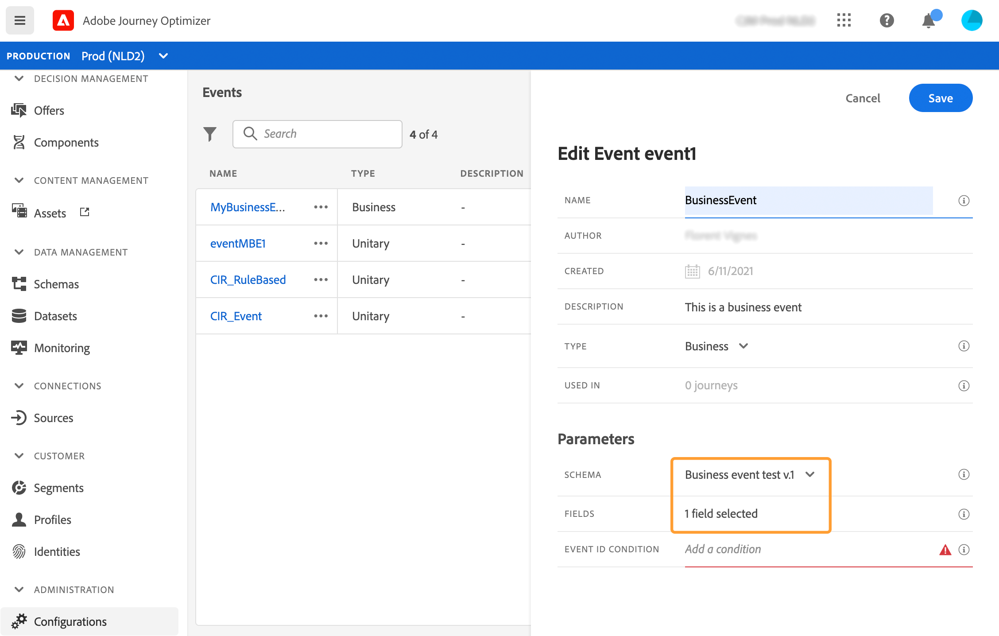

   Only time series schemas are available. Experience Events, Decision Events and Journey Step Events schemas are not available. The event schema must contain a primary identity.

    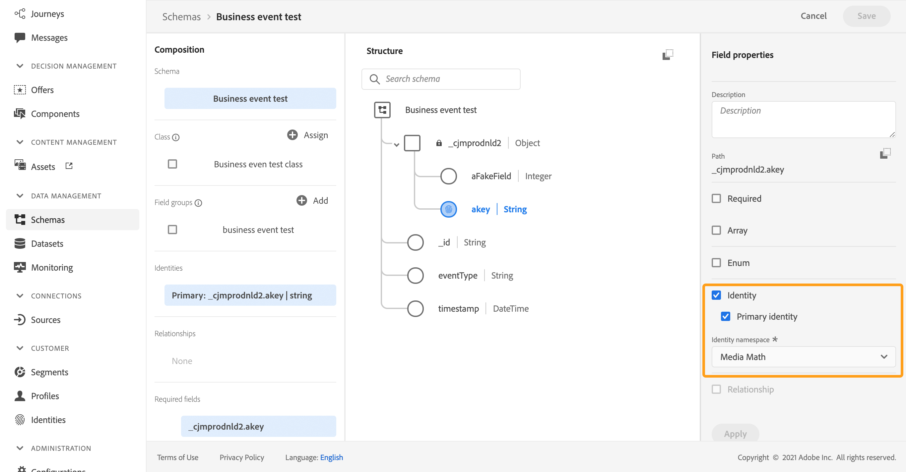

1. Click inside the **[!UICONTROL Event ID condition]** field. Using the simple expression editor, define the condition that will be used by the system to identify the events that will trigger your journey.
  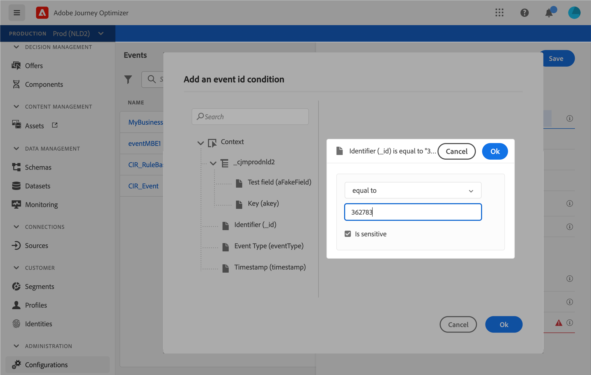

   In our example, we wrote a condition based on the product's id. This means that whenever the system receives an event that matches this condition, it will pass it to journeys.

1. Click **[!UICONTROL Save]**.

    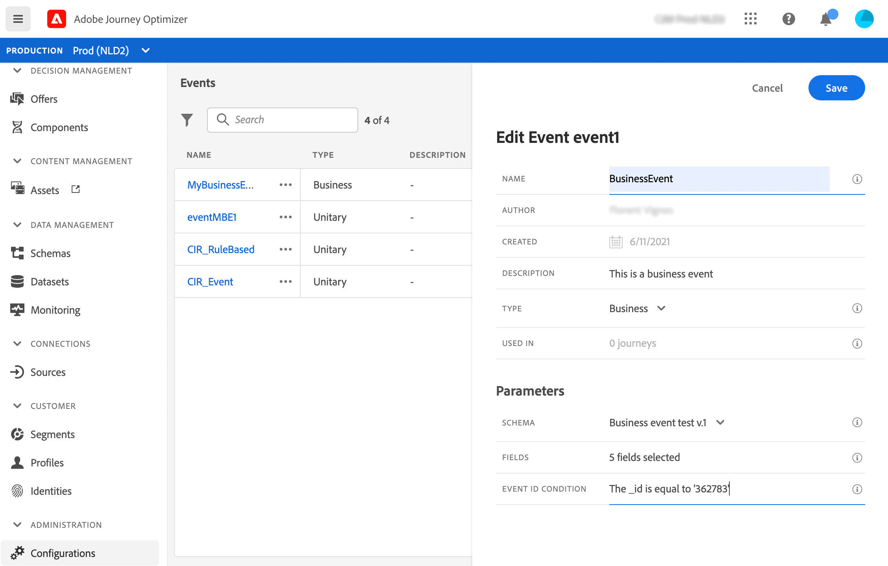

    The event is now configured and ready to be dropped into a journey. Additional configuration steps are required to receive events. See [this page](../event/additional-steps-to-send-events-to-journey-orchestration.md).

## Define the payload fields {#define-the-payload-fields}

The payload definition allows you to choose the information the system expects to receive from the event in your journey and the key to identify which person is associated to the event. The payload is based on the Experience Cloud XDM field definition. For more information on XDM, refer to [this page](https://experienceleague.adobe.com/docs/experience-platform/xdm/home.html).

1. Select an XDM schema from the list and click on the **[!UICONTROL Payload]** field or on the **[!UICONTROL Edit]** icon.

    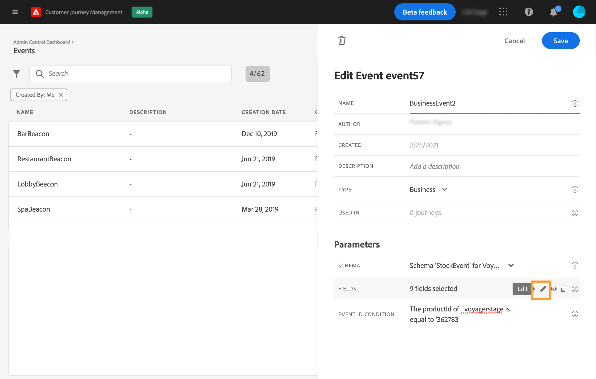

    All the fields defined in the schema are displayed. The list of fields varies from one schema to another. You can search for a specific field or use the filters to display all nodes and fields or only the selected fields. According to the schema definition, some fields may be mandatory and pre-selected. You cannot unselect them. All fields that are mandatory for the event to be received properly by journeys are selected by default.

    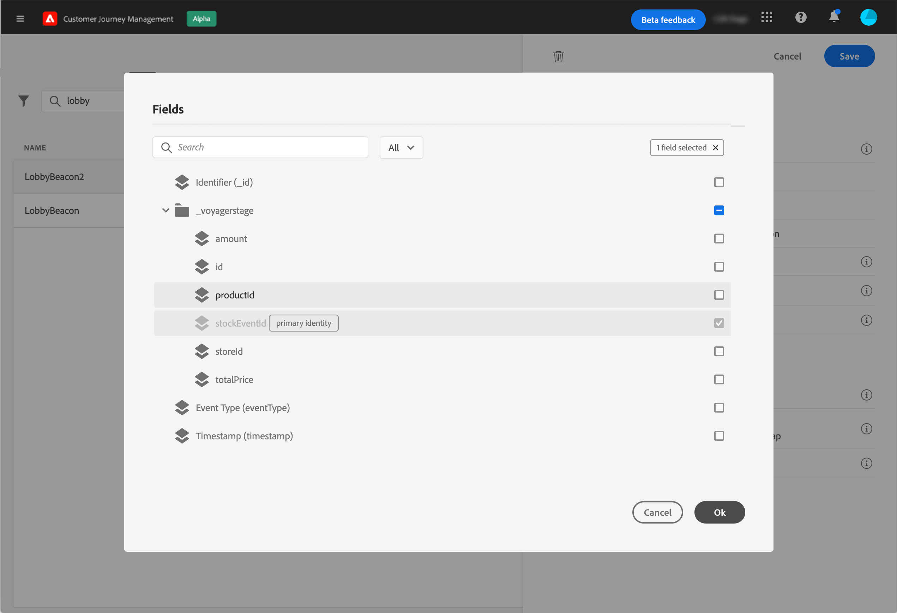

1. Select the fields you expect to receive from the event. These are the fields which the business user will leverage in the journey. 

    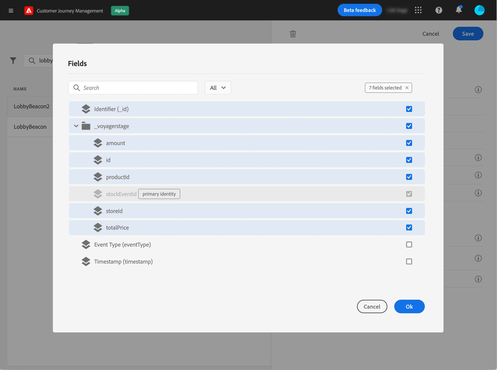

1. When you're done selecting the needed fields, click **[!UICONTROL Save]** or press **[!UICONTROL Enter]**.

    The number of selected fields appears in the **[!UICONTROL Payload]** field.

    

## Preview the payload {#preview-the-payload}

The payload preview allows you to validate the payload definition.

1. Click the **[!UICONTROL View Payload]** icon to preview the payload expected by the system.

    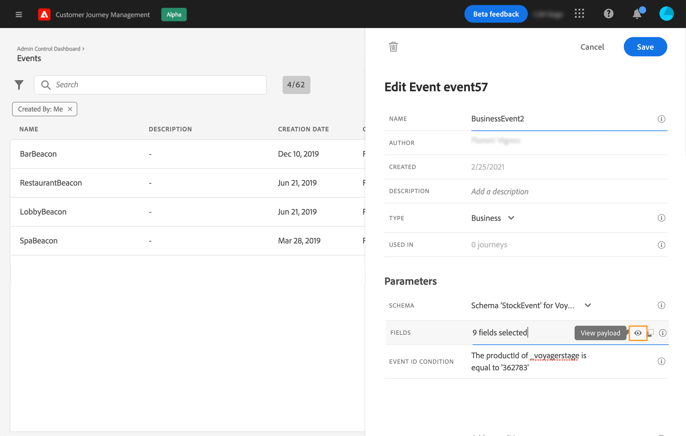

    You can notice that the fields selected are displayed.

    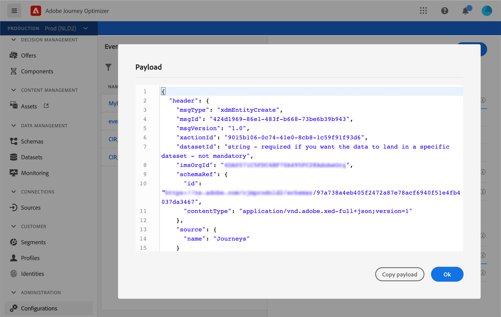

1. Check the preview to validate the payload definition.

1. Then, you can share the payload preview with to the person responsible for the event sending. This payload can help him design the setup of an event pushing to [!DNL Customer Journey Management]. See [this page](../event/additional-steps-to-send-events-to-journey-orchestration.md).
