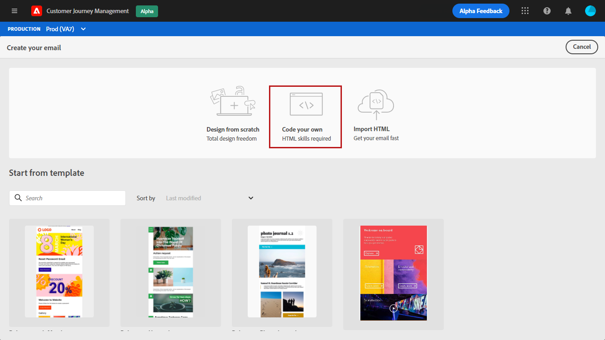
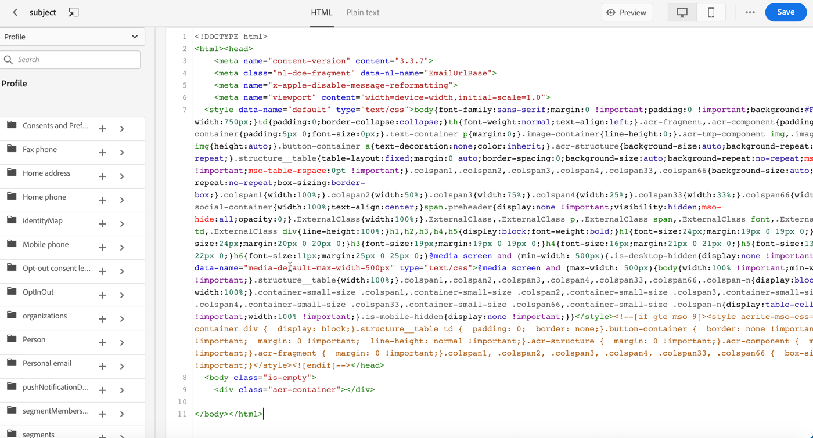
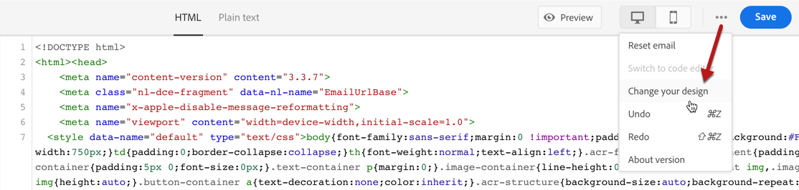
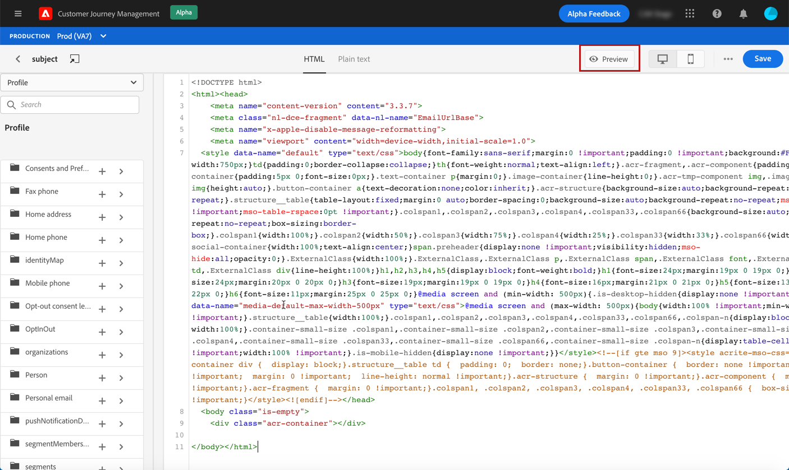
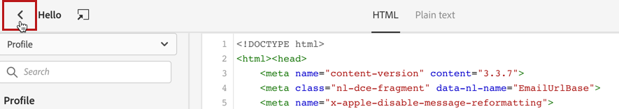
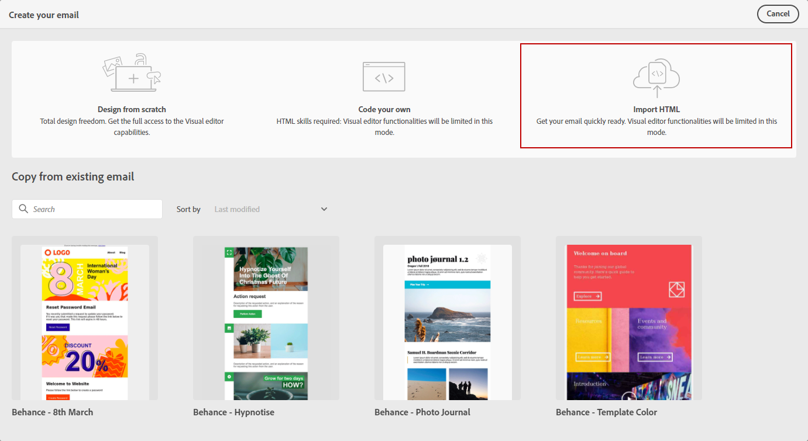
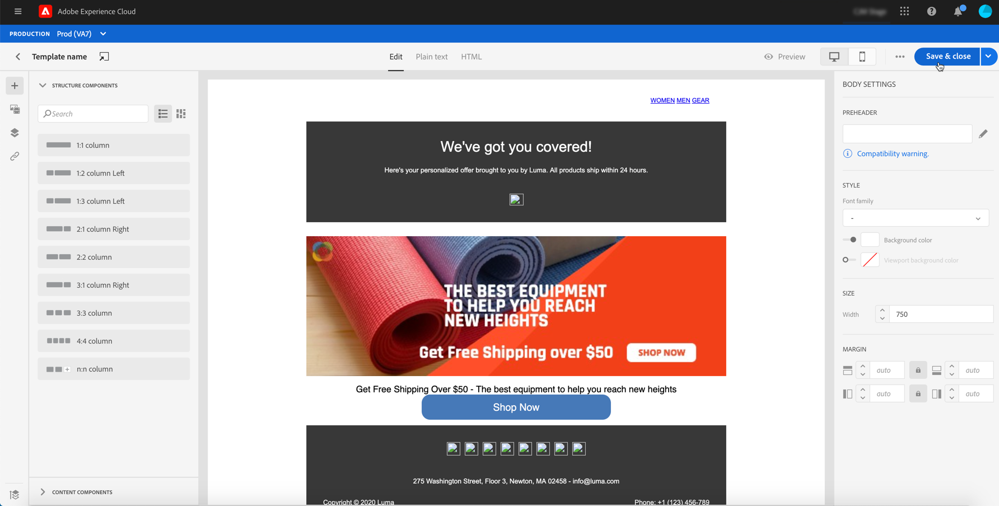

# Import or code your email content {#existing-content}

Journey Optimizer allows you to import existing HTML content to design your emails. This content can be raw HTML code or content from an existing HTML file or a zip folder.

To code HTML content or import existing content, follow the steps below:

1. [Create a message](create-message.md)

1. Open the **[!UICONTROL Email Designer]** from the **[!UICONTROL Edit Content]** section.

    

1. Select **[!UICONTROL Code your own]** or **[!UICONTROL Import HTML]**. Refer to the sections below for next steps.

## Code your own {#import-raw-html-code}

Use the **[!UICONTROL Code your own]** mode to can import raw HTML and/or code your email content. This method requires HTML skills.

>[!CAUTION]
>
> Images from [Adobe Experience Manager Assets Essentials](assets-essentials.md) cannot be referenced when using this method. The images referenced in your HTML code must be stored into a public location. 

1. In the Email Designer home page, select **[!UICONTROL Code your own]**.

    

1. Enter or paste your raw HTML code. 

1. Use the left pane to leverage [!DNL Journey Optimizer] personalization capabilities. For more on this, refer to [this section](personalization/personalize.md).

    

1. If you want to open the Email Designer to start your email from a new design, select **[!UICONTROL Change your design]** from the options menu.
    
    

1. Click the **[!UICONTROL Preview]** button to check the message design and personalization using test profiles. For more on this, refer to [this section](preview.md).

    

1. Once your code is ready, click **[!UICONTROL Save]** then go back to the message creation screen to finalize your message.

    

## Import HTML {#import-html-content-from-file}

You can import HTML content in the email designer. This content can be:

* An **HTML file** with an incorporated style sheet,
* A **.zip folder** with the HTML file, the style sheet (.css) and images.

    >[!NOTE]
    >
    >There are no constraints on the .zip file structure. However, references must to be relative and fit with the tree structure of the .zip folder.

To import a file containing HTML content, follow the steps below:

1. In the Email Designer home page, select **[!UICONTROL Import HTML]**.

    

1. Drag and drop the HTML or .zip file containing your HTML content.

1. Once the HTML content is uploaded, you can leverage the Email Designer capabilities to edit and preview your email. [Learn more in this section](create-email-content.md).

    
