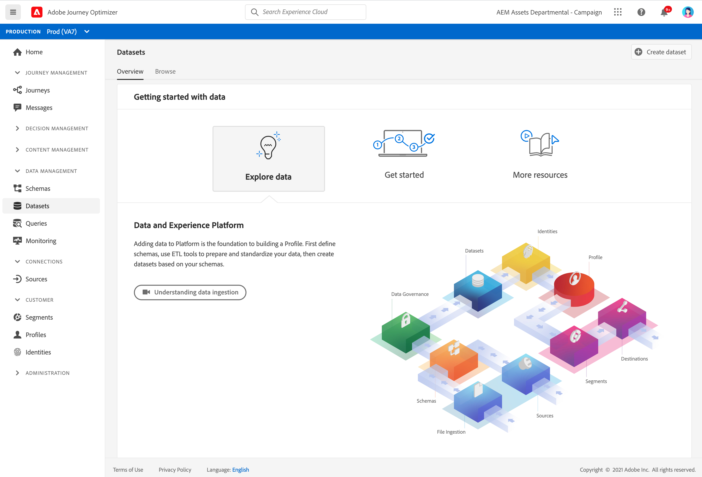

# Get Started with Datasets {#datasets-gs}

All data that is ingested into Adobe Experience Platform is persisted within the Data Lake as datasets. A dataset is a storage and management construct for a collection of data, typically a table, that contains a schema (columns) and fields (rows).

Learn how to create datasets in [this documentation](https://experienceleague.adobe.com/docs/experience-platform/catalog/datasets/overview.html){target="_blank"}.

Adding data to Adobe Experience Platform is the foundation to building a Profile. You will then be able to leverage profiles in [!DNL Adobe Journey Optimizer]. First define schemas, use ETL tools to prepare and standardize your data, then create datasets based on your schemas.

➡️ [Learn how create and configure a dataset](#video-dataset) (video)

The **Datasets** workspace in the [!DNL Adobe Journey Optimizer] user interface allows you to explore data and create datasets. 

Learn how to use Datasets UI in the [Data Ingestion overview documentation](https://experienceleague.adobe.com/docs/experience-platform/ingestion/home.html){target="_blank"}.

Step by step documentation to map a CSV file to an XDM Schema is available in [this documentation](https://experienceleague.adobe.com/docs/experience-platform/ingestion/tutorials/map-a-csv-file.html){target="_blank"}

## How-to video{#video-dataset}

Learn how to create a dataset, map it to a schema, add data to it, and confirm that the data has been ingested.

>[!VIDEO](https://video.tv.adobe.com/v/334293?quality=12)

**See also**

* [Create a schema, a dataset and ingest data to add Test profiles in Journey Optimizer](building-journeys/creating-test-profiles.md)
* [Streaming ingestion overview](https://experienceleague.adobe.com/docs/experience-platform/ingestion/streaming/overview.html){target="_blank"}
* [Ingest data into Adobe Experience Platform](https://experienceleague.adobe.com/docs/experience-platform/ingestion/tutorials/ingest-batch-data.html){target="_blank"}
