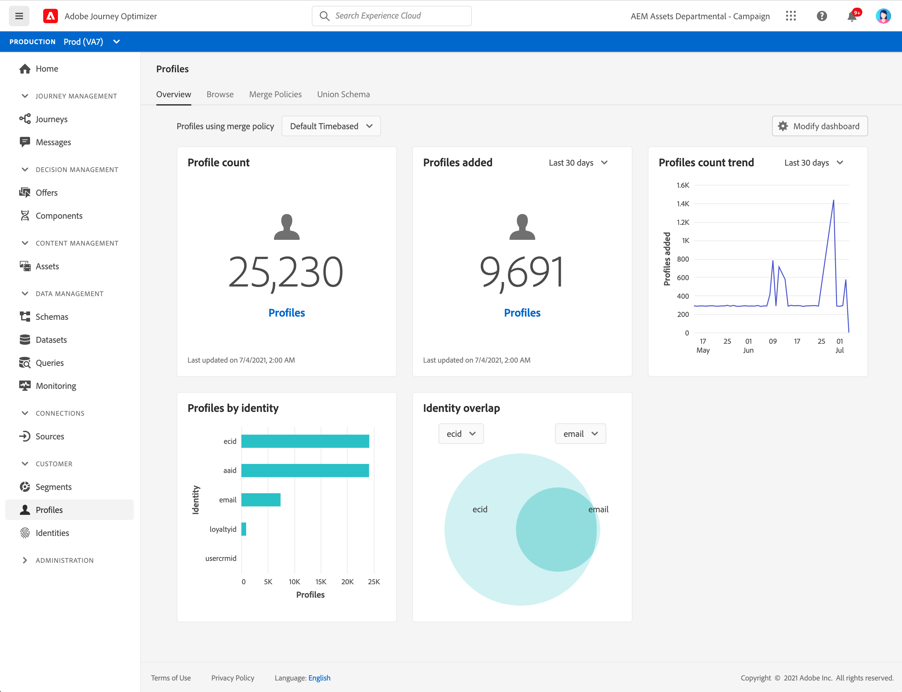

# Get Started with profiles {#profiles-gs}

Leverage Real-time Customer Profile in [!DNL Adobe Journey Optimizer] to see a holistic view of each individual customer by combining data from multiple channels, including online, offline, CRM, and third party. **Profiles** allows you to consolidate your customer data into a unified view offering an actionable, timestamped account of every customer interaction. 

>[!NOTE]
>
>If your organization is new to [!DNL Adobe Journey Optimizer] and does not yet have active Profile datasets or merge policies created, the **Profiles** dashboard is not visible. Instead, the **Overview** tab displays links to Adobe Experience Platform documentation to help you get started with Real-time Customer Profile.

To learn how to access and work with the **Profile dashboard** and detailed information regarding the metrics displayed in the dashboard, refer to [this section](https://experienceleague.adobe.com/docs/experience-platform/profile/ui/user-guide.html){target="_blank"}.

You can bring data fragments together from multiple sources and combine them in order to see a complete view of each of your individual customers. When bringing this data together, merge policies are the rules used to determine how data will be prioritized and what data will be combined to create the unified view.

Learn more about **Merge policies** in this [documentation](https://experienceleague.adobe.com/docs/experience-platform/profile/merge-policies/ui-guide.html){target="_blank"}.

**See also**

* [Real-time Customer Profile documentation](https://experienceleague.adobe.com/docs/experience-platform/query/home.html){target="_blank"}
* [Real-time Customer Profile overview video](https://experienceleague.adobe.com/docs/experience-platform/profile/home.html){target="_blank"}
