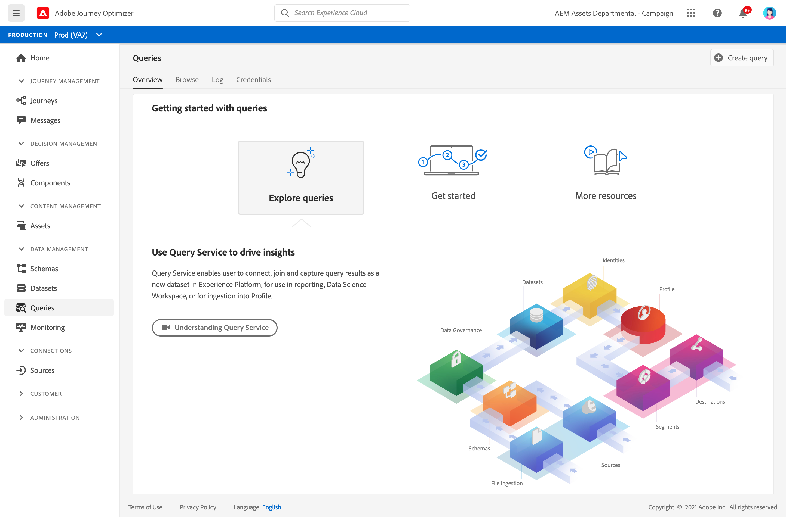

# Get Started with Queries {#queries-gs}

Query Editor is an interactive tool provided by Adobe Experience Platform Query Service, which allows you to write, validate, and run queries for customer experience data within [!DNL Adobe Journey Optimizer] user interface. 

Query Editor supports developing queries for analysis and data exploration, and allows you to run interactive queries for development purposes as well as non-interactive queries to populate [datasets](get-started-datasets.md).

Learn how to use the Query Editor in [this documentation](https://experienceleague.adobe.com/docs/experience-platform/query/ui/user-guide.html){target="_blank"}.

**See also**

* [Query Service documentation](https://experienceleague.adobe.com/docs/experience-platform/query/home.html){target="_blank"}
* [Query Service overview video](https://experienceleague.adobe.com/docs/platform-learn/tutorials/queries/understanding-query-service.html){target="_blank"}
