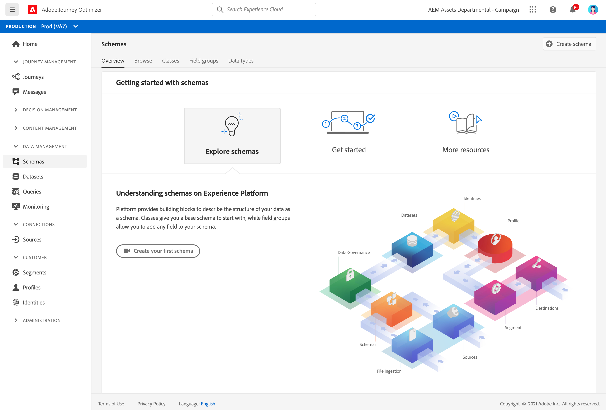

# Get Started with Schemas {#schemas-gs}

Schemas are the standard way of describing data in Experience Platform, allowing all data that conforms to schemas to be reused across an organization without conflicts, or even shared between multiple organizations.

➡️ [Learn how create and configure a schema](#video-schema) (video)

A schema is a set of rules that represent and validate the structure and format of data. At a high level, schemas provide an abstract definition of a real-world object (such as a person) and outline what data should be included in each instance of that object (such as first name, last name, birthday, and so on).

Learn how to build schemas in [this documentation](https://experienceleague.adobe.com/docs/experience-platform/xdm/schema/composition.html){target="_blank"}

The **Schemas** workspace in the [!DNL Adobe Journey Optimizer] user interface allows you to manage Experience Data Model (XDM) resources, including schemas, classes, schema field groups, and data types. You can view and explore core resources provided by Adobe, and create custom resources and schemas for your organization.

Learn how to use Schemas user interface in [this documentation](https://experienceleague.adobe.com/docs/experience-platform/xdm/ui/overview.html){target="_blank"}

Step by step documentation to create a schema using the Schema Editor is available in [this page](https://experienceleague.adobe.com/docs/experience-platform/xdm/tutorials/create-schema-ui.html){target="_blank"}

## How-to video{#video-schema}

Learn how to create a schema, add field groups, create, and configure custom field groups.

>[!VIDEO](https://video.tv.adobe.com/v/334461?quality=12)

**See also**

* [Create a schema, a dataset and ingest data to add Test profiles in Journey Optimizer](building-journeys/creating-test-profiles.md)
* [XDM System overview](https://experienceleague.adobe.com/docs/experience-platform/xdm/home.html){target="_blank"}
* [Best practices for data modeling](https://experienceleague.adobe.com/docs/experience-platform/xdm/schema/best-practices.html){target="_blank"}
* [Create a schema using the Schema Registry API](https://experienceleague.adobe.com/docs/experience-platform/xdm/tutorials/create-schema-api.html){target="_blank"}
* [Define a relationship between two schemas using the Schema Editor](https://experienceleague.adobe.com/docs/experience-platform/xdm/tutorials/relationship-ui.html){target="_blank"}

