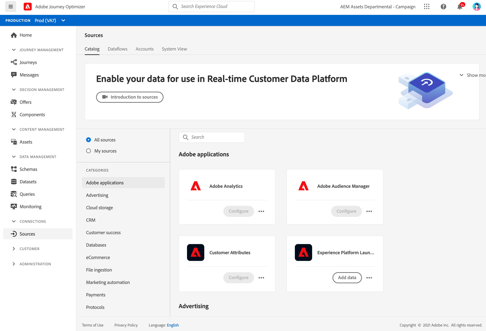

# Get Started with Sources connectors {#sources-gs}

Adobe Experience Platform allows data to be ingested from external sources while providing you with the ability to structure, label, and enhance incoming data using Platform services. You can ingest data from a variety of sources such as Adobe applications, cloud-based storages, databases, and many others.

Learn more how to ingest data from external sources with Source connectors in [this documentation](https://experienceleague.adobe.com/docs/experience-platform/sources/home.html){target="_blank"}.
