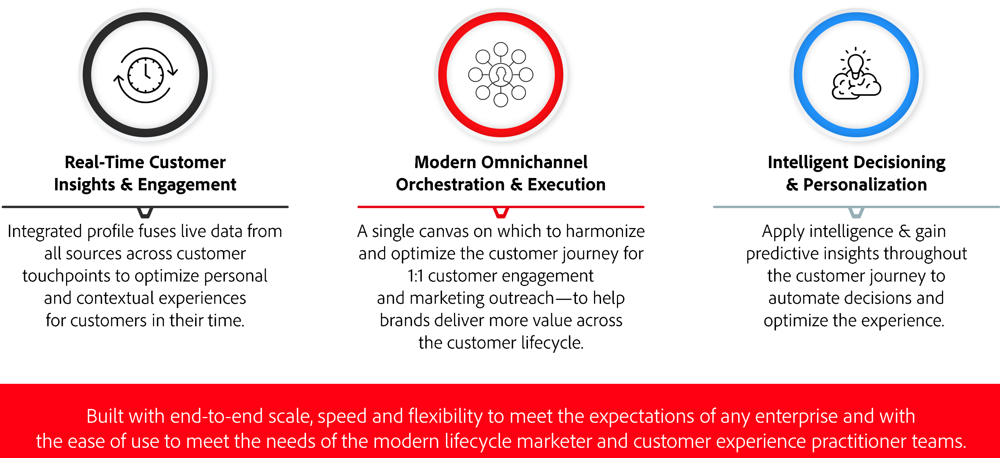

# Get Started with Journey Optimizer {#cjm-gs}

>[!CONTEXTUALHELP]
>id="test_id"
>title="Some test Content"
>abstract="Test Content for contextual help integration into AJO."

## What is [!DNL Adobe Journey Optimizer]?{#about-cjm}

[!DNL Adobe Journey Optimizer] helps companies deliver connected, contextual, and personalized experiences to their customers. The customer journey is the entire process of a customer’s interactions with the brand, from the first moment of contact until the customer leaves. It starts with the awareness phase, where the customer learns about the brand and starts engaging. The customer will then further interact with the brand, visit online and physical sites, and make purchases, send messages or post reviews.

[!DNL Adobe Journey Optimizer] is built natively on the [!DNL Adobe Experience Platform] and combines a unified, real-time customer profile, an API-first open framework, centralized offer decisioning, and artificial intelligence (AI) and machine learning (ML) for personalization and optimization. Journey Optimizer allows brands to intelligently determine the next best interaction with scale, speed, and flexibility across the entire customer journey. With [!DNL Adobe Journey Optimizer], companies can create and deliver both scheduled marketing campaigns (such as weekly promotions for a retail store) and tailored individual communications (like a push notification for an item that a loyalty app customer may have looked at that was previously out of stock) within the same application.

## Use cases

* Marketers can use [!DNL Adobe Journey Optimizer] to send both individualized communications as well as audience-based batch communications. For example, a clothing store typically sends post-purchase surveys to all customers who have purchased products in the last week. Due to inclement weather, a few shipments experienced delays. Seeing which customers have not received their shipments, the clothing store can exclude them from the scheduled customer satisfaction send and instead send a personalized email apologizing for the delay and offering a discount code with product recommendations based on the customer’s past purchases.
    
    Marketers can also use the application to send real-time behavior-based communications. For example, the same retailer would be able to engage a loyal customer who pulls into the store parking lot in real time by sending them a push notification about a sweater that is back in stock in the customer’s size.

* Non-marketers such as operations teams and customer support who are engaged in the customer experience can use [!DNL Adobe Journey Optimizer] to manage a variety of tasks such as operational notifications or even to monitor the onboarding process. Take for example, an amusement park where park visitors download a mobile app as part of their park experience. Maintenance staff can use [!DNL Adobe Journey Optimizer] to notify park visitors of rides that are currently closed due to maintenance.

## Key capabilities 

[!DNL Adobe Journey Optimizer] is an agile and scalable application for creating and delivering personalized, connected, and timely customer experiences across any app, device, or channel. 

Key capabilities include:

* **Real-time Customer Insights & Engagement** – An integrated profile fuses live data from all sources across customer touchpoints, including behavioral, transactional, financial, and operational data to optimize personal and contextual experiences for customers in their time. 

* **Modern Omnichannel Orchestration & Execution** – A single canvas on which to harmonize and optimize the customer journey for 1:1 customer engagement and marketing outreach—to help brands deliver more value across the customer lifecycle. Customer journeys designed in [!DNL Adobe Journey Optimizer] can be dynamic and event based to help brands react to real-time signals as well as connect those interactions with scheduled campaigns so the right decisions can be made about what communications to send a customer, when and through what channels.

* **Intelligent Decisioning & Personalization** – Brands can apply centralized decisioning and incorporate artificial intelligence and machine learning to surface predictive insights throughout the customer experience, making it easier to automate decisions and optimize the experience at scale. Offer Decisioning powers centralized offers across channels at scale through [!DNL Adobe Journey Optimizer].

>[!NOTE]
>
> Adobe Experience Cloud general privacy guidelines and procedures apply to [!DNL Journey Optimizer]. [Learn more about Adobe Experience Cloud privacy](https://www.adobe.com/privacy/experience-cloud.html).
> You also need to be aware of [Guardrails for Real-time Customer Profile data before starting](https://experienceleague.adobe.com/docs/experience-platform/profile/guardrails.html).
>

**See also**

* [Key steps to start](quick-start.md)
* [Create your first message](get-started-content.md)
* [Design journeys and send messages](building-journeys/journey-gs.md)
* [Live reports](reports/live-report.md)
* [Journey Optimizer FAQ](assets/do-not-localize/AJO-FAQ.pdf) (PDF)
