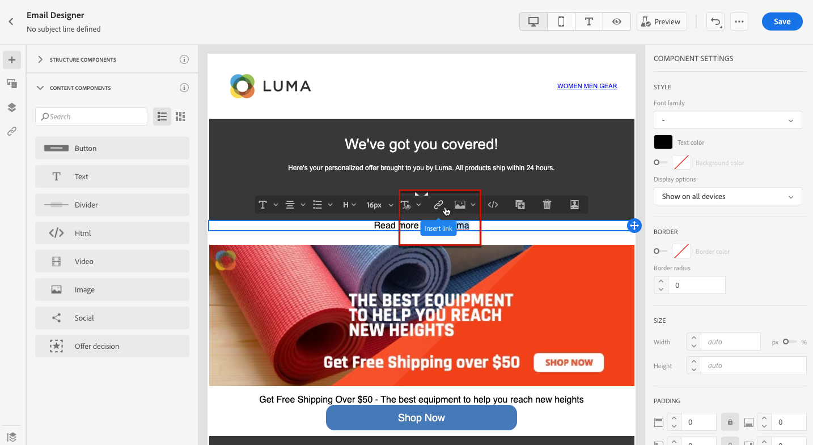
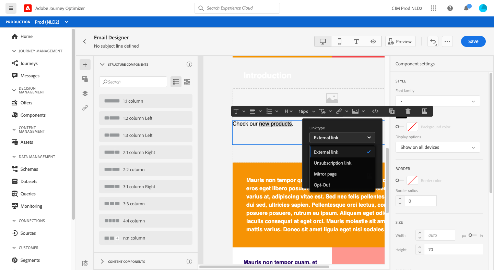
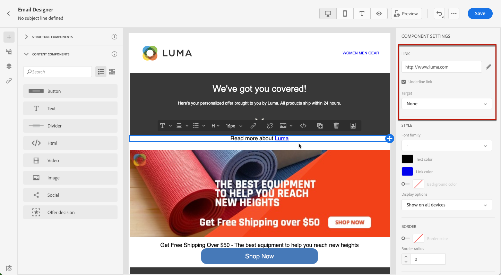
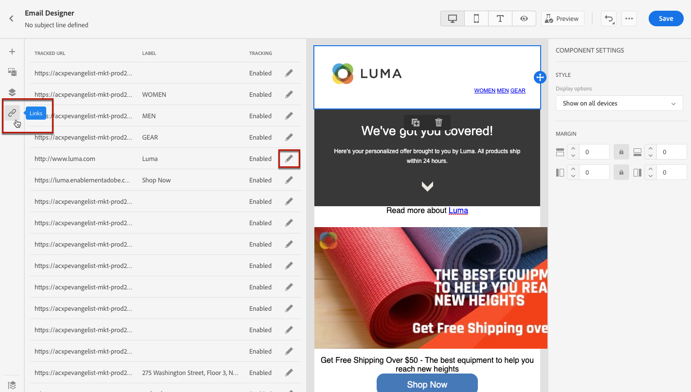
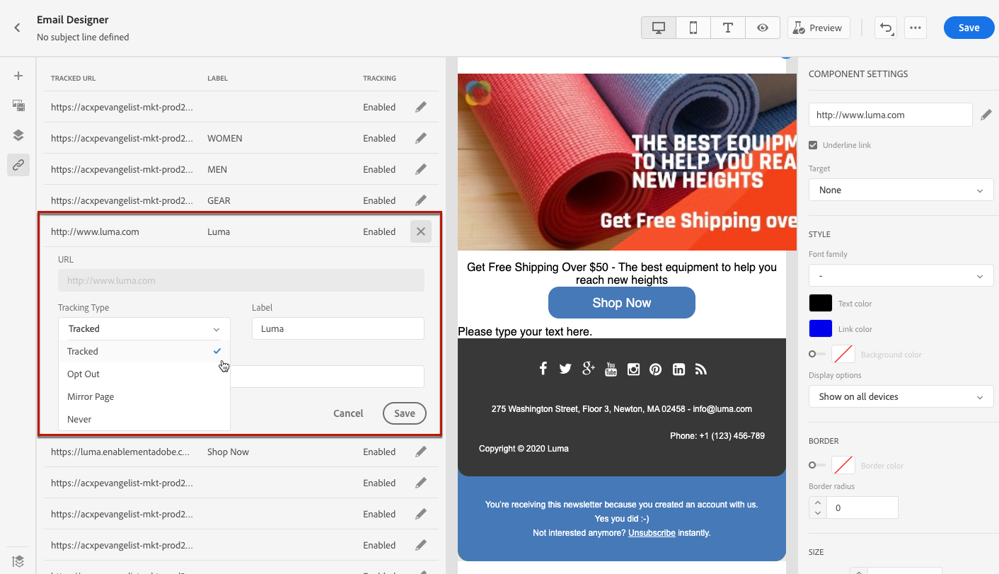

# Message tracking {#tracking}

Use [!DNL Journey Optimizer] to track the messages sent and the behavior of your recipients.

## Enable tracking {#enable-tracking}

You can enable tracking at the message level by checking the **[!UICONTROL Open Tracking for email]** and/or **[!UICONTROL Click Tracking for email]** options when [creating your message](create-message.md).

>[!NOTE]
>
>Both options are enabled by default.

This will let you track the behavior of your recipients through:
* **[!UICONTROL Open Tracking for email]**: Messages that have been opened.
* **[!UICONTROL Click Tracking for email]**: Clicks on links in an email.

## Insert links {#insert-links}

When designing a message, you can add links to your content.

>[!NOTE]
>
>When [tracking is enabled](#enable-tracking), all links included in the message content are tracked.

To insert links into your email content, follow the steps below:

1. Select an element and click **[!UICONTROL Insert link]** from the contextual toolbar.

    

1. Choose the type of link you want to create:

    * **[!UICONTROL External link]**: Insert a link to an external URL.

    * **[!UICONTROL Unsubscription link]**: Insert a link to unsubscribe from receiving communications from your brand. Learn more on opt-out management in [this section](consent.md#opt-out-management).

    * **[!UICONTROL Mirror page]**: Insert a link to display the email content in a web browser.

    

1. You can personalize your links, using a simple expression only. Learn more on personalization in [this section](personalization/personalization-syntax.md).

1. Save your changes.

1. Once the link is created, you can still modify it from the **[!UICONTROL Component settings]** pane on the right. 

    * Click the pencil icon to edit the link.
    * You can choose to underline the link or not by checking the corresponding option.

    

## Manage tracking {#manage-tracking}

The [Email Designer](create-email-content.md) allows you to manage the tracked URLs, such as editing the tracking type for each link.

1. Click the **[!UICONTROL Links]** icon from the left pane to display the list of all the URLs of your content that will be tracked.

    This list enables you to have a centralized view and to locate each URL in the email content.

1. To edit a link, click the corresponding pencil icon.

    

1. You can modify the **[!UICONTROL Tracking Type]** if needed:

   

    For each tracked URL, you can set the tracking mode to one of these values:

    * **[!UICONTROL Tracked]**: Activates tracking on this URL.
    * **[!UICONTROL Opt out]**: Considers this URL as an opt-out or unsubscription URL.
    * **[!UICONTROL Mirror page]**: Considers this URL is a mirror page URL.
    * **[!UICONTROL Never]**: Never activates tracking of this URL. <!--This information is saved: if the URL appears again in a future message, its tracking is automatically deactivated.-->

The number of messages that have been opened and the number of links that have been clicked are listed in the [Executions tab](message-monitoring.md).

Reporting on openings and clicks is available in the [Email Live report](reports/email-live-report.md) and in the [Email Global report](reports/email-global-report.md).

