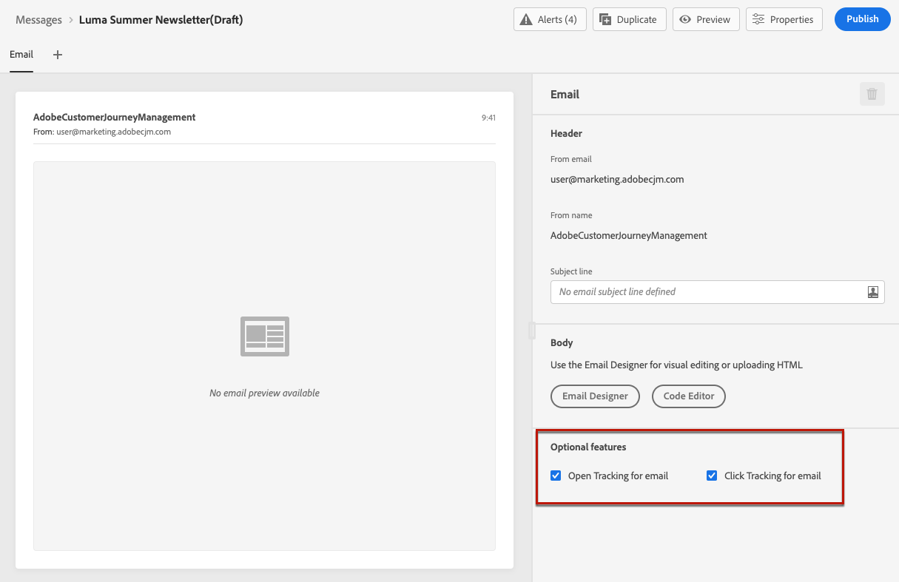
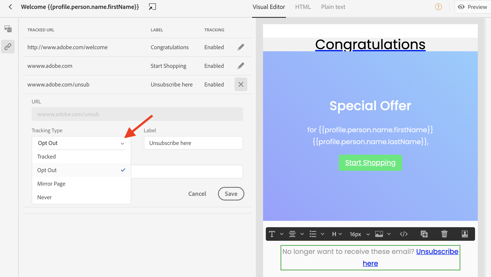

# Message tracking {#tracking}

Customer Journey Management enables you to track the messages sent and the behavior of your recipients.

You can enable tracking at the message level by checking the **[!UICONTROL Open Tracking for email]** and/or **[!UICONTROL Click Tracking for email]** options. This will let you track the behavior of your recipients through openings and/or clicks on links. [Learn more about creating messages](create-message.md).

When designing a message, you can add tracked links to your content. Moreover, the Email Designer allows you to manage the URLs that will be tracked, such as enabling/disabling tracking, or editing the tracking type for each link. [Learn more about working with the Email Designer](create-email-content.md).

The number of messages that have been opened and the number of links that have been clicked are listed in the [Executions tab](message-monitoring.md).
