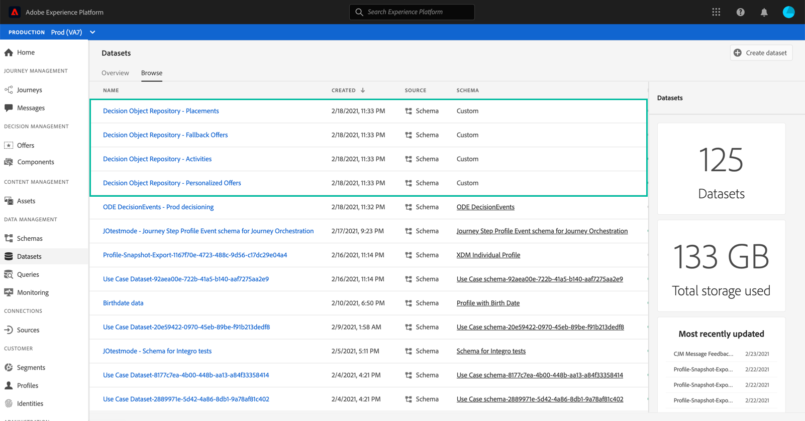
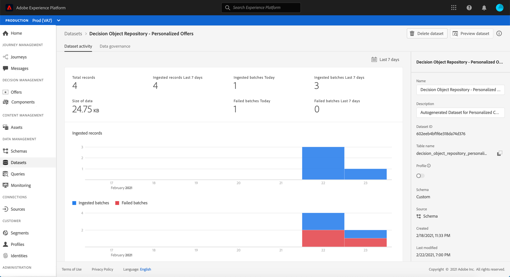
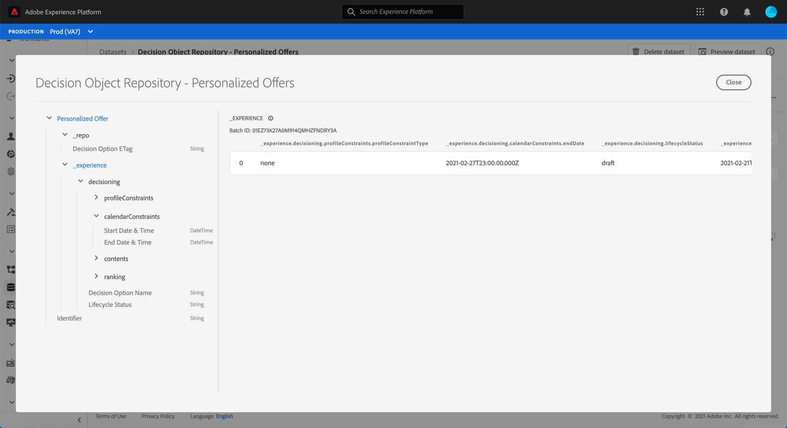

# Access the exported offer catalog {#access-exported-catalog}

The exported offer catalog is accessible in Adobe Experience Platform **[!UICONTROL Datasets]** menu. One dataset is created for each object of your Offer Library.

Click a dataset to access its details.

The **[!UICONTROL Preview dataset]** button allows you to display the most recent successful batch in the dataset. The left pane provides information on the types of data that have been exported.

For more information on how to browse and use datasets, refer to [this page](../../get-started-datasets.md).
