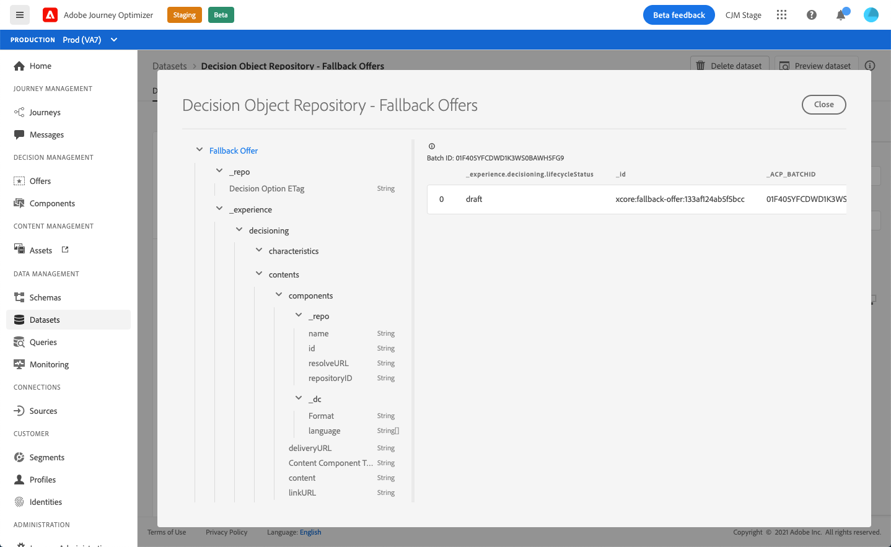

# Fallback offers dataset {#fallback-dataset}

Each time an offer is modified, the autogenerated dataset for fallback offers is updated.

The most recent successful batch in the dataset is displayed on the right. The hierarchical view of the schema for the dataset displays on the left pane.

>[!NOTE]
>
>Learn how to access the exported datasets for each object of your Offer Library in [this section](../export-catalog/access-dataset.md).

Here is the list of all the fields that can be used in the **[!UICONTROL Decision Object Repository - Fallback Offers]** dataset.

## Identifier
    
**Field:** _id
**Title:** Identifier
**Description:** A unique identifier for the record.
**Type:** string

## _experience

**Field:** _experience
**Type:** object

### _experience > decisioning

**Field:** decisioning
**Type:** object

#### _experience > decisioning > characteristics

**Field:** characteristics
**Title:** Decision Option Characteristics
**Description:** Additional properties or attributes belonging to this particular decision option. Different instances can have different characteristics (keys in the map). The characteristics are name value pairs used to distinguish one decision option from others. Characteristics are used as values in content that represents this decision option and as features to analyze and optimize the performance of an option. When every instance has the same attribute or property, that aspect should be modeled as an extension schema that derives from decision option detail.
**Type:** object

<!--Field under Characteristics without title = additionalProperties? Desc = Value of the property. Type: string-->

#### _experience > decisioning > contents

**Field:** contents
**Title:** Content Details
**Description:** Content items to render the decision item in different contexts. A single decision option can have multiple contents variants. Content is information that is directed towards an audience for consumption in a (digital) experience. Content is delivered through channels into a particular placement.
**Type:** array

**_experience > decisioning > contents > components**

**Field:** components
**Description:** The components of the content representing the decision option, including all their language variants. Specific components are found by 'dx:format', 'dc:subject' and 'dc:language' or a combination thereof. This metadata is used to locate or represent the content that is associated with an offer and integrate it according to the placement contract.
**Type:** array
**Required:** "_type", "_dc" <!--TBC?-->

* **_experience > decisioning > contents > components > Content Component Type**

    **Field:** _type
    **Title:** Content Component Type
    **Description:** An enumerated set of URIs where each value maps to a type given to the content component. Some consumers of the content representations are expecting the @type value to be a reference to schema that describes additional properties of the content component.
    **Type:** string

* **_experience > decisioning > contents > components > _dc**

    **Field:** _dc
    **Type:** object
    **Required:** "format"
        
    * **Format**

        **Field:** format
        **Title:** Format
        **Description:** The physical or digital manifestation of the resource. Typically, Format should include the media-type of the resource. Format may be used to determine the software, hardware or other equipment needed to display or operate the resource. Recommended best practice is to select a value from a controlled vocabulary (for example, the list of [Internet Media Types](http://www.iana.org/ assignments/media-types/) defining computer media formats).
        **Type:** string
        **Example:** "application/vnd.adobe.photoshop"

    * **Language**

        **Field:** language
        **Title:** Language
        **Description:** The language or languages of the resource. \nLanguages are specified in language code as defined in [IETF RFC 3066](https://www.ietf.org/rfc/rfc3066.txt), which is part of BCP 47, which is used elsewhere in XDM.
        **Type:** array
        **Examples:** "\n", "pt-BR", "es-ES"

* **_experience > decisioning > contents > components > _repo**

    **Field:** _repo
    **Type:** object

    * **id**

        **Field:** id
        **Description:** An optional unique identifier to reference the asset in a content repository. When Platform APIs are used to retrieve the representation, the client can expect an additional property \"repo:resolveUrl\" to retrieve the asset.
        **Type:** string
        **Example:** "urn:aaid:sc:US:6dc33479-13ca-4b19-b25d-c805eff8a69e"

    * **name**

        **Field:** name
        **Description:** Some hint about where to locate the repository that stores the external asset by the \"repo:id\".
        **Type:** string

    * **repositoryID**

        **Field:** repositoryID
        **Description:** An optional unique identifier to reference the asset in a content repository. When Platform APIs are used to retrieve the representation, the client can expect an additional property \"repo:resolveUrl\" to retrieve the asset.
        **Type:** string
        **Example:** "C87932A55B06F7070A49412D@AdobeOrg"

    * **resolveURL**

        **Field:** resolveURL
        **Description:** An optional unique resource locator to read the asset in a content repository. This will make it easier to obtain the asset whithout the client understanding where the asset is managed and what APIs to call. This is similar to a HAL link, but the semantic is simpler and more purposeful.
        **Type:** string
        **Example:** "https://plaftform.adobe.io/resolveByPath?path=&quot;/mycorp/content/projectx/fragment/prod/herobanners/banner14.html3&quot;"

* **_experience > decisioning > contents > components > content**
        
    **Field:** content
    **Description:** An optional field to hold content directly. Instead of referencing content in an asset repository, the component can hold simple content directly. This field is not used for composite, complex and binary content assets.
    **Type:** string

* **_experience > decisioning > contents > components > deliveryURL**

    **Field:** deliveryURL
    **Description:** An optional unique resource locator to obtain the asset from a content delivery network or service endpoint. This URL is used to access the asset publicly by a user agent.
    **Type:** string
    **Example:** "https://cdn.adobe.io/content/projectx/fragment/prod/static/1232324wd32.jpeg"

* **_experience > decisioning > contents > components > linkURL**

    **Field:** linkURL
    **Description:** An optional unique resource locator for user interactions. This URL is used to refer the end user to in a user agent and can be tracked.
    **Type:** string
    **Example:** "https://cdn.adobe.io/tracker?code=23432&redirect=/content/projectx/fragment/prod/static/1232324wd32.jpeg"

**_experience > decisioning > contents > Placement**
    
 **Field:** placement
**Title:** Placement
**Description:** Placement to comply with. The value is the URI (@id) of the offer placement that is referenced. See schema https://ns.adobe.com/experience/decisioning/placement.
**Type:** string

#### _experience > decisioning > Lifecycle Status

**Field:** lifecycleStatus
**Title:** Lifecycle Status
**Description:** Lifecycle status allows workflows to be conducted with an object. The status may affect where an object is visible or considered relevant. Status changes are driven by the clients or services that use the objects.
**Type:** string
**Possible values:** "Draft", "Approved", "Live", "Completed", "Archived"
**Default value:** "Draft"

#### _experience > decisioning > Decision Option Name

**Field:** name
**Title:** Decision Option Name
**Description:** Option name that is displayed in various user interfaces.
**Type:** string

#### _experience > decisioning > tags

**Field:** tags
**Title:** Tags
**Description:** The set of tags associated with this entity. The tags are used in filter expressions to constrain the overall inventory to a sub set (category).
**Type:** array

<!--Field without name under tags: Description: An identifier of a tag object. The value is the @id of the tag that is referenced. See tag schema: https://ns.adobe.com/experience/decisioning/tag. Type: string-->

## _repo
    
### _repo > Decision Option ETag

**Field:** etag
**Title:** Decision Option ETag
**Description:** The revision that the decision option object was at when the snapshot was taken.
**Type:** string
