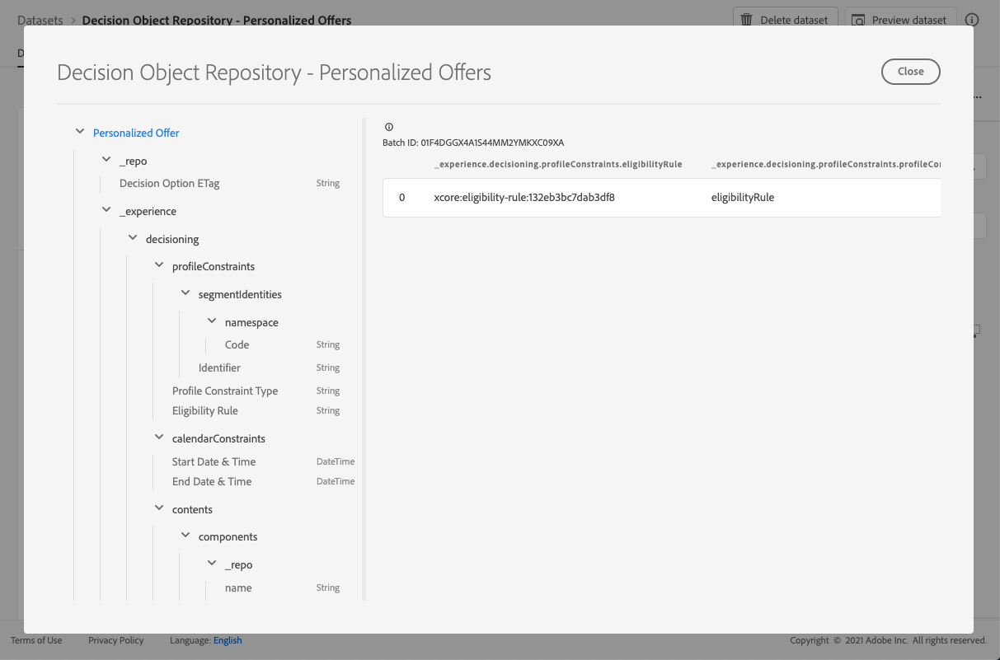

# Personalized offers dataset {#offers-dataset}

Each time an offer is modified, the autogenerated dataset for personalized content offers is updated.

The most recent successful batch in the dataset is displayed on the right. The hierarchical view of the schema for the dataset displays on the left pane.

>[!NOTE]
>
>Learn how to access the exported datasets for each object of your Offer Library in [this section](../export-catalog/access-dataset.md).

Here is the list of all the fields that can be used in the **[!UICONTROL Decision Object Repository - Personalized Offers]** dataset.

<!--Personalized offers form the set of choices for a decision. The objective for decisioning is to take a large inventory of items and apply numerous constraint rules to that inventory to narrow it down and then to rank the qualifying options according to a criteria. The resulting propositions assemble and personalize the experience for specific individuals.-->
    
## Identifier
    
**Field:** _id
**Title:** Identifier
**Description:** A unique identifier for the record.
**Type:** string

## _experience

**Field:** _experience
**Type:** object

### _experience > decisioning

**Field:** decisioning
**Type:** object

#### _experience > decisioning > calendarConstraints 

**Field:** calendarConstraints
**Title:** Calendar Constraint Details
**Description:** Calendar constraints decide if a decision option is valid given a date range. Outside that date range the option cannot be proposed.
**Type:** object

* **End Date & Time**
    
    **Field:** endDate
    **Title:** End Date & Time
    **Description:** The end date of a decision options validity. Options that have passed their end date can no longer be proposed in the decisioning process.
    **Type:** string

* **Start Date & Time**

    **Field:** startDate
    **Title:** Start Date & Time
    **Description:** The start date of a decision options validity. Options that have not reached their start date cannot be proposed yet in the decisioning process.
    **Type:** string

#### _experience > decisioning > characteristics

**Field:** characteristics
**Title:** Decision Option Characteristics
**Description:** Additional properties or attributes belonging to this particular decision option. Different instances can have different characteristics (keys in the map). The characteristics are name value pairs used to distinguish one decision option from others. Characteristics are used as values in content that represents this decision option and as features to analyze and optimize the performance of an option. When every instance has the same attribute or property, that aspect should be modeled as an extension schema that derives from decision option detail.
**Type:** object

#### _experience > decisioning > contents

**Field:** contents
**Title:** Content Details
**Description:** Content items to render the decision item in different contexts. A single decision option can have multiple contents variants. Content is information that is directed towards an audience for consumption in a (digital) experience. Content is delivered through channels into a particular placement.
**Type:** array

**_experience > decisioning > contents > components**

**Field:** components
**Description:** The components of the content representing the decision option, including all their language variants. Specific components are found by 'dx:format', 'dc:subject' and 'dc:language' or a combination thereof. This metadata is used to locate or represent the content that is associated with an offer and integrate it according to the placement contract.
**Type:** array
**Required:** "_type", "_dc" <!--TBC?-->

* **_experience > decisioning > contents > components > Content Component Type**

    **Field:** _type
    **Title:** Content Component Type
    **Description:** An enumerated set of URIs where each value maps to a type given to the content component. Some consumers of the content representations are expecting the @type value to be a reference to the schema that describes additional properties of the content component.
    **Type:** string

* **_experience > decisioning > contents > components > _dc**

    **Field:** _dc
    **Type:** object
    **Required:** "format"

    * **Format**
            
        **Field:** format
        **Title:** Format
        **Description:** The physical or digital manifestation of the resource. Typically, Format should include the media-type of the resource. Format may be used to determine the software, hardware or other equipment needed to display or operate the resource. Recommended best practice is to select a value from a controlled vocabulary (for example, the list of [Internet Media Types](http://www.iana.org/assignments/media-types/) defining computer media formats).
        **Type:** string
        **Example:** "application/vnd.adobe.photoshop"

    * **Language**
        **Field:** language
        **Title:** Language
        **Description:** The language or languages of the resource. \nLanguages are specified in language code as defined in [IETF RFC 3066](https://www.ietf.org/rfc/rfc3066.txt), which is part of BCP 47, which is used elsewhere in XDM.
        **Type:** array
        **Examples:** "\n", "pt-BR", "es-ES"

* **_experience > decisioning > contents > components > _repo**

    **Field:** _repo
    **Type:** object

    * **id**
        
        **Field:** id
        **Description:** An optional unique identifier to reference the asset in a content repository. When Platform APIs are used to retrieve the representation, the client can expect an additional property \"repo:resolveUrl\" to retrieve the asset.
        **Type:** string
        **Example:** "urn:aaid:sc:US:6dc33479-13ca-4b19-b25d-c805eff8a69e"

    * **name**
            
        **Field:** name
        **Description:** Some hint about where to locate the repository that stores the external asset by the \"repo:id\".
        **Type:** string

    * **repositoryID**

        **Field:** repositoryID
        **Description:** An optional unique identifier to reference the asset in a content repository. When Platform APIs are used to retrieve the representation, the client can expect an additional property \"repo:resolveUrl\" to retrieve the asset.
        **Type:** string
        **Example:** "C87932A55B06F7070A49412D@AdobeOrg"

    * **resolveURL**
        
        **Field:** resolveURL
        **Description:** An optional unique resource locator to read the asset in a content repository. This will make it easier to obtain the asset whithout the client understanding where the asset is managed and what APIs to call. This is similar to a HAL link, but the semantic is simpler and more purposeful.
        **Type:** string
        **Example:** "https://plaftform.adobe.io/resolveByPath?path=&quot;/mycorp/content/projectx/fragment/prod/herobanners/banner14.html3&quot;"

* **_experience > decisioning > contents > components > content**
    
    **Field:** content
    **Description:** An optional field to hold content directly. Instead of referencing content in an asset repository, the component can hold simple content directly. This field is not used for composite, complex and binary content assets.
    **Type:** string

* **_experience > decisioning > contents > components > deliveryURL**
    
    **Field:** deliveryURL
    **Description:** An optional unique resource locator to obtain the asset from a content delivery network or service endpoint. This URL is used to access the asset publicly by a user agent.
    **Type:** string
    **Example:** "https://cdn.adobe.io/content/projectx/fragment/prod/static/1232324wd32.jpeg"

* **_experience > decisioning > contents > components > linkURL**
        
    **Field:** linkURL
    **Description:** An optional unique resource locator for user interactions. This URL is used to refer the end user to in a user agent and can be tracked.
    **Type:** string
    **Example:** "https://cdn.adobe.io/tracker?code=23432&redirect=/content/projectx/fragment/prod/static/1232324wd32.jpeg"

**_experience > decisioning > contents > Placement**

**Field:** placement
**Title:** Placement
**Description:** Placement to comply with. The value is the URI (@id) of the offer placement that is referenced. See schema https://ns.adobe.com/experience/decisioning/placement.
**Type:** string

#### _experience > decisioning > Lifecycle Status

**Field:** lifecycleStatus
**Title:** Lifecycle Status
**Description:** Lifecycle status allows workflows to be conducted with an object. The status may affect where an object is visible or considered relevant. Status changes are driven by the clients or services that use the objects.
**Type:** string
**Possible values:** "Draft" (default), "Approved", "Live", "Completed", "Archived"

#### _experience > decisioning > Decision Option Name

**Field:** name
**Title:** Decision Option Name
**Description:** Option name that is displayed in various user interfaces.
**Type:** string

#### _experience > decisioning > profileConstraints

**Field:** profileConstraints
**Title:** Profile Constraint Details
**Description:** The profile constraints decide if an option is eligible for this profile identity, at this moment, in this context. If the profile constraint does not need to consider values of each of the option, i.e. it is invariant of the options from the option selection, the profile constraint that evaluates to 'false' cancels out the entire option selection. On the other hand, a profile constraint rule that takes an option as a parameter is evaluated for each qualifiying option of the option selection.
**Type:** object

**_experience > decisioning > profileConstraints > Description**

**Field:** description
**Title:** Description
**Description:** Profile constraint description. It is used to convey human readable intentions on how or why this profile constraint was constructed and/or what option will be included or excluded by it.
**Type:** string

**_experience > decisioning > profileConstraints > Eligibility Rule**

**Field:** eligibilityRule
**Title:** Eligibility Rule
**Description:** A reference to a decision rule that evaluates to true or false for a given profile and/or other given contextual XDM objects. The rule is used to decide if the option qualifies for a given profile. The value is the URI (@id) of the decision rule that is referenced. See schema https://ns.adobe.com/experience/decisioning/rule.
**Type:** string

**_experience > decisioning > profileConstraints > Profile Constraint Type**

**Field:** profileConstraintType
**Title:** Profile Constraint Type
**Description:** Determines if any constraints are currently set and how the contraints are expressed. It could be through a rule or through one or more segment memberships.
**Type:** string
**Possible values:**
* "none" (default)
* "eligibilityRule": "The profile constraint is expressed as a single rule that must evaluate to true before the constrained action is allowed."
* "anySegments": "The profile constraint is expressed as one or more segments and the profile must be a member of at least one of them before the constrained action is allowed."
* "allSegments": "The profile constraint is expressed as one or more segments and the profile must be a member of all of them before the constrained action is allowed."
* "rules": "The profile constraint is expressed as a number of different rules, e.g. eligibility, applicability, suitability, which all must evaluate to true before the constrained action is allowed."

**_experience > decisioning > profileConstraints > Segment Identifiers**

**Field:** segmentIdentities
**Title:** Segment Identifiers
**Description:** Identifiers of the segments
**Type:** array

* **Identifier**
        
    **Field:** _id
    **Title:** Identifier
    **Description:** Identity of the segment in the related namespace.
    **Type:** string

* **Namespace**

    **Field:** namespace
    **Title:** Namespace
    **Description:** The namespace associated with the `xid` attribute.
    **Type:** object
    **Required:** "code"

    * **Code**
        
        **Field:** code
        **Title:** Code
        **Description:** The code is a human readable identifier for the namespace and can be used to request the technical namespace id which is used for identity graph processing.
        **Type:** string

* **Experience identifier**
    
    **Field:** xid
    **Title:** Experience identifier
    **Description:** When present, this value represents a cross-namespace identifier that is unique across all namespace-scoped identifiers in all namespaces.
    **Type:** string

#### _experience > decisioning > ranking

**Field:** ranking
**Title:** Ranking Details
**Description:** Rank (priority). Defines what is considered the \"best action\" given the context of the decision criterion. Among all the selected options that meet the eligibility constraint, the ranking order will decide the top (or top N) option(s) to be proposed.
**Type:** object

**_experience > decisioning > ranking > Order Evaluation**

**Field:** order
**Title:** Order Evaluation
**Description:** Evaluation of a relative order of one or more decision options. Options with higher ordinal values are selected over any options with lower ordinal values. The values determined by this method can be ordered but distances between them cannot be measured and neither can sums nor products be calculated. The median and the mode are the only measures of central tendency that can be used for ordinal data.
**Type:** object

* **Scoring Function**
        
    **Field:** function
    **Title:** Scoring Function
    **Description:** A reference to a function that computes a numerical score for this decision option. Decision options will then be ordered (ranked) by that score. The value of this property is the URI (@id) of the function to be invoked with on option at a time. See schema https://ns.adobe.com/experience/decisioning/function.
    **Type:** string

* **Order Evaluation Type**
        
    **Field:** orderEvaluationType
    **Title:** Order Evaluation Type
    **Description:** Specifies which order evaluation mechanism is used, static priority of the decision options, a scoring function that calculates a  numeric value for every option or a ranking strategy that receives a list to order it.
    **Type:** string
    **Possible values:** "static", "scoringFunction", "rankingStrategy"

* **Ranking Strategy**
        
    **Field:** rankingStrategy
    **Title:** Ranking Strategy
    **Description:** A reference to a strategy that ranks a list of decision option. Decision options will be returned in an ordered list. The value of this property is the URI (@id) of the function to be invoked with on option at a time. See schema https://ns.adobe.com/experience/decisioning/rankingStrategy.
    **Type:** string

**_experience > decisioning > ranking > Priority**
    
**Field:** priority
**Title:** Priority
**Description:** The priority of a single decision option relative to all other options. Options for which no order function is given are prioritized using this propery. Options with higher priority values are selected before any lower priority options. If two or more qualifying options share the highest priority value, one is chosen at uniform random and used for the decision proposition.
**Type:** integer
**Minimum value:** 0
**Default value:** 0

#### _experience > decisioning > tags

**Field:** tags
**Title:** Tags
**Description:** The set of tags associated with this entity. The tags are used in filter expressions to constrain the overall inventory to a subset (category).
**Type:** array

<!--Field without name under tags: Description: An identifier of a tag object. The value is the @id of the tag that is referenced. See tag schema: https://ns.adobe.com/experience/decisioning/tag. Type: string-->

## _repo

**Field:** _repo
**Type:** object
    
### _repo > Decision Option ETag

**Field:** etag
**Title:** Decision Option ETag
**Description:** The revision that the decision option object was at when the snapshot was taken.
**Type:** string

