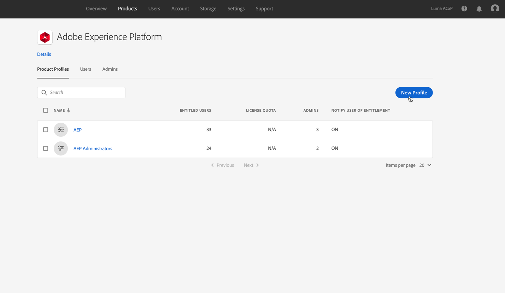
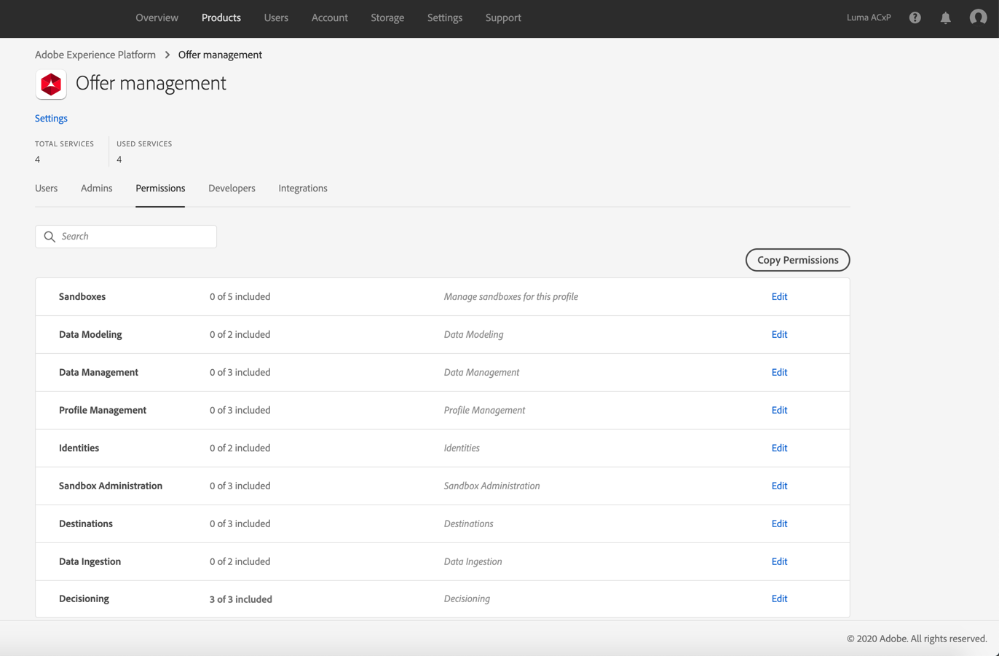

# Grant access to Decision management {#granting-acess-to-decision-management}

Permissions to access and use the Decision Management capabilities are managed using the [Adobe Admin Console](https://helpx.adobe.com/enterprise/managing/user-guide.html).

* If you are a [!DNL Journey Optimizer] user leveraging the **Decision Management** functionality, you need to have the [Decision management permissions](../../administration/high-low-permissions.md#decisions-permissions) enabled to acces all related capabilities. Learn more on managing [!DNL Journey Optimizer] users and permissions in [this section](../../administration/permissions.md).

* If you are an [Adobe Experience Platform](https://experienceleague.adobe.com/docs/experience-platform/landing/home.html){target="_blank"} user leveraging the **Offer Decisioning** application service, follow the steps [below](#granting-acess-to-offer-decisioning) to grant access to [!DNL Offer Decisioning].

## Grant access to Offer Decisioning {#granting-acess-to-offer-decisioning}

>[!NOTE]
>
>The steps below only apply to **Experience Platform users** leveraging the [!DNL Offer Decisioning] service.

1. Open the Admin Console, then select **[!UICONTROL Adobe Experience Platform]**. 

    

1. The product profiles for the service display. You can have as many product profiles as desired, corresponding to the various roles that you want to set up for your organization.

    To create a new product profile, click the **[!UICONTROL New Profile]** button. 

    

1. Specify the product profile's name and description then click **[!UICONTROL Next]** To access the product profile’s permissions, select the **[!UICONTROL Permissions]** line.

    

1. Select the services to enable for the product profile.

    By default, all services are selected, which is recommended to ensure that all the Experience Platform functionalities are available.

    

1. In the **[!UICONTROL Decisioning]** section, click the **+** button to assign permissions to the product profile, then click **[!UICONTROL Save]**.

    

    Available permissions are:
    
    **[!UICONTROL Manage Decisioning Activities]**:
    
    * Read, write, delete offers
    * Read, write, delete decisions (previously known as offer activities)
    * Read, write, delete placements

    **[!UICONTROL Execute Decisioning Activities]**:
    
    * Read offers
    * Read decisions
    * Read placements
    
    **[!UICONTROL Manage Decisioning Options]**:

    * Read, write, delete offers
    * Read decisions
    * Read, write, delete placements

1. A summary of the product profile's permissions displays. You can now assign users to the product profile so that they access these permissions.

    For more details on how to manage users permissions, refer to the [Admin Console documentation](https://helpx.adobe.com/enterprise/managing/user-guide.html){target="_blank"}.    

    
