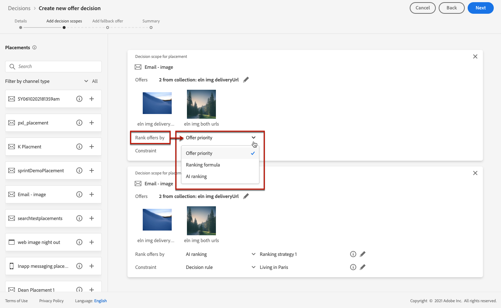
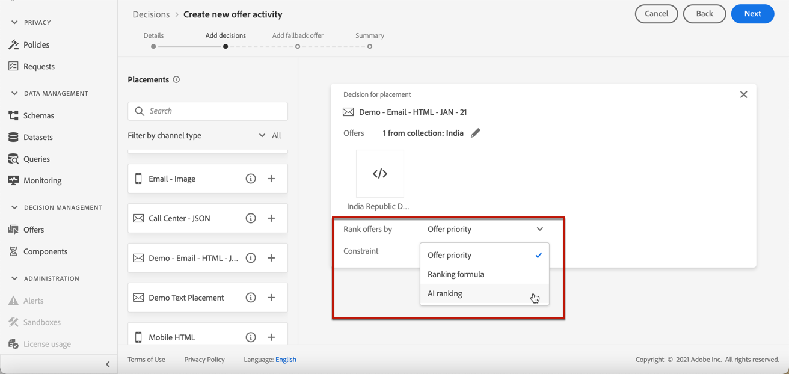
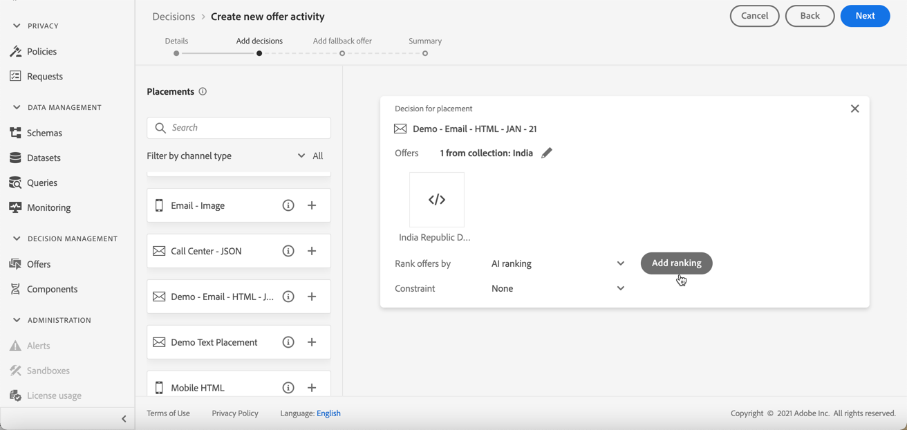
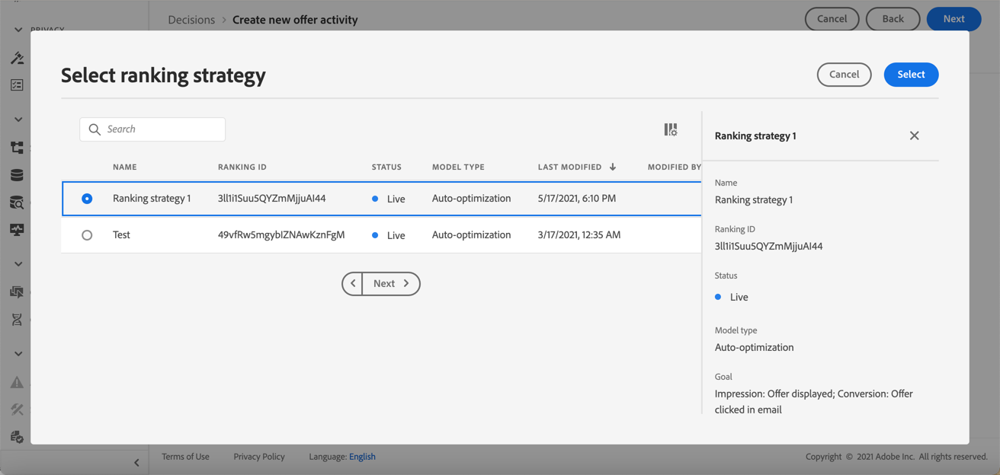

# Configure offers selection in decisions {#offers-selection-in-activities}

If several offers are eligible for a given placement, you can choose the method that will select the best offer for each profile when configuring a decision (previously known as offer activity). You can rank offers by:
* Offer priority
* Ranking formula
* [AI ranking](#use-ranking-strategy) (in early access for select users only)

## Offer priority {#about-offers-priority}

By default, when several offers are eligible for a given placement in a decision (previously known as offer activity), the offers with the highest **priority** will be delivered to the customers first.

Offers' priority scores are assigned when creating an offer. Learn how to create a personalized offer in [this section](../offer-library/creating-personalized-offers.md).

## Ranking formula {#assign-ranking-formula}

In addition to offer priority, Journey Optimizer allows you to create **ranking formulas**. These are formulas that determine which offer should be presented first for a given placement, rather than taking into account the offers' priority scores.

For example, you can boost the priority of all offers where the end date is less than 24 hours from now, or boost offers from the "running" category if the profile's point of interest is "running".

Learn how to create a ranking formula in [this section](../offer-library/create-ranking-formulas.md).

Once a ranking formula has been created, you can assign it to a placement in a decision (previously known as offer activity). To do this, follow the steps below:

1. Create a decision or edit an existing one. See [Create decisions](../offer-activities/create-offer-activities.md).

1. Add the placements that will contain your offers. See [Create placements](../offer-library/creating-placements.md).

1. For each placement, add a collection. See [Create collections](../offer-library/creating-collections.md).

1. Choose to rank offers by **[!UICONTROL Ranking]** from the drop-down list, then click **[!UICONTROL Add ranking]**.

    

1. Select the desired ranking formula, then click **[!UICONTROL Select]**.

    

The ranking formula is now associated to the placement.

If multiple offers are eligible to be presented in this placement, the decision will use the ranking formula's formula to calculate which offer to deliver first.

## AI ranking {#use-ranking-strategy}

<!--If you are an [Adobe Experience Platform](https://experienceleague.adobe.com/docs/experience-platform/landing/home.html){target="_blank"} user leveraging the **Offer Decisioning** application service,-->You can also use an trained model system that automatically ranks offers to display for a given profile by selecting a ranking strategy. Learn how to create a ranking strategy in [this section](../offer-library/create-ranking-strategies.md).

>[!CAUTION]
>
>The use of AI ranking is currently available in early access to select users only.

Once a ranking strategy has been created, you can assign it to a placement in a decision (previously known as offer activity). To do this this, follow the steps below:

1. Create a decision or edit an existing one. See [Create decisions](../offer-activities/create-offer-activities.md).

1. Add the placements that will contain your offers. See [Create placements](../offer-library/creating-placements.md).

1. For each placement, add a collection. See [Create collections](../offer-library/creating-collections.md).

1. Choose to rank offers by **[!UICONTROL AI ranking]** from the drop-down list.

    

1. Click **[!UICONTROL Add ranking]**.

    

1. Select the ranking strategy that you created. All the details of the ranking strategy are displayed.

    

1. Click **[!UICONTROL Select]**. The ranking strategy is now associated with the placement.

If multiple offers are eligible, the trained model system will determine which offer should be presented first for a given placement.

<!--Result? Describe the impact for the user, i.e. what's the effect of selecting this ranking strategy for this collection/placement.-->

<!--Click **[!UICONTROL Next]** to confirm and save your decision.-->
