# Create decisions {#create-offer-activities}

Decisions (previously known as offer activities) are containers for your offers that will leverage the Offer Decision Engine in order to pick the best offer to deliver, depending on the target of the delivery.

➡️ [Discover this feature in video](#video)

The list of decisions is accessible in the **[!UICONTROL Offers]** menu > **[!UICONTROL Decisions]** tab. Filters are available to help you retrieve decisions according to their status or start and end dates.

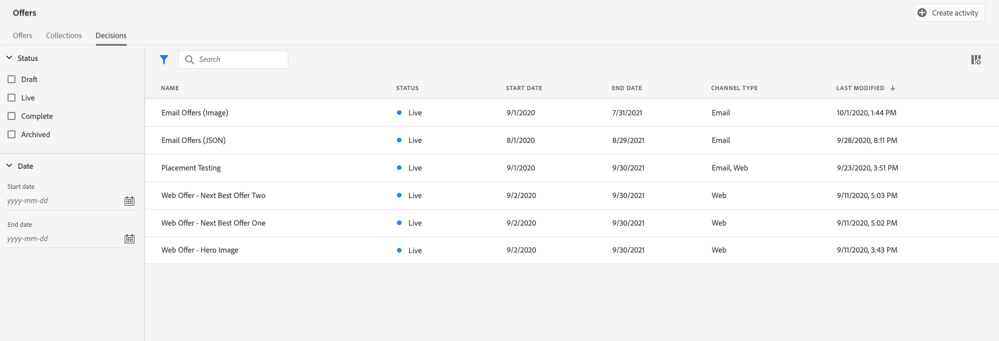

Before creating a decision, make sure that the components below have been created in the Offer Library:

* [Placements](../offer-library/creating-placements.md)
* [Collections](../offer-library/creating-collections.md)
* [Personalized offers](../offer-library/creating-personalized-offers.md)
* [Fallback offers](../offer-library/creating-fallback-offers.md)

## Create the decision {#create-activity}

1. Access the decision list, then click **[!UICONTROL Create decision]**.

1. Specify the decision's name.

1. Define a start and end date and time, then click **[!UICONTROL Next]**.

    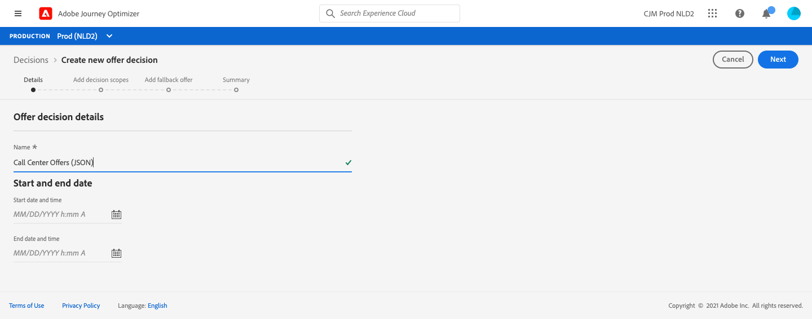

## Define decision scopes {#add-decision-scopes}

1. Select a placement from the drop-down list. It will be added to the first decision scope in your decision.

    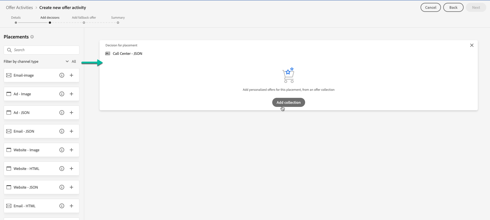

1. Click **[!UICONTROL Add]** to select your evaluation criteria for this placement.

    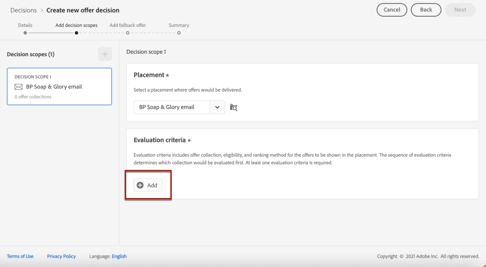

    Evaluation criteria include offer collection, eligibility, and ranking method for the offers to be shown in the placement. They determine which collection will be evaluated first.
    
    >[!NOTE]
    >
    >At least one evaluation criteria is required.

1. Select the offer collection that contains the offers to consider, then click **[!UICONTROL Add]**.

    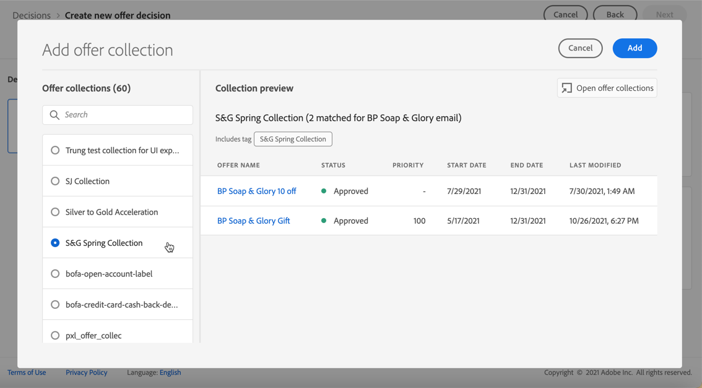

    >[!NOTE]
    >
    >You can click the **[!UICONTROL Open offer collections]** link to display the list of collections in a new tab, which enables you to browse the collections and the offers they contain.

    The selected collection is added to the placement.

    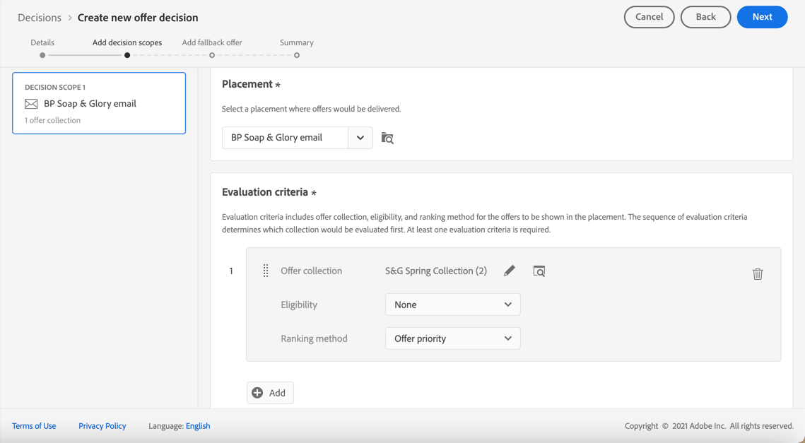

1. Use the **[!UICONTROL Eligibility]** field to restrict the selection of offers for this placement.

    This constraint can be applied by using a **decision rule**, or one or several **Adobe Experience Platform segments**. Both are detailed in [this section](#segments-vs-decision-rules).

    * To restrict the selection of the offers to the members of an Experience Platform segment, select **[!UICONTROL Segments]**, then click **[!UICONTROL Add segments]**.

        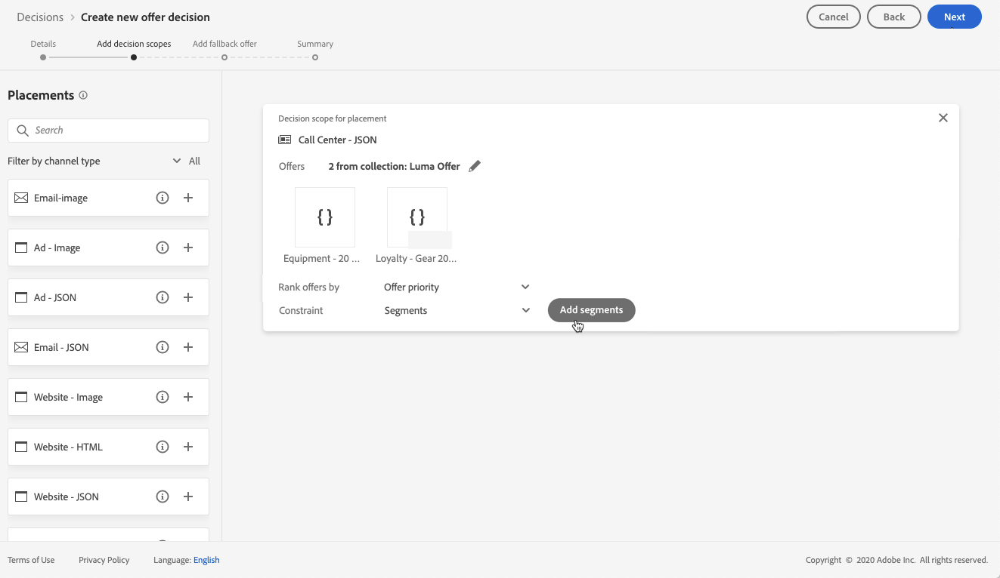
    
        Add one or several segments from the left pane, combine them using the **[!UICONTROL And]** / **[!UICONTROL Or]** logical operators. Click **[!UICONTROL Select]** to confirm.

        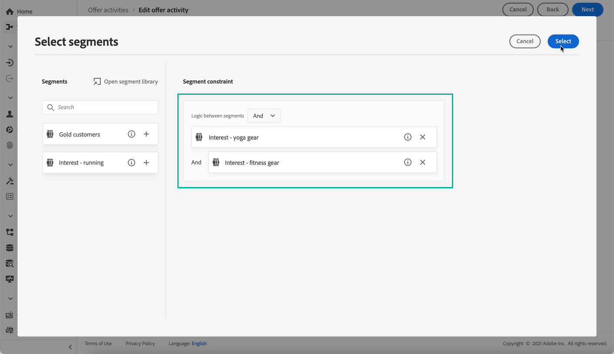

        Learn more on how to work with segments in [this section](../../segment/about-segments.md).

    * If you want to add a selection constraint for this placement using a decision rule, use the **[!UICONTROL Decision rule]** option and select the rule of your choice.

        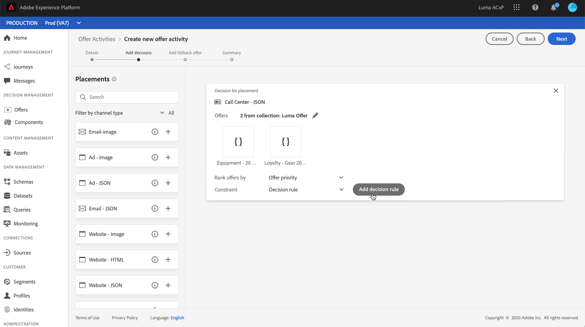

        Learn more on how to create a decision rule in [this section](../offer-library/creating-decision-rules.md).

1. Define the ranking method you want to use to select the best offer for each profile.

    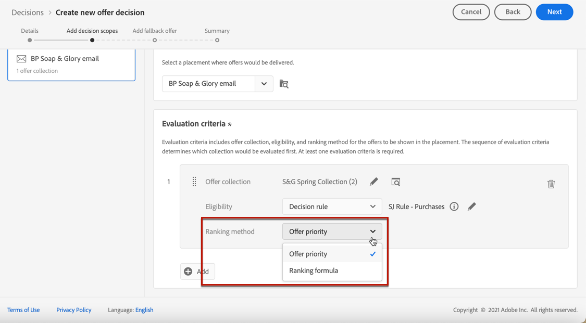

    * By default, if multiple offers are eligible for this placement, the offers with the highest priority score will be delivered to the customer.

    * If you want to use a specific formula to choose which eligible offer to deliver, select **[!UICONTROL Ranking formula]**. Learn how to rank offers in [this section](../offer-activities/configure-offer-selection.md).

1. Click **[!UICONTROL Add]** to define more placements for this decision scope.

    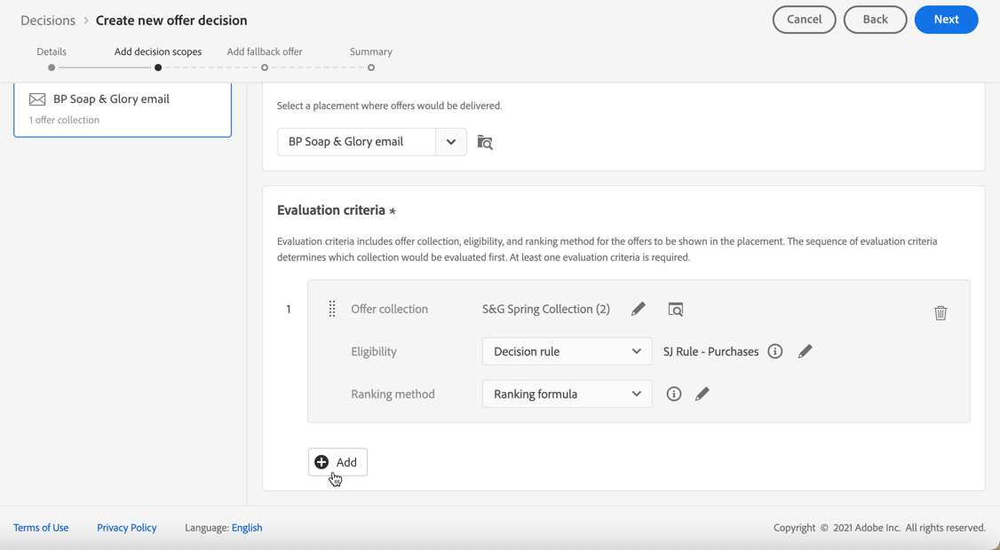

1. When you add several collections, they will be evaluated in a specific order. The first collection that was added to the sequence will be evaluated first, and so on.
    
    To change the default sequence, you can drag and drop the collections to reorder them as wanted.

    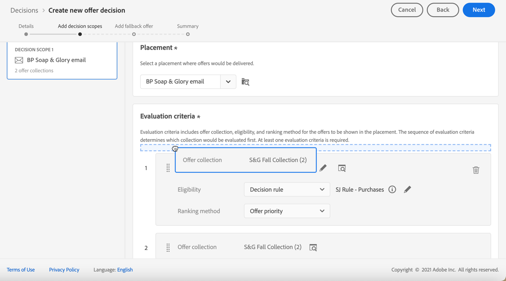
    
1. You can also evaluate several collections at the same time. To do so, drap and drop the collection on top of another.

    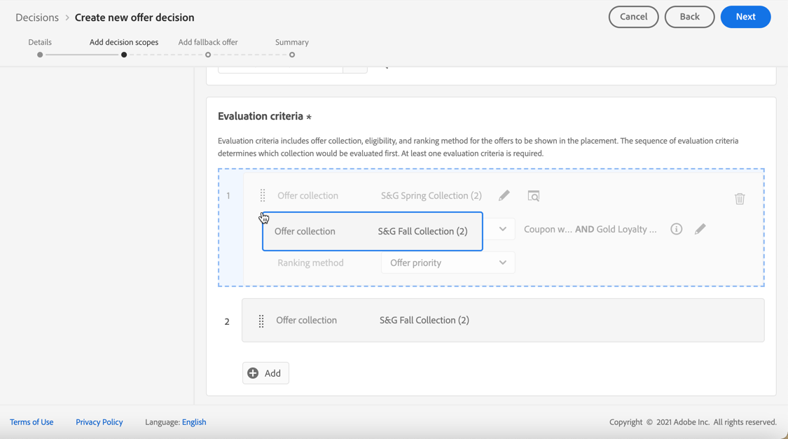

    They now have the same rank and thus will be evaluated at the same time.

    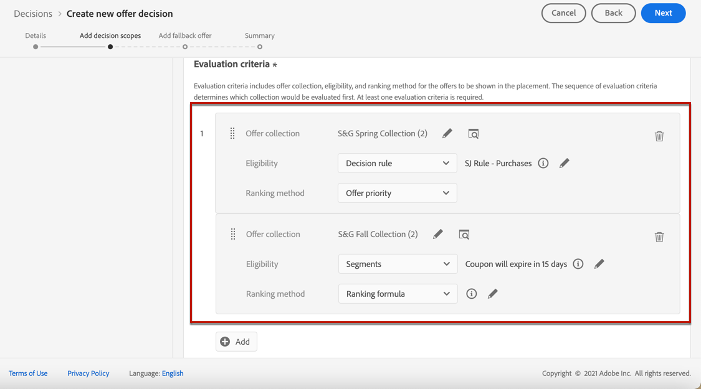

1. To add another placement for your offers, add another decision scope using the **[!UICONTROL New scope]** button. Repeat the steps above for each scope.

    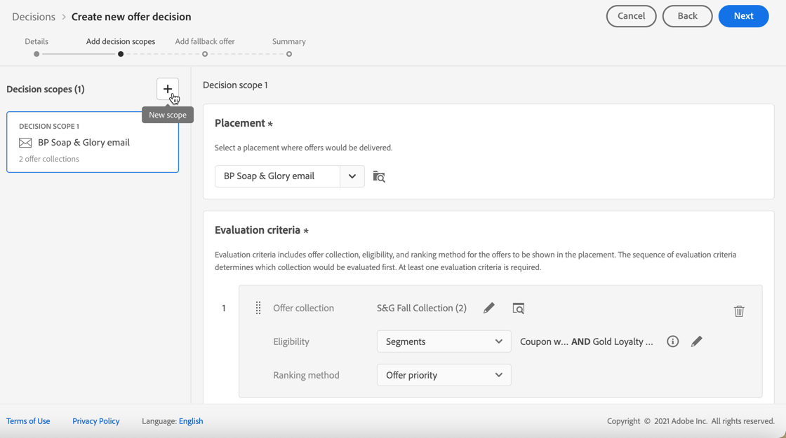

### Using segments vs decision rules {#segments-vs-decision-rules}

<!--to move to create-offers?-->

To apply a constraint, you can restrict the selection of offers to the members of one or several **Adobe Experience Platform segments**, or you can use a **decision rule**, both solutions corresponding to different usages.

Basically, the output of a segment is a list of profiles, whereas a decision rule is a function executed on demand against a single profile during the decisioning process. The difference between those two usages are detailed below.

* **Segments**

    On one hand, segments are a group of Adobe Experience Platform profiles that match a certain logic based on profile attributes and experience events. However, Offer Management does not recompute the segment, which may not be up-to-date when presenting the offer.

    Learn more on segments in [this section](../../segment/about-segments.md).

* **Decision rules**
    
    On the other hand, a decision rule is based on data available in Adobe Experience Platform and determines to whom an offer can be shown. Once selected in an offer or a decision for a given placement, the rule is executed every single time a decision is made, which ensures that each profile gets the latest and the best offer.

    Learn more on decision rules in [this section](../offer-library/creating-decision-rules.md).

## Add a fallback offer {#add-fallback}

Once you defined the decision scopes, select the fallback offer that will be presented as a last resort to the customers that do not match the offers eligibility rules and constraints, then click **[!UICONTROL Next]**.

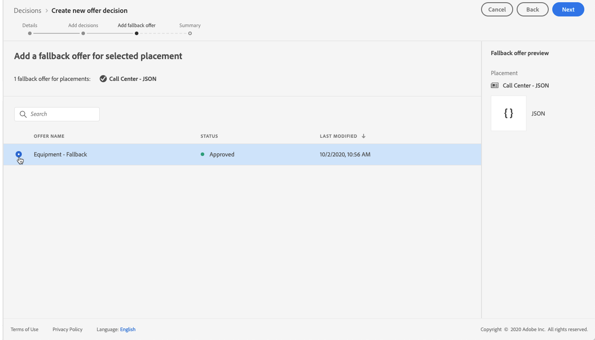

## Review and save the decision {#review}

If everything is configured properly, a summary of the decision properties displays. 

1. Make sure decision is ready to be used to  present offers to customers.
1. Click **[!UICONTROL Finish]**.
1. Then select **[!UICONTROL Save and activate]**.

    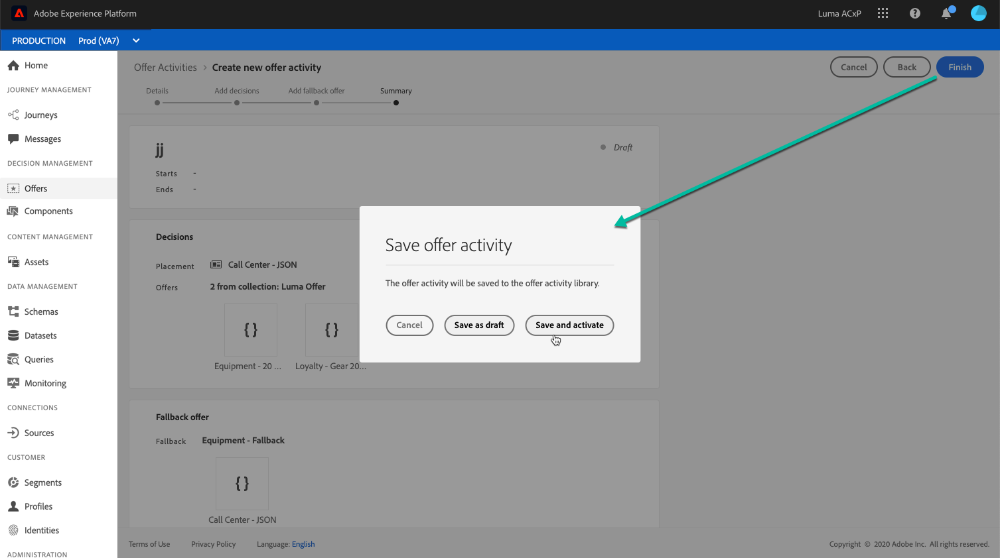
    
    You can also save the decision as draft, in order to edit and activate it later on.

The decision displays in the list with the **[!UICONTROL Live]** or **[!UICONTROL Draft]** status, depending on whether you activated it or not in the previous step. 

It is now ready to be used to deliver offers to customers.

## Decision list {#decision-list}

From the decision list, you can select the decision to display its properties. From there you can also edit it, change its status (**Draft**, **Live**, **Complete**, **Archived**), duplicate the decision, or delete it.

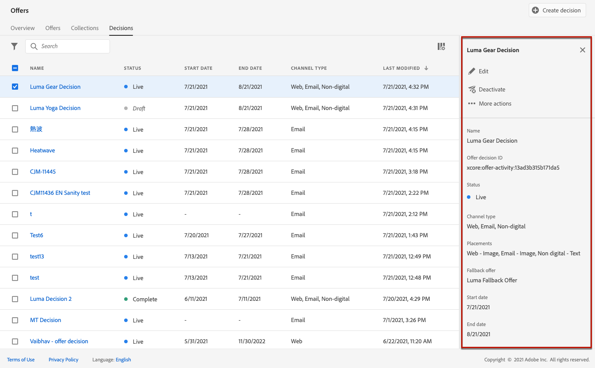

Select the **[!UICONTROL Edit]** button to go back to the decision edition mode, where you can modify the decision's [details](#create-activity), [decision scopes](#add-decision-scopes) and [fallback offer](#add-fallback).

Select a live decision and click **[!UICONTROL Deactivate]** to set the decision status back to **[!UICONTROL Draft]**.

To set again the status to **[!UICONTROL Live]**, select the **[!UICONTROL Activate]** button that is now displayed.

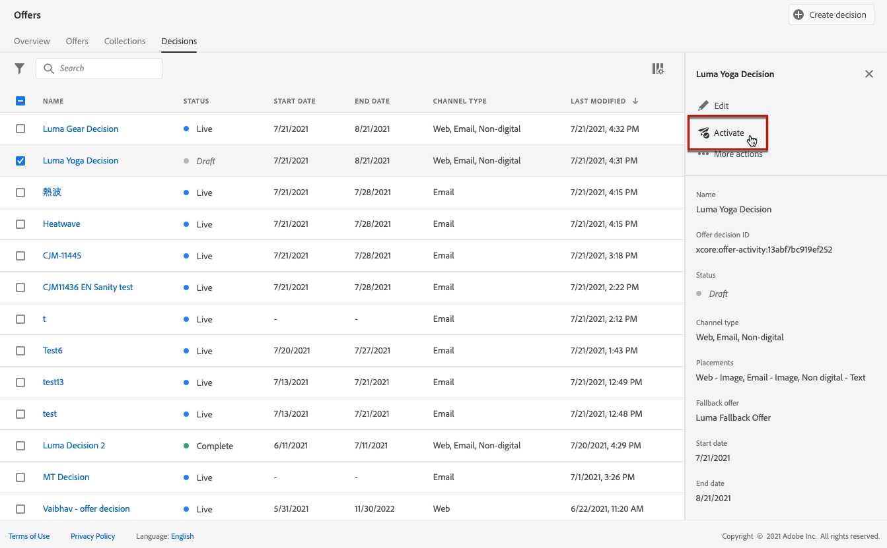

The **[!UICONTROL More actions]** button enables the actions described below.

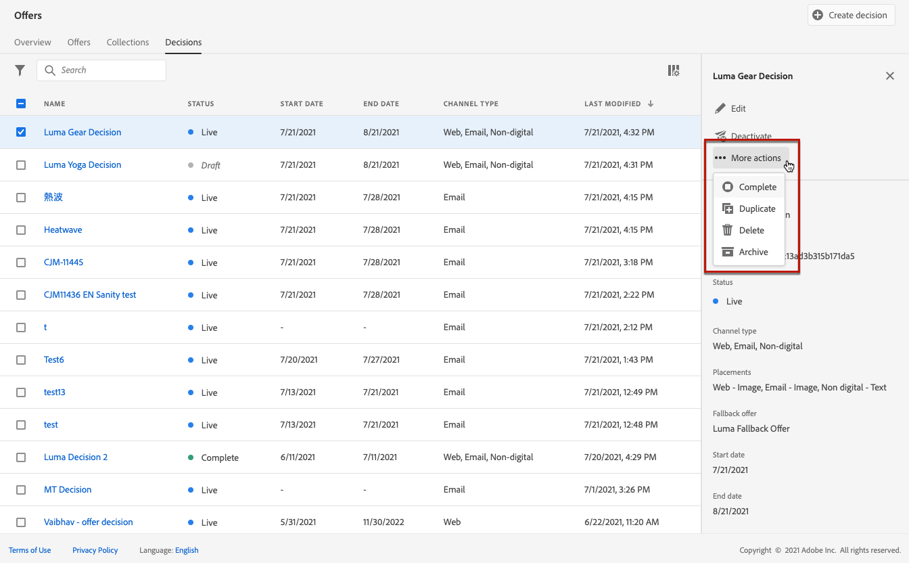

* **[!UICONTROL Complete]**: sets the decision's status to **[!UICONTROL Complete]**, meaning the decision cannot be called anymore. This action is only available for activated decisions. The decision is still available from the list, but you cannot set its status back to **[!UICONTROL Draft]** or **[!UICONTROL Approved]**. You can only duplicate, delete or archive it.

* **[!UICONTROL Duplicate]**: creates a decision with the same properties, decision scopes and fallback offer. By default, the new decision has the **[!UICONTROL Draft]** status.

* **[!UICONTROL Delete]**: removes the decision from the list.

    >[!CAUTION]
    >
    >The decision and its content will not be accessible anymore. This action cannot be undone.
    >
    >If the decision is used in another object, it cannot be deleted.

* **[!UICONTROL Archive]**: sets the decision status to **[!UICONTROL Archived]**. The decision is still available from the list, but you cannot set its status back to **[!UICONTROL Draft]** or **[!UICONTROL Approved]**. You can only duplicate or delete it.

You can also delete or change the status of multiple decisions at the same time by selecting the corresponding checkboxes.

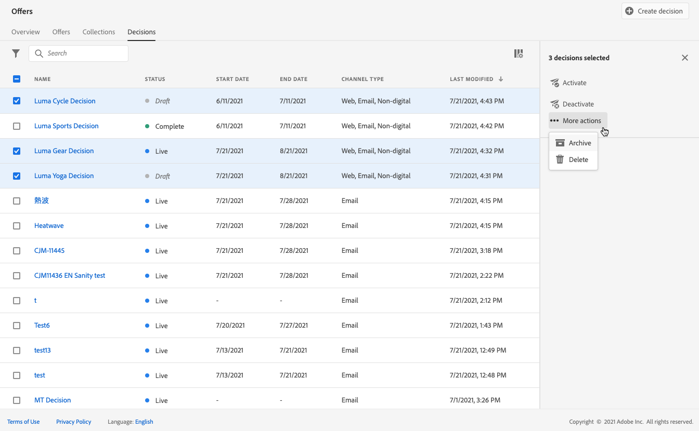

If you want to change the status of several decisions whith different statuses, only the relevant statuses will be changed.

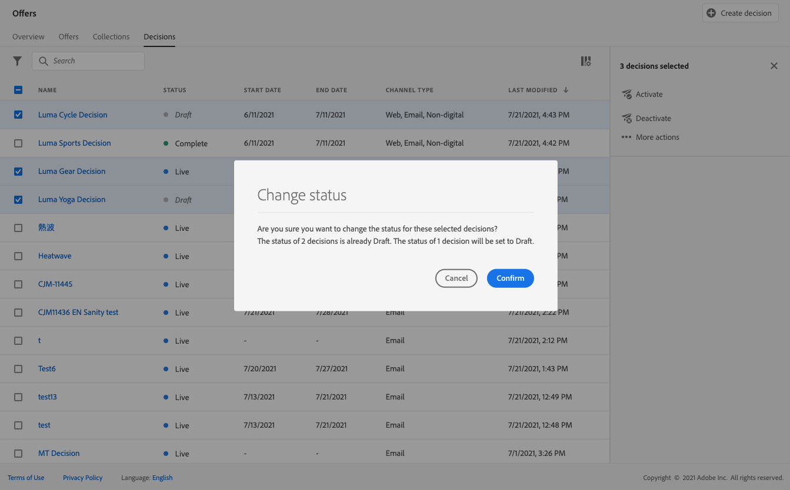

Once a decision has been created, you can click its name from the list.

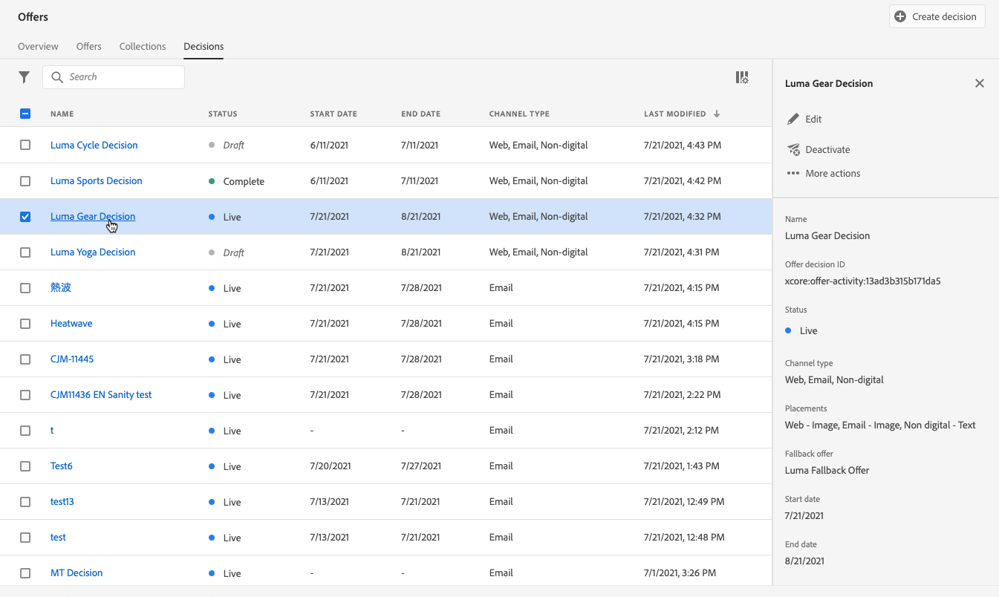

This enables you to access detailed information for that decision. Select the **[!UICONTROL Change log]** tab to [monitor all the changes](../get-started/user-interface.md#changes-log) that have been made to the decision.

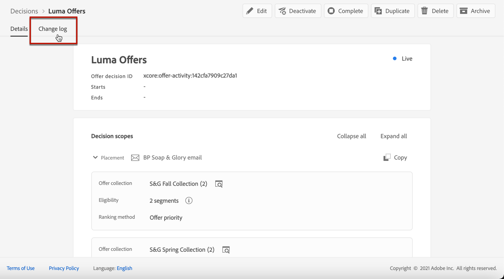

## Tutorial video {#video}

>[!NOTE]
>
>This video applies to the Offer Decisioning application service built on Adobe Experience Platform. However, it provides generic guidance to use Offer in the context of Journey Optimizer.

>[!VIDEO](https://video.tv.adobe.com/v/329606?quality=12)
