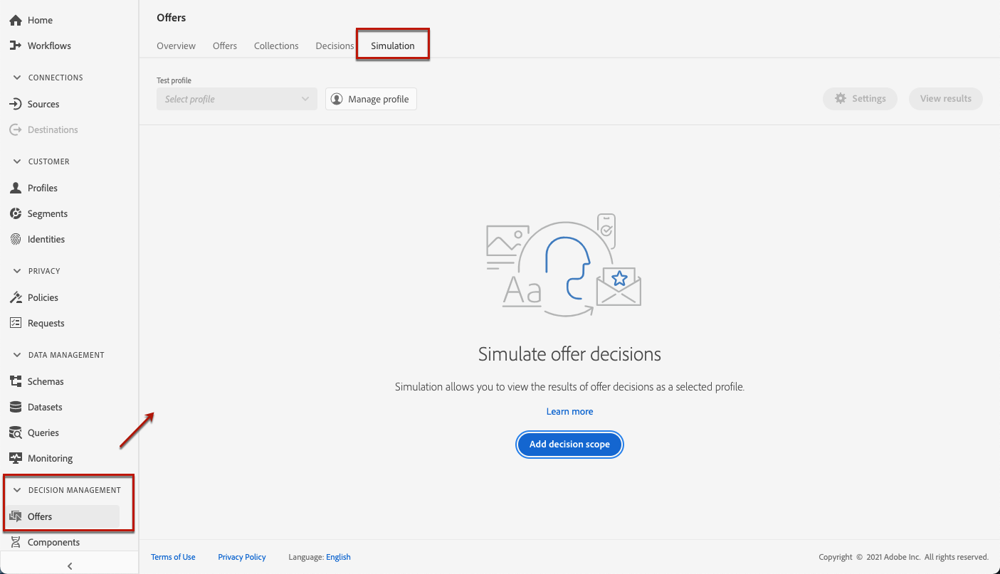
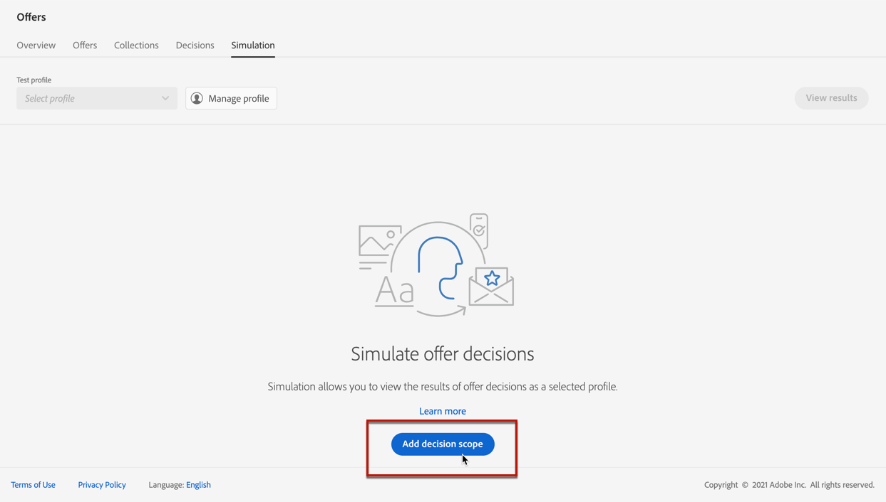
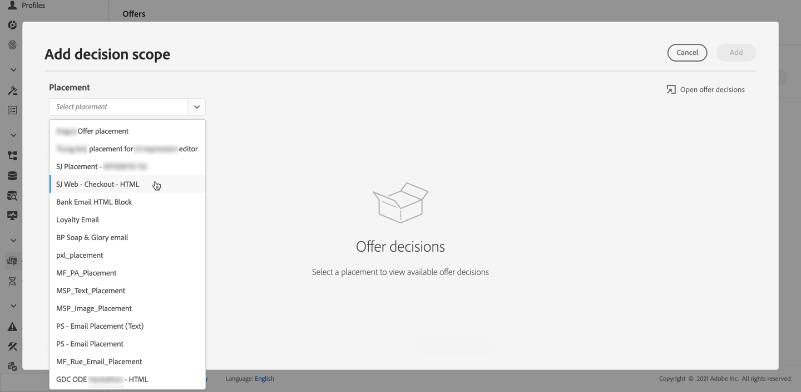
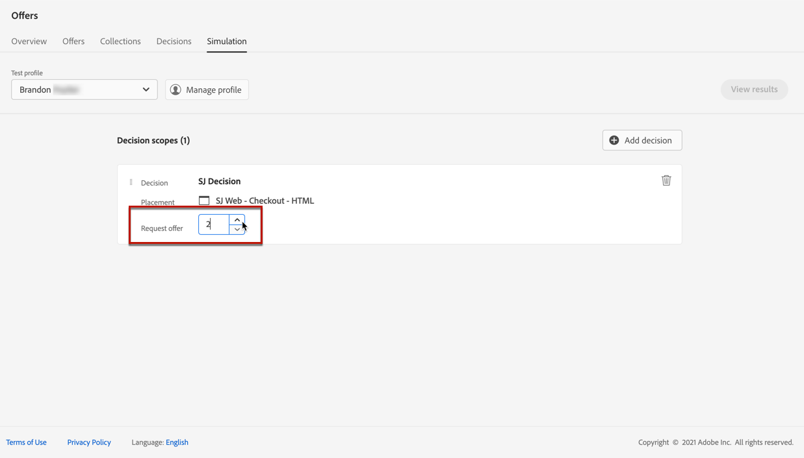
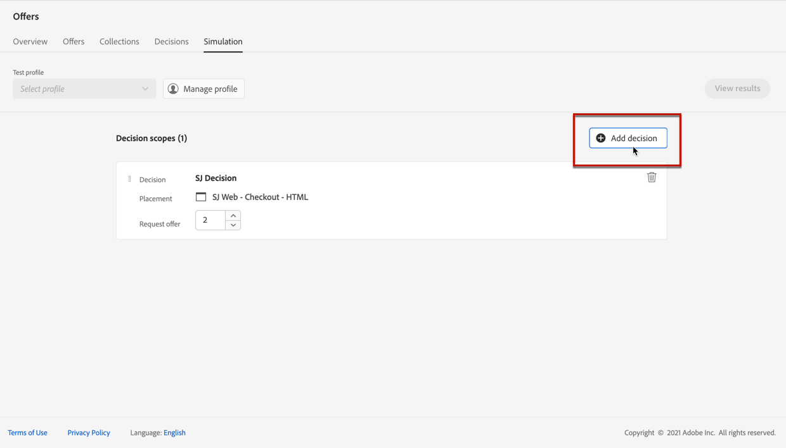
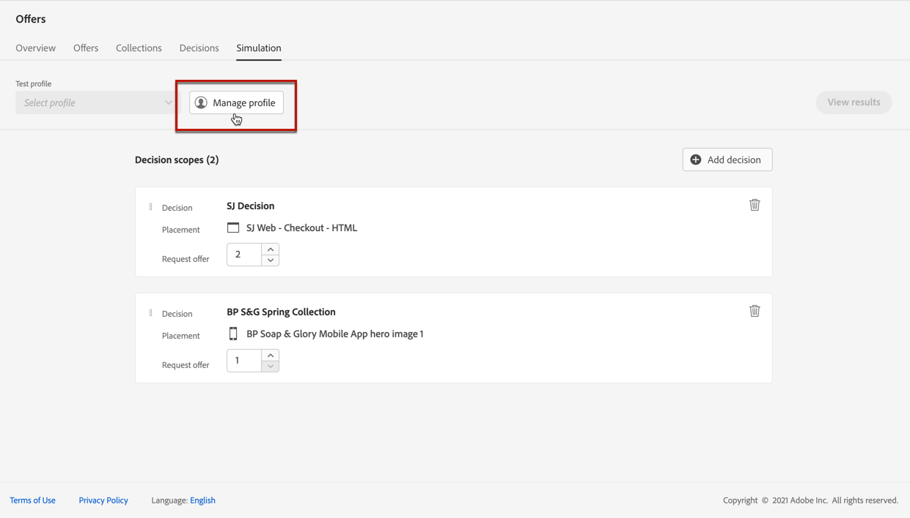
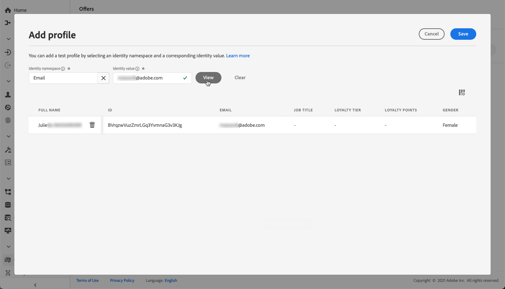
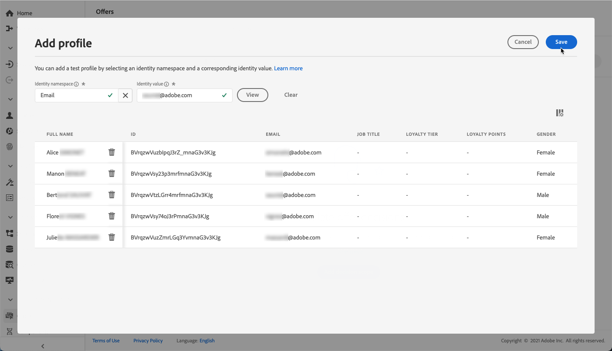
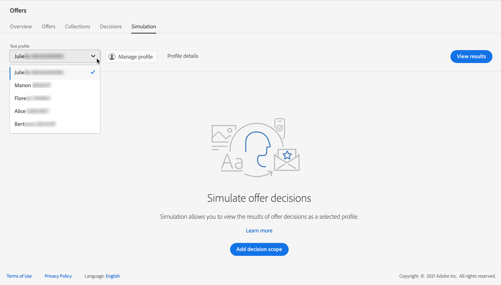
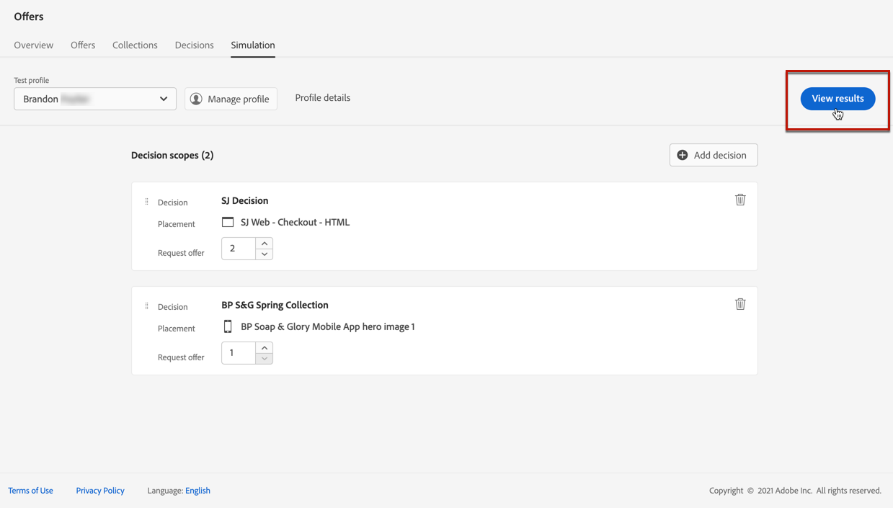

# Create simulations

## About simulation

To validate your decisioning logic, you can simulate which offers will be delivered to a test profile for a given placement.

<!--Simulation allows you to view the results of offer decisions as a selected profile.-->

This enables you to test and refine various versions of your offers with no impact on the targeted recipients.

To access this feature, select the **[!UICONTROL Simulation]** tab from the **[!UICONTROL Decision management]** > **[!UICONTROL Offers]** menu.

<!-->
➡️ [Discover this feature in video](#video)
-->

## Add decision scopes

First you need to select the offer decisions you want to test.

1. Select **[!UICONTROL Add decision scope]**.

    

1. Select a placement from the list.

    

1. The available decisions are displayed.

    >[!NOTE]
    >
    >You can use the **[!UICONTROL Search offer decisions]** field to refine the selection.
    
    Select the decision of your choice and click **[!UICONTROL Add]**.

    

1. You can click the **[!UICONTROL Open offer decisions]** link to open the list of all the decisions that you created in another tab. Learn more on [decisions](create-offer-activities.md).

1. The decision scope you just defined displays in the main workspace. Adjust the number of offers you want to request.

    

1. Repeat the steps above to add as many decisions as you need.

    

## Select test profiles

Now you need to select test profiles to view the results of offer decisions on them.

1. Click **[!UICONTROL Manage profile]**.

    

1. Select the identity namespace you want to use to identify test profiles. In this example, we will use the **Email** namespace.

    >[!NOTE]
    >
    >An identity namespace defines the context of an identifier such as an email address or CRM ID. Learn more about Adobe Experience Platform identity namespaces [in this section](get-started-identity.md){target="_blank"}.

1. Enter the identity value and click **[!UICONTROL View]** to list the available profiles.

    

1. Add other profiles if you want to test different profile data, and save your selection.

    

1. Once added, all profiles are listed in the drop-down list under **[!UICONTROL Test profile]**. You can switch between the saved test profiles to display the results for each selected profile.

    

1. Click the **[!UICONTROL Profile details]** link to display the selected profile date.

<!--Learn more on [selecting test profiles](preview.md#select-test-profiles)-->

## View simulation results

Once you added at least one decision scope and selected at least one test profile, you can view the results.

1. Click **[!UICONTROL View results]**.

    

1. The scores for each decision according to the selected profile are displayed.

    

1. Select another profile from the list to display the results of the offer decisions for a different test profile.

***

* Is it recommended to first select profiles or first add decision scopes?
* What does Request offer changes?
* Nothing displays when I click View results? Can't see any score...
* What's the typical example? i.e. how many decisions do you select, and how do you compare scores?
* What do you learn from simulation? i.e. if I selected 2 decisions and I compare the scores, which one is better or should I use for my customers?
* Error on Profile details link.
* Is there a tutorial planned to be released?
* Why still a big red frame when no profile is found?

***

<!-->
## Tutorial video {#video}

>[!NOTE]
>
>This video applies to the Offer Decisioning application service built on Adobe Experience Platform. However, it provides generic guidance to use Offer in the context of Journey Optimizer.

>[!VIDEO](https://video.tv.adobe.com/v/329606?quality=12)
-->