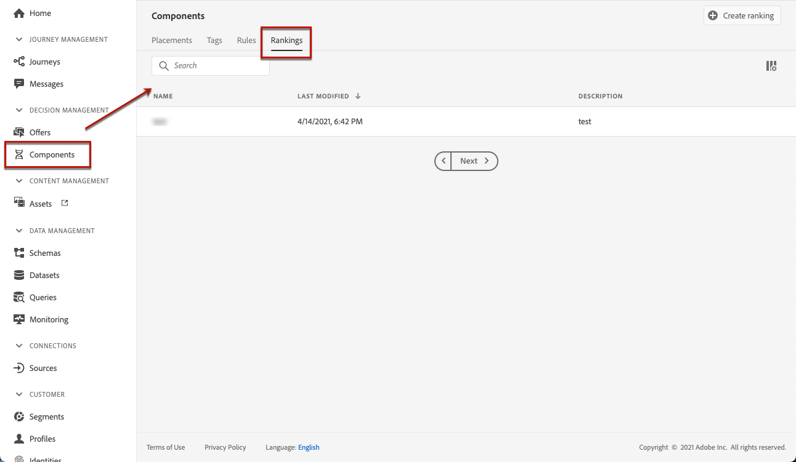
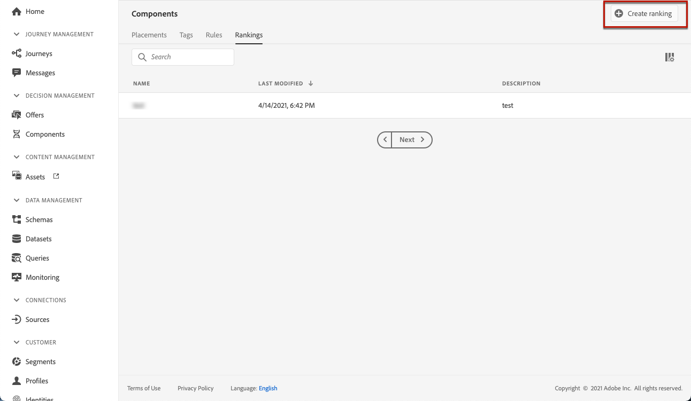
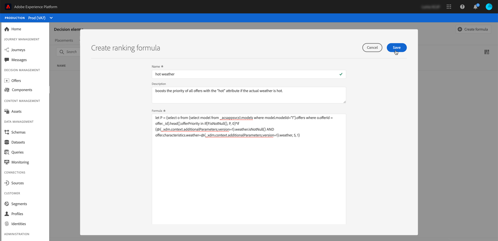
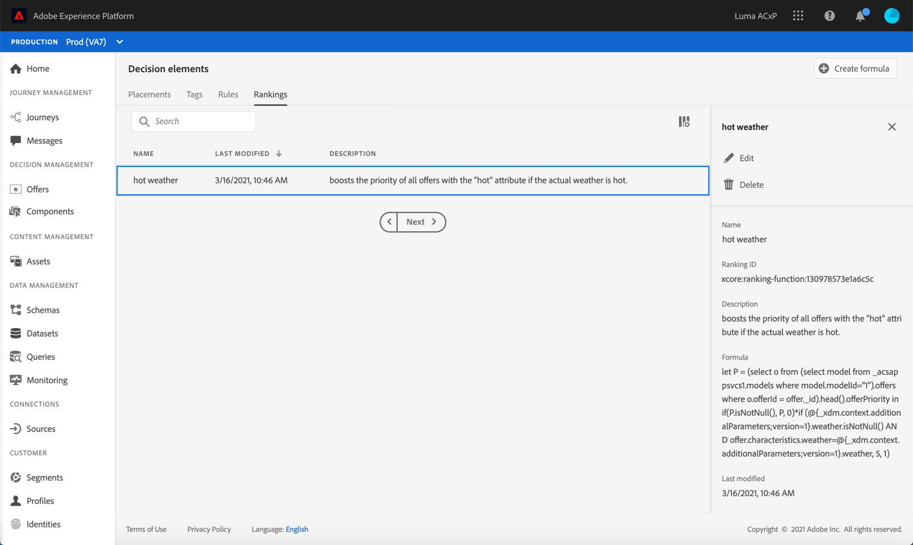
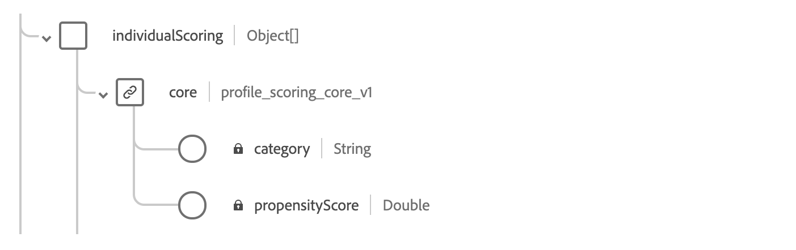
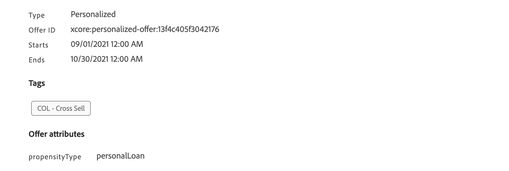

# Create ranking formulas {#create-ranking-formulas}

## About ranking formulas {#about-ranking-formulas}

**Ranking formulas** allow you to define rules that will determine which offer should be presented first for a given placement, rather than taking into account the offers' priority scores.

Ranking formulas are expressed in **PQL syntax** and can leverage profile attributes, context data and offer attributes. For more on how to use the PQL syntax, refer to the [dedicated documentation](https://experienceleague.adobe.com/docs/experience-platform/segmentation/pql/overview.html).

Once a ranking formula has been created, you can assign it to a placement in a decision (previously known as offer activity). For more on this, see [Configure offers selection in decisions](../offer-activities/configure-offer-selection.md).

## Create a ranking formula {#create-ranking-formula}

To create a ranking formula, follow the steps below:

1. Access the **[!UICONTROL Components]** menu, then select the **[!UICONTROL Rankings]** tab. The list of rankings previously created is displayed.

    

1. Click **[!UICONTROL Create ranking]** to create a new ranking formula.

    

1. Specify the ranking formula name, description, and formula. 

    In this example, we want to boost the priority of all offers with the "hot" attribute if the actual weather is hot. To do this, the **contextData.weather=hot** was passed in the decisioning call.

    

1. Click **[!UICONTROL Save]**. Your ranking formula is created, you can select it from the list to get details and edit or delete it.

    It is now ready to be used in a decision to rank eligible offers for a placement (see [Configure offers selection in decisions](../offer-activities/configure-offer-selection.md)).

    

## Ranking formula examples

You can create many different ranking formulas according to your needs. Below are some examples.

<!--
###Boost by offer ID

Boost the priority of an offer with the offer ID *xcore:personalized-offer:13d213cd4cb328ec* by 5.

**Ranking formula:**

```
if( offer._id = "xcore:personalized-offer:13d213cd4cb328ec", offer.rank.priority + 5, offer.rank.priority)
```
-->

### Change the offer priority based on a certain profile attribute

Set the offer priority to 30 for offer *xcore:personalized-offer:13d213cd4cb328ec* if the user lives in the city of Bondi.

**Ranking formula:**

```
if( offer._id = "xcore:personalized-offer:13d213cd4cb328ec" and homeAddress.city.equals("Bondi", false), 30, offer.rank.priority)
```
<!-->
### Boost multiple offers by offer ID based on the presence of a profile's segment membership

Boost the priority of offers based on whether the user is a member of a priority segment, which is configured as an attribute in the offer.

**Ranking formula:**

```
if( segmentMembership.get("ups").get(offer.characteristics.prioritySegmentId).status in (["realized","existing"]), offer.rank.priority + 10, offer.rank.priority)
```
-->

### Boost offers with certain offer attribute based on context data

Boost certain offers based on the context data being passed in the decisioning call. For example, if the `contextData.weather=hot` is passed in the decisioning call, the priority of all offers with `attribute=hot` must be boosted.

**Ranking formula:**

```
if (@{_xdm.context.additionalParameters;version=1}.weather.isNotNull()
and offer.characteristics.weather=@{_xdm.context.additionalParameters;version=1}.weather, offer.rank.priority + 5, offer.rank.priority)
```

Note that when using the decisioning API, the context data is added to the profile element in the request body, such as in the example below.

**Snippet from request body:**

```
"xdm:profiles": [
{
    "xdm:identityMap": {
        "crmid": [
            {
            "xdm:id": "CRMID1"
            }
        ]
    },
    "xdm:contextData": [
        {
            "@type":"_xdm.context.additionalParameters;version=1",
            "xdm:data":{
                "xdm:weather":"hot"
            }
        }
    ]
 }],
```

### Boost offers with certain offer attribute based on profile attribute

If the profile lives in the city corresponding to the offer, then double the priority for all offers in that city.

**Ranking formula:**

```
if( offer.characteristics.city = homeAddress.city, offer.rank.priority * 2, offer.rank.priority)
```

### Boost offers where the end date is less than 24 hours from now

**Ranking formula:**

```
if( offer.selectionConstraint.endDate occurs <= 24 hours after now, offer.rank.priority * 3, offer.rank.priority)
```

### Boost offers based on the customers propensity (calculated by CustomerAI) to purchase the product being offered

If we have 2 instances of *CustomerAI* calculating propensity for purchasing *travelInsurance* and *extraBaggage* for an airline company, the following ranking formula will boost the priority (by 50 points) of the offer specific to either insurance or baggage if the customer propensity score to purchase that product is higher than 90.

However, because each *CustomerAI* instance creates its own object within the unified profile schema, there is no way to dynamically select the score based on the offer propensity type. Thus you have to chain the `if` statements to first check the offer propensity type, then extract the score from the appropriate profile field.   

**Ranking formula:**

```
if ( offer.characteristics.propensityType = "extraBaggagePropensity" and _salesvelocity.CustomerAI.extraBaggagePropensity.score > 90, offer.rank.priority + 50,
    (
        if ( offer.characteristics.propensityType = "travelInsurancePropensity" and _salesvelocity.CustomerAI.insurancePropensity.score > 90, offer.rank.priority + 50, offer.rank.priority )
    )
)
```

A better solution is to store the scores in an array in the profile. The following example will work across a variety of different propensity scores using just a simple ranking formula. The expectation is that you have a profile schema with an array of scores. In this example, the instance tenant is *_salesvelocity* and the profile schema contains the following:



Given this, for a profile such as:

```
{"_salesvelocity": {"individualScoring": [
                    {"core": {
                            "category":"insurance",
                            "propensityScore": 96.9
                        }},
                    {"core": {
                            "category":"personalLoan",
                            "propensityScore": 45.3
                        }},
                    {"core": {
                            "category":"creditCard",
                            "propensityScore": 78.1
                        }}
                    ]}
}
```

The offers would contain an attribute for *propensityType* which matches the category from the scores:



Your ranking formula can then set the priority of each offer to equal the customers *propensityScore* for that *propensityType*. If no score is found, use the static priority set on the offer:

```
let score = (select _Individual_Scoring1 from _salesvelocity.individualScoring
             where _Individual_Scoring1.core.category.equals(offer.characteristics.propensityType, false)).head().core.propensityScore
in if(score.isNotNull(), score, offer.rank.priority)
```
