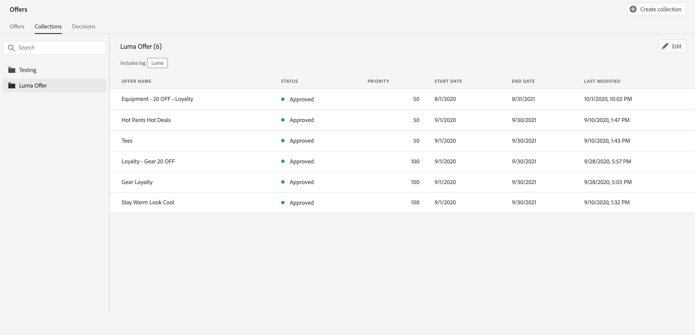
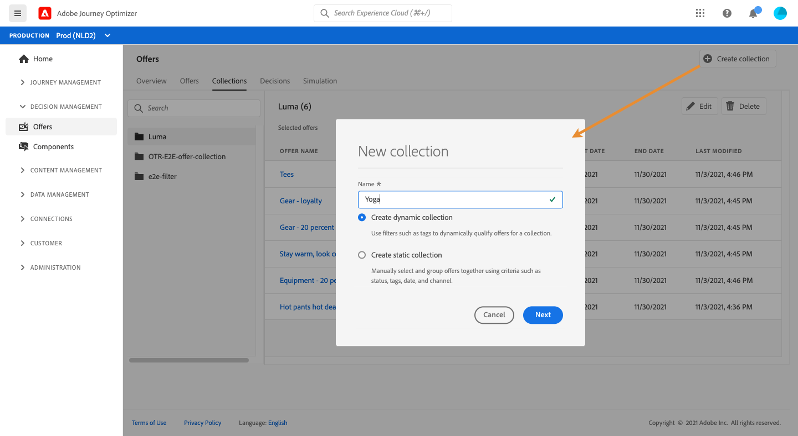
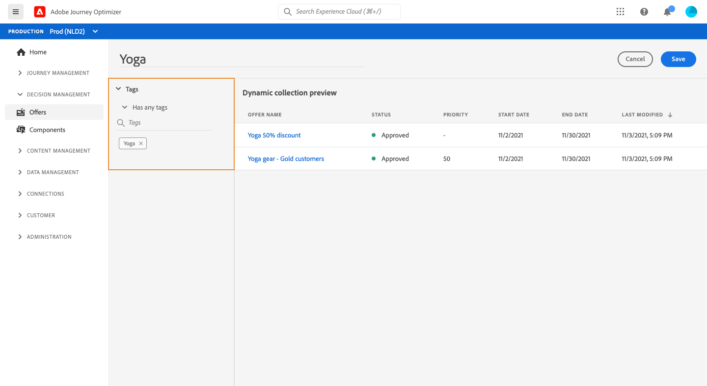
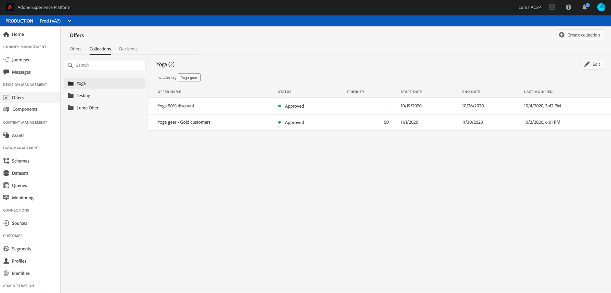

# Create collections {#creating-collections}

Collections allows you to organize your offers by regrouping them into categories of your choice. You can, for example, create a "sport" collection that will contain sport-related offers only. 

➡️ [Discover this feature in video](#video)

The list of offer collections is accessible in the **[!UICONTROL Offers]** menu.   

You can create two types of collections: 

* **Dynamic collections** are collections of offers based on tags. These collections are updated automatically. For example, if a new offer is created with the selected tag, it will automatically be added to the collection.

* **Static collections** are collections built by manually selecting individual offers to include in the Collection. The collection can only be updated by manually adding more offers to it.

To create a collection, follow these steps:

1. Go to the **[!UICONTROL Collections]** tab, then click **[!UICONTROL Create collection]**.

1. Specify the name and type of collection to create.

    

1. To create a dynamic collection, use the left pane to select the tag of the offers to add to the collection, then click **[!UICONTROL Save]**. All the offers with the selected tag will be saved in the collection.

    For more on tags creation, see [Create tags](../offer-library/creating-tags.md).

    

1. To create a static collection, use the left pane to filter the list of offers (status, tag, date, channel, content type), then select the offers to add to the collection.

    

    >[!NOTE]
    >
    >Static collections are not updated automatically. To add offers to a static collection, you need to edit it and add them manually.

1. Once the collection is created, it displays in the list. You can select it to edit or delete it.

    

## Tutorial video {#video}

>[!NOTE]
>
>This video applies to the Offer Decisioning application service built on Adobe Experience Platform. However, it provides generic guidance to use Offer in the context of Journey Optimizer.

>[!VIDEO](https://video.tv.adobe.com/v/329376?quality=12)
