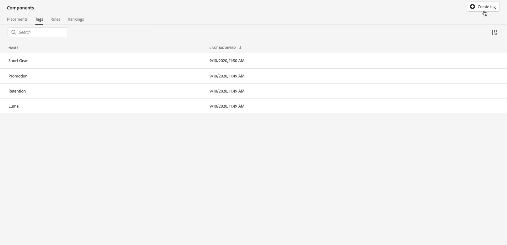
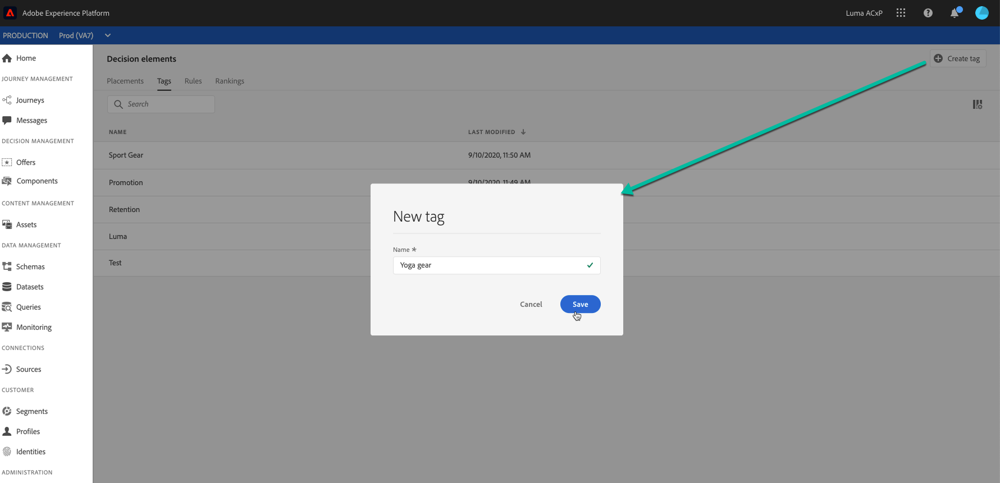
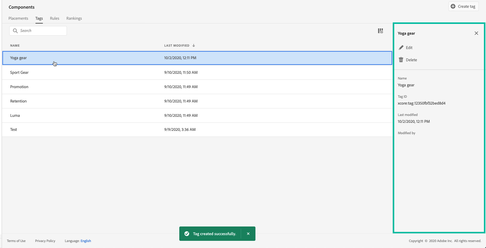

# Create tags {#creating-tags}

Associating tags to your offers make it easier to keep them organized. For example, you could label your Black Friday offers with the "Black Friday" tag. You can then use the search functionality in the Offer Library to easily locate all of the offers with that tag.

Tags can also be used to group offers together into offer collections. See [Create collections](../offer-library/creating-collections.md).

 [Discover this feature in video](#video)

The list of created tags is accessible in the **[!UICONTROL Components]** menu.

To create a tag, follow these steps:

1. Go to the **[!UICONTROL Tags]** tab, then click **[!UICONTROL Create tag]**.

1. Specify the tag's name, then click **[!UICONTROL Save]**.

    

1. Once the tag is created, it displays in the list. You can select it to display its properties and edit or suppress it.

    

## Tutorial video {#video}

>[!NOTE]
>
>This video applies to the Offer Decisioning application service built on Adobe Experience Platform. However, it provides generic guidance to use Offer in the context of Journey Optimizer.

>[!VIDEO](https://video.tv.adobe.com/v/329374?quality=12)
