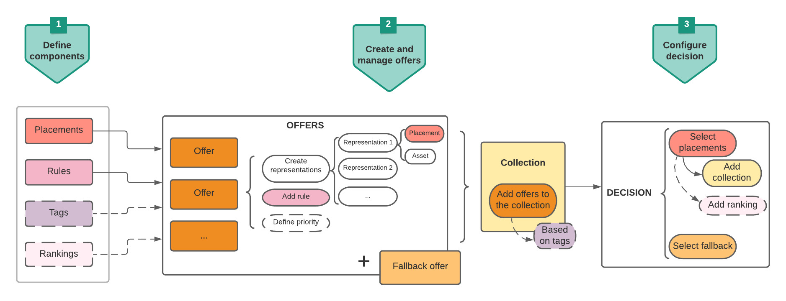

# Key steps to create and manage offers {#key-steps}

The main steps to create, configure and manage offers, as well as use them in a decision, are presented below.

For a full end-to-end example showing how to configure offers, use them in a decision and leverage this decision in an email, check out [this page](../offers-e2e.md).

## Create components

Before starting to create offers, you must define several components that you will use in your offers.

1. **Create placements**, which are containers that will be used to showcase your offers. You can, for example, create a placement that will be dedicated to offers in the image format only, and situated to the top of your messages.

1. **Create decision rules** that will specify the conditions under which the offers will be presented.

1. **Create tags** that you will associate to the offers, allowing you to easily organize and search them into the library.

1. If you want to define rules that will determine which offer should be presented first for a given placement (rather than taking into account the offers' priority scores), you can **create a ranking formula**.

<table>
<tr>
<td>
<a href="../offer-library/creating-placements.md">Create placements</a>
</td>
<td>
<a href="../offer-library/creating-decision-rules.md">Create decision rules</a>
</td>
<td>
<a href="../offer-library/creating-tags.md">Create tags</a>
</td>
<td>
<a href="../offer-library/create-ranking-formulas.md">Create ranking formulas</a>
</td>
</table>

## Create and manage offers

1. **Create offers**, and configure their content and properties.

1. **Create fallback offers**, which are the last resort offers to display if customers are not eligible for any of the selected offers.

1. **Create a collection** to include the personalized offers you created and use them in a decision.

<table>
<tr>
<td>
<a href="../offer-library/creating-personalized-offers.md">Create offers</a>
</td>
<td>
<a href="../offer-library/creating-fallback-offers.md">Create fallback offers</a>
</td>
<td>
<a href="../offer-library/creating-collections.md">Create collections</a>
</td></tr>
</table>

## Create and configure decisions

1. **Create a decision** that will combine placements with the personalized offers and the fallback offers. This combination will be used by the Offer Decisioning engine to find the best offer for a specific profile. 

1. **Configure the decision**. To do so, select the placements, and for each placement, select a collection and a fallback.

1. If needed, you can **assign a ranking formula** to a placement when configuring the decision.

<table>
<tr>
<td>
<a href="../offer-activities/create-offer-activities.md">Create decisions</a>
</td>
<td>
<a href="../offer-activities/create-offer-activities.md#add-offers">Configure decisions</a>
</td>
<td>
<a href="../offer-activities/create-offer-activities.md#add-offers">Assign ranking</a>
</td>
</tr>
</table>
