# Configure personalized offers and use them in an email {#configure-add-personalized-offers-email}

This section presents an end-to-end example to show how to configure offers and use them in a email, based on a decision you previously created.

## Main steps

The key steps to configure offers, include them in a decision and leverage this decision in an email are listed below:

1. Before creating offers, define your components
    
    * Create placements
    * Create decision rules
    * Create tags
    * Create rankings (optional)

    [!DNL :bulb:] Learn more in [this section](#define-components)

1. Configure the offers

    * Create offers
    * For each offer:
        
        * Create representations, and select a placement and an asset for each representation
        * Add a rule for each offer
        * Define a priority for each offer

        [!DNL :bulb:] Learn more in [this section](#configure-offers)

1. Create a fallback offer

    [!DNL :bulb:] Learn more in [this section](#create-fallback)

1. Create a collection to include the offers you created

    [!DNL :bulb:] Learn more in [this section](#create-collection)

1. Configure the decision

    * Create a decision
    * Select the placements you created
    * For each placement, select the collection
    * For each placement, select a ranking (optional)
    * Select the fallback

    [!DNL :bulb:] Learn more in [this section](#configure-decision)

1. Insert the decision in an email

    * Select a placement matching the offers you want to display
    * Select the decision from the items compatible with the selected placement 
    * Preview your offers

    [!DNL :bulb:] Learn more in [this section](#insert-decision-in-email)

The overall Decision Management process to use offers in an email can be described as follows:

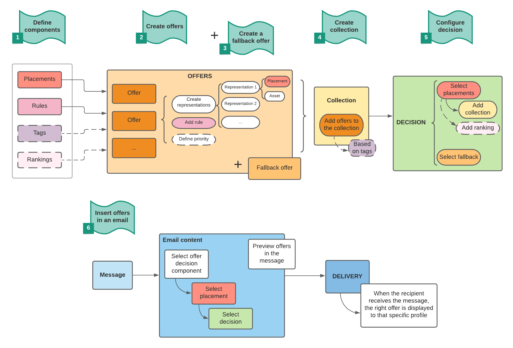

## Define the components {#define-components}

Before starting to create offers, you must define several components that you will use in your offers.

You will find them under the **[!UICONTROL Decision Management]** > **[!UICONTROL Components menu]**.

1. Start by creating **placements** for your offers.

    You will use these placements to define where the resulting offer will appear when defining your offer decision.

    In this example, create three placements with the following channel and content types:

    * *Web - Image*
    * *Email - Image*
    * *Non-digital - Text*

    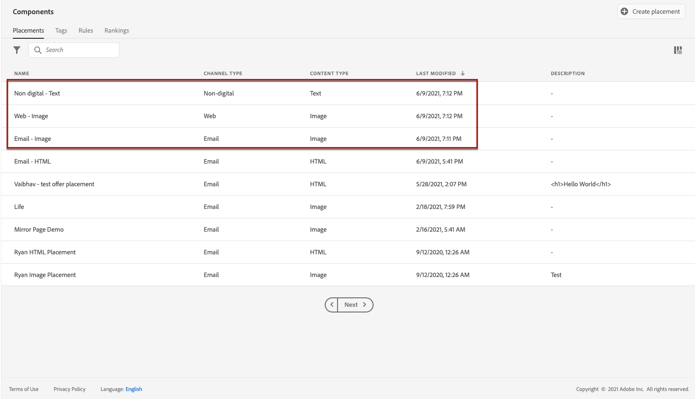

    The detailed steps to create placements are described in [this section](../../using/offers/offer-library/creating-placements.md).

1. Create **decision rules**.

    Decision rules will provide the best offer to a profile in the Adobe Experience Platform.
    
    Configure two simple rules by using the **[!UICONTROL XDM Individual Profile > Person > Gender]** attribute:

    * *Female Customers*
    * *Male Customers*

    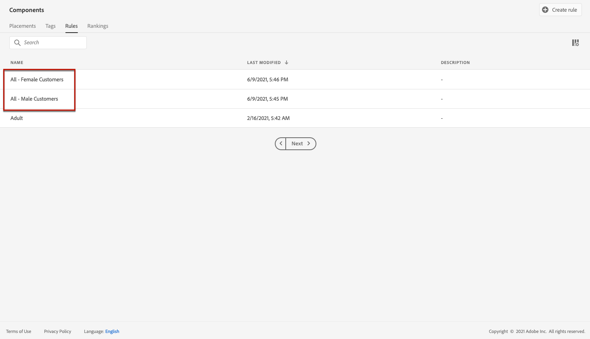

    The detailed steps to create rules are described in [this section](../../using/offers/offer-library/creating-decision-rules.md).

1. You can also create a **tag**.

    You will then be able to associate it to your offers and use this tag to group your offers together into a collection.

    In this example, create the *Yoga* tag.

    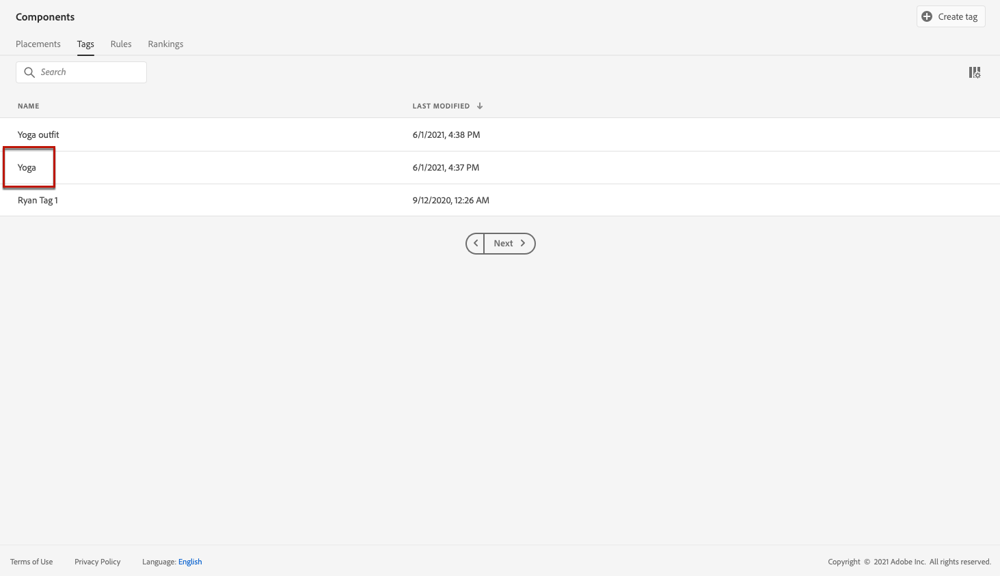

    The detailed steps to create tags are described in [this section](../../using/offers/offer-library/creating-tags.md).

1. If you want to define rules that will determine which offer should be presented first for a given placement (rather than taking into account the offers' priority scores), you can create a [**ranking formula**](../../using/offers/offer-library/create-ranking-formulas.md#about-ranking-formulas).

    The detailed steps to create ranking formulas are described in [this section](../../using/offers/offer-library/create-ranking-formulas.md#create-ranking-formula).

    >[!NOTE]
    >
    >In this example, we will only use the priority scores. Learn more on [eligibility rules and constraints](../../using/offers/offer-library/creating-personalized-offers.md#eligibility).

## Configure offers {#configure-offers}

You can now create and configure your offers. In this example, you will create four offers that you want to display according to each specific profile.

1. Create an offer. Learn more in [this section](../../using/offers/offer-library/creating-personalized-offers.md#create-offer).

1. In this offer, create three representations. Each representation must be a combination of a placement that you created earlier and an asset:

    * One corresponding to the *Web - Image* placement
    * One corresponding to the *Email - Image* placement
    * One corresponding to the *Non-digital - Text* placement

    Learn more on representations in [this section](../../using/offers/offer-library/creating-personalized-offers.md#representations).

    >[!NOTE]
    >
    >An offer can be displayed at different places in a message to create more opportunities to use the offer in different placement contexts.

1. Select an appropriate image for the first two placements. Enter custom text for the *Non-digital - Text* placement.

    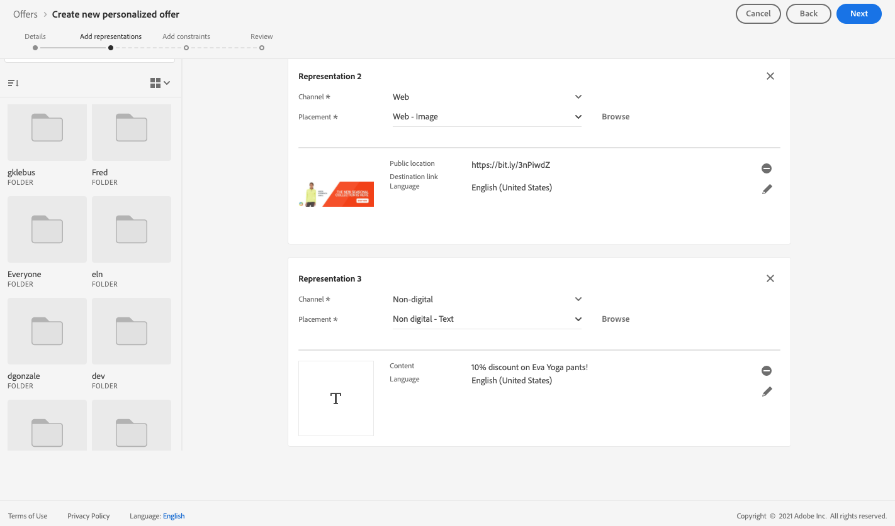

1. In the **[!UICONTROL Offer eligiblity]** section, select **[!UICONTROL By defined decision rule]** and drag and drop the rule of your choice.

    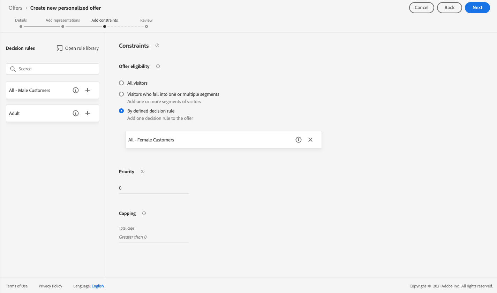

1. Fill out the **[!UICONTROL Priority]**. In this example, add *25*.

1. Review your offer, then click **[!UICONTROL Save and approve]**.

    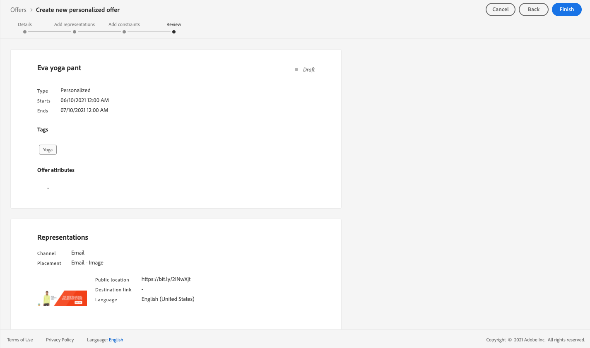

1. In this example, create three more offers with the same representations, but different assets. Assign them with different rules and priorities, such as:

    * First offer - Decision rule: *Female Customers*, Priority: *25*
    * Second offer - Decision rule: *Female Customers*, Priority: *15*
    * Third offer - Decision rule: *Male Customers*, Priority: *25*
    * Fourth offer - Decision rule: *Male Customers*, Priority: *15*

    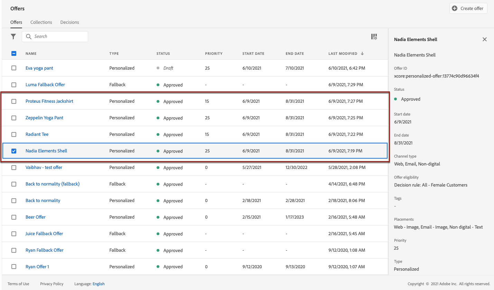

The detailed steps to create and configure offers are described in [this section](../../using/offers/offer-library/creating-personalized-offers.md).

## Create a fallback offer {#create-fallback}

1. Create a fallback offer.

1. Define the same representations as for the offers, with appropriate assets (they should be different from the ones used in your offers).

    Each representation must be a combination of a placement that you created earlier and an asset:

    * One corresponding to the *Web - Image* placement
    * One corresponding to the *Email - Image* placement
    * One corresponding to the *Non-digital - Text* placement

    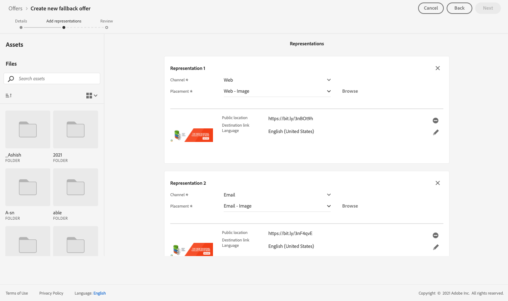

1. Review your fallback offer, then click **[!UICONTROL Save and approve]**.

Your fallback offer is now ready to be used in a decision.

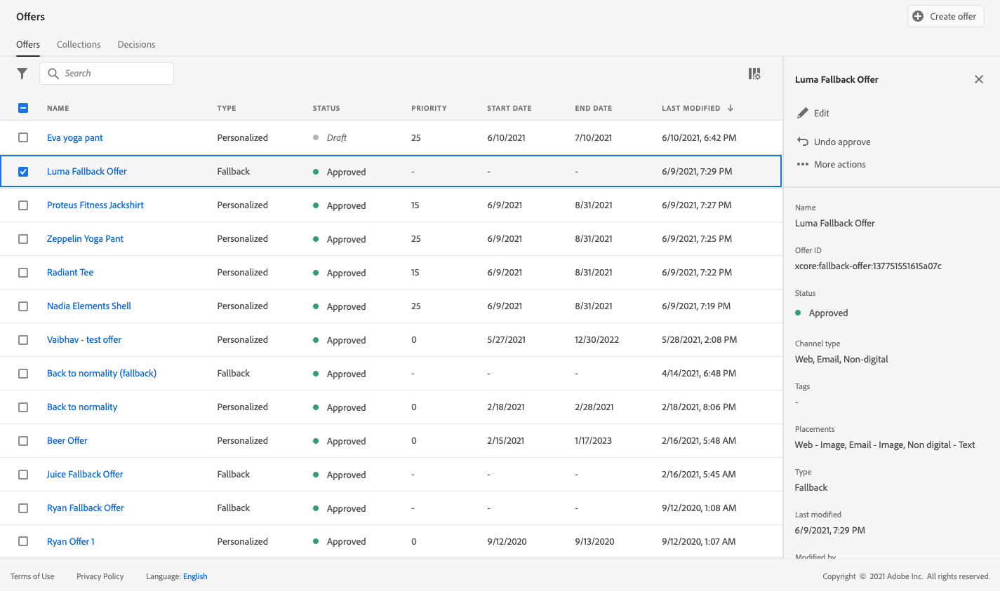

The detailed steps to create and configure a fallback offer are described in [this section](../../using/offers/offer-library/creating-fallback-offers.md).

## Create a collection {#create-collection}

1. To speed up the decision process, create a dynamic collection.

1. Use the tag you created earlier to select the four personalized offers you created earlier.

    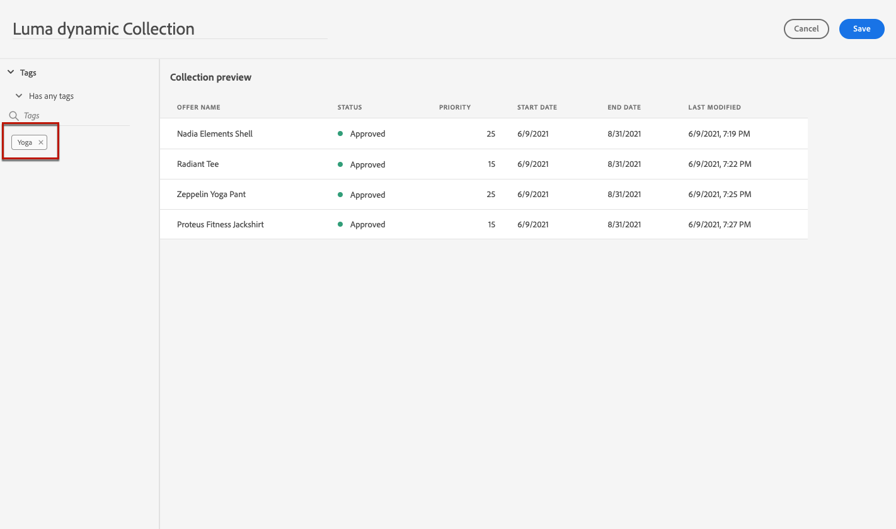

The detailed steps to create a collection are described in [this section](../../using/offers/offer-library/creating-collections.md).

## Configure the decision {#configure-decision}

Now you must create a decision that will combine placements with the personalized offers and the fallback offer you just created.

This combination will be used by the Offer Decisioning engine to find the best offer for a specific profile, in this example based on the priority and decision rule you assigned to each offer. 

To create and configure an offer decision, follow the main steps below:

1. Create a decision. Learn more in [this section](../../using/offers/offer-activities/create-offer-activities.md#create-activity).

1. Select the *Web - Image*, *Email - Image* and *Non-digital - Text* placements.

    

1. For each placement, add the collection you created.

    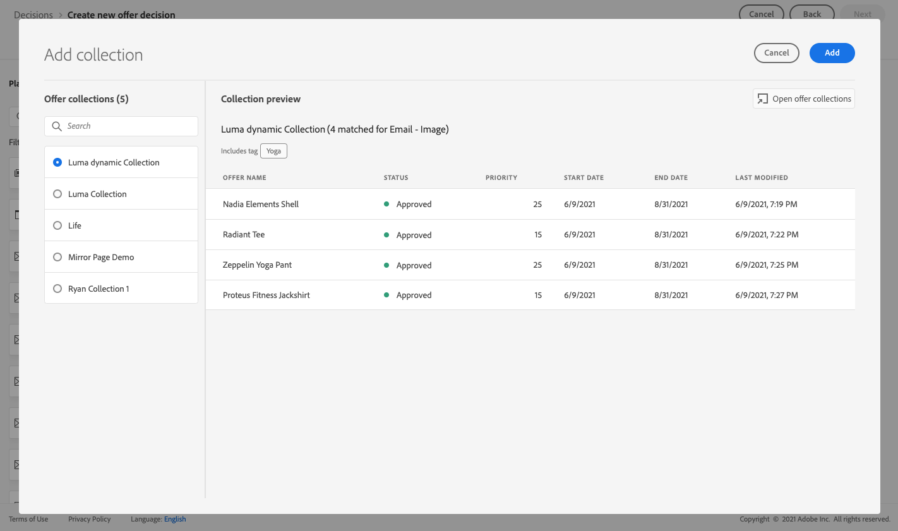

1. If you defined a ranking when [building your components](#define-components), you can assign it to a placement in the decision. If mutiple offers are eligible to be presented in this placement, the decision will use this formula to calculate which offer to deliver first.

    The detailed steps to assign a ranking formula to a placement are described in [this section](../../using/offers/offer-activities/configure-offer-selection.md#assign-ranking-formula).

1. Select the fallback offer that you created. It will be displayed as an available fallback offer for the three selected placements.

    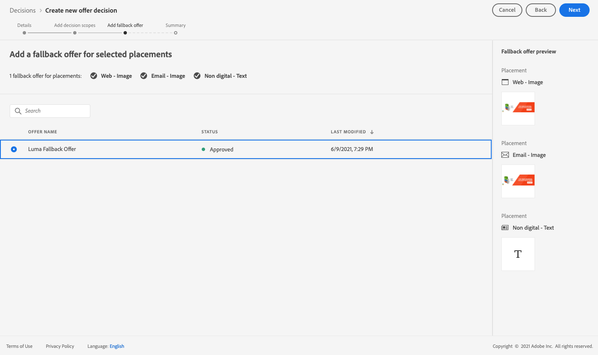

1. Review your decision, then click **[!UICONTROL Save and approve]**.

    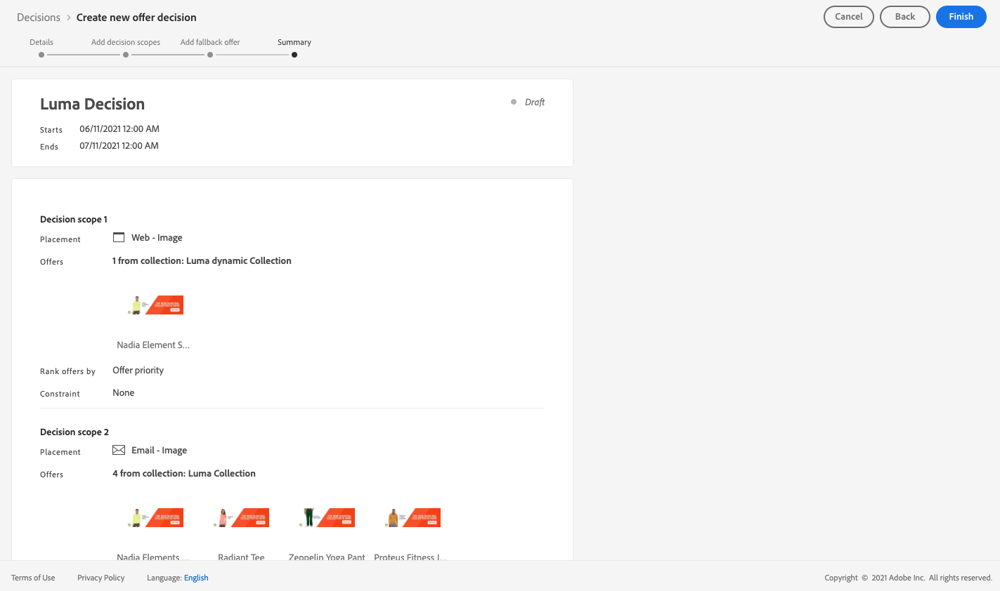

Your decision is now ready to be used to deliver optimized and personalized offers.

The detailed steps to create and configure a decision are described in [this section](../../using/offers/offer-activities/create-offer-activities.md).

## Insert the decision in an email {#insert-decision-in-email}

Now that your decision is live, you can insert it into an email message. To do so, follow the steps below:

1. Create your email, then open the [Email Designer](../../using/design-emails.md) to configure its content.

1. Add a structure component from the left palette.

1. Add an **[!UICONTROL Offer decision]** content component. Learn how to use content components in [this section](../../using/content-components.md).

    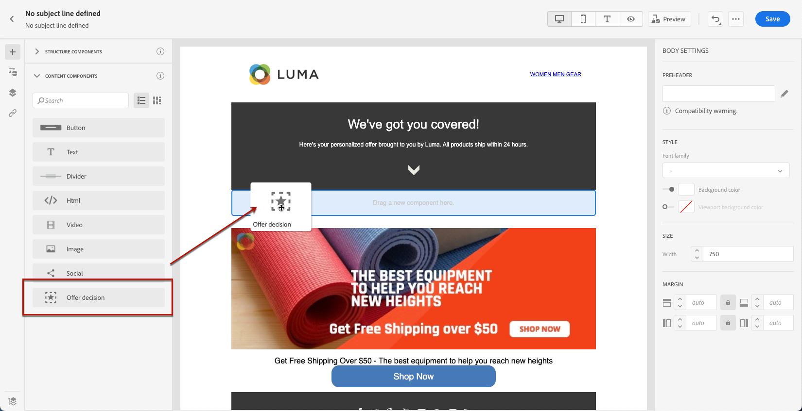

1. Select it and in the right palette, click **[!UICONTROL Select offer decision]** to add an offer activity.

    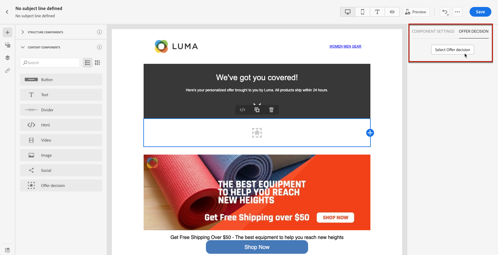

1. Select the placement corresponding to the offers that you want to display from the **[!UICONTROL Placements]** dropdown list.

    In this case, from the placements that you created earlier as part of this example, only the **Email - Image** placement is available as you want to use the decision in an email. Learn more on [creating placements](../../using/offers/offer-library/creating-placements.md).

    

1. Decisions matching the **Email - Image** placement are displayed. Select the decision to use in the content component, then click **[!UICONTROL Add]**.

    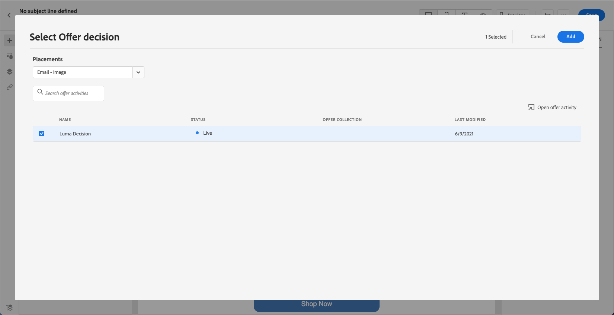

    >[!NOTE]
    >
    >Only decisions that are compatible with the selected placement display in the list.

You can now see all personalized offers and the fallback offer being visualized in the Email Designer.

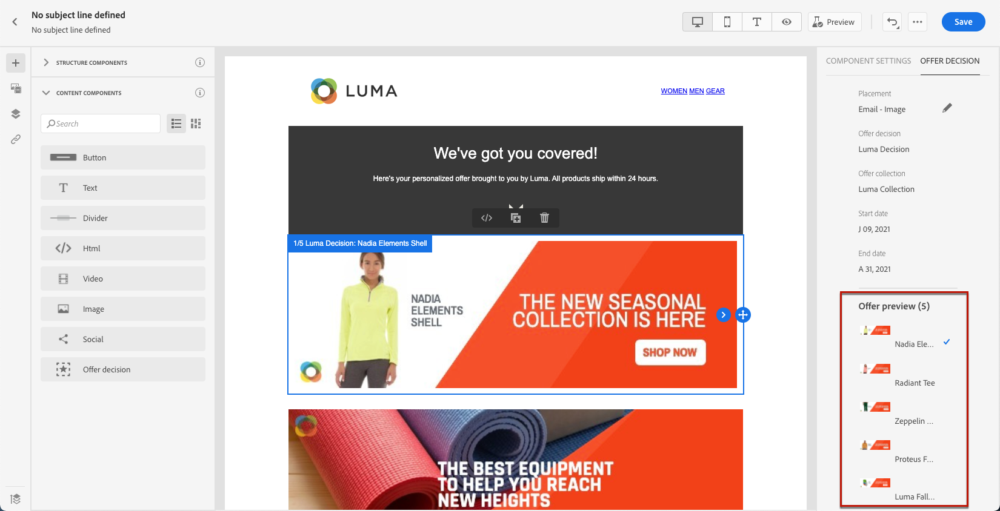

Use the **[!UICONTROL Offers]** section or the content components arrows (right and left arrows) to browse data. You can also display the different offers that are part of the decision with a customer profile. Learn more in [this section](../../using/deliver-personalized-offers.md#preview-offers-in-email).

After saving your changes and once the message is published, your offers are ready to be displayed to the relevant profiles when sending the message as part of a journey.

**Related topics:**

* Learn how to check the message preview in [this section](../../using/preview.md#preview-your-messages).

* Learn how to publish messages in [this section](../../using/publish-manage-message.md).

* Learn how messages are triggered by one or more journeys in [this section](../building-journeys/journey.md).

