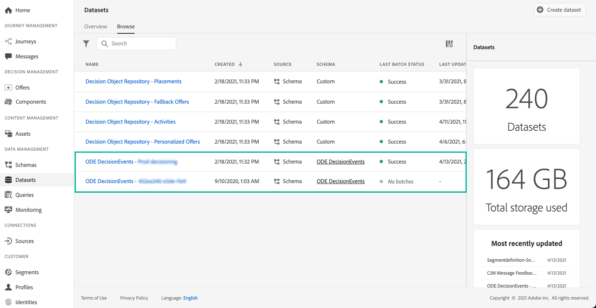

# Get started with Decision Management events {#monitor-offer-events}

Each time Decision Management makes a decision for a given profile, information related to these events are automatically sent to Adobe Experience Platform.

This allows you to export these data to analyze them into your own reporting system. You can also leverage Adobe Experience Platform [Query Service](https://experienceleague.adobe.com/docs/experience-platform/query/home.html) in combination with other tools for enhanced analysis and reporting purposes.

The datasets containing Decision Management events are accessible from Adobe Experience Platform **[!UICONTROL Datasets]** menu. One dataset is automatically created on provisioning for each of your instances.

These datasets are based on the **[!UICONTROL ODE DecisionEvents]** schema, which contains all the XDM fields that are required to send information from Decision Management to Adobe Experience Platform.  

>[!NOTE]
>
>Note that ODE DecisionEvents datasets are **non-profile datasets**, meaning that they cannot be ingested into Experience Platform for use by Real-time Customer Profile.

**Related topics:**

* [Decision Management events key information](../reports/key-information.md)
* [Access events XDM fields](../reports/xdm-fields.md)
