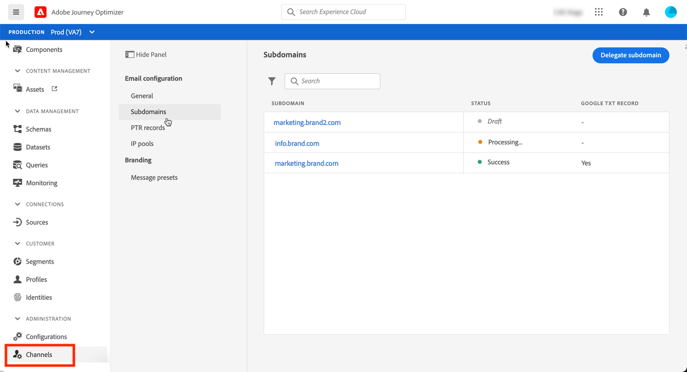
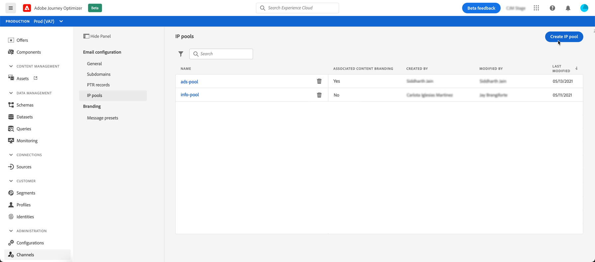

# Get Started for System Admin

 

Before starting using [!DNL Adobe Journey Optimizer], several steps are required to prepare your environment.

As a System Administrator, you need to **understand product profiles and assign permissions** for sandbox administration and channel configuration. You also need to setup sandbox(es) and manage them for the available product profiles.

You will then be able to assign team members to product profiles.

>[!NOTE]
>
>These capabilities can be managed by **[!UICONTROL Product administrators]** that have access to the Admin console. [Learn more about Adobe Admin Console](https://helpx.adobe.com/enterprise/managing/user-guide.html){target="_blank"}.

Learn about access management in the following pages:

1. **Understand product profiles**. Product profiles are a set of unitary rights which allows users access to certain functionalities or objects in the interface. Learn more in the [Out-of-the-box product profiles](../../using/administration/ootb-product-profiles.md) section.

1. **Set user permissions** and give access to your team members.  Permissions are unitary rights that allow you to define the authorizations assigned to **[!UICONTROL Product profile]**. Each permission is gathered under capabilities, e.g. Journey, Messages or Offers, which represents the different functionalities or objects in [!DNL Journey Optimizer]. Learn more in the [Permission levels](../../using/administration/high-low-permissions.md) section.

1. **Manage sandboxes** to partition your instances into separate, isolated virtual environments. Learn more in the [Sandboxes](../../using/administration/sandboxes.md) section.

In addition, you must * **Deploy [!DNL Adobe Experience Manager Assets Essentials]** to manage assets and images in your messages: users who need access to [!DNL Assets Essentials] must be a part of the **Assets Essentials Consumer Users** or/and **Assets Essentials Users** Product profiles. [Read more in Assets Essentials documentation](https://experienceleague.adobe.com/docs/experience-manager-assets-essentials/help/deploy-administer.html){target="_blank"}

When accessing [!DNL Journey Optimizer] for the first time, you are provisioned a production sandbox and allocated a certain number of IPs depending on your contract.

To be able to create your journeys and send messages, you need to go though these configuration steps:

1. **Configure messages and channels**: define presets, adapt and customize email and push messages

    * Define **push notifications settings** in both [!DNL Adobe Experience Platform] and [!DNL Adobe Experience Platform Launch]. [Learn more](../push-gs.md)

    * Create **message presets** to configure all the technical parameters required for email and push notification messages. [Learn more](../configuration/message-presets.md)

    * Manage the number of days during which **retries** are performed before sending email addresses to the suppression list. [Learn more](../configuration/manage-suppression-list.md)

1. **Delegate subdomains**: for any new subdomain to be used in Journey Optimizer, the first step will be to delegate it. [Learn more](about-subdomain-delegation.md)

    

1. **Create IP pools**: improve your email deliverability and reputation by grouping together IP addresses provisioned with your instance. [Learn more](ip-pools.md)

    
