# Manage permissions {#manage-permissions}

## Access to Customer Journey Management {#access-CJM}

[!DNL Customer Journey Management] allows you to assign a set of permissions to your users to define which part of the interface they can access.

They can be managed by Administrators that have access to the Admin console. [Learn more about Adobe Admin Console](https://helpx.adobe.com/enterprise/managing/user-guide.html).

To be able to access [!DNL Customer Journey Management], a user must be:

* part of a [!DNL Customer Journey Management] **[!UICONTROL product profile]** associated to [!DNL Customer Journey Management] permissions.

* part of an [!DNL Adobe Experience Platform] **[!UICONTROL product profile]**. There is no mandatory permission to have. The user should have the **[!UICONTROL profile management]** permission to be able to create and edit platform segments from [!DNL Customer Journey Management] interface. [Learn more about access control](https://experienceleague.adobe.com/docs/experience-platform/access-control/home.html?lang=en#adobe-admin-console).

In the Admin console, you can assign one of the following out-of-the-box product profiles to your users:

* **[!UICONTROL Limited Access User]**: user with read-only access to journeys and reports. This product profile includes the following permissions:
  * Read journeys
  * Read reports

* **[!UICONTROL Administrators]**: user with access to the administration menus with the possibility to manage journeys, events and reports. This product profile includes the following permissions:
  * Manage journeys
  * Publish journeys
  * Manage events, data sources and actions
  * Manage reports

* **[!UICONTROL Standard User]**: user with basic access such as journey management. This product profile includes the following permissions:
  * Manage journeys
  * Publish journeys
  * Manage reports
  * Read Events, data sources and actions

You can also create your own product profiles if the out-of-the-box profiles are not enough to manage your users.
Users must always be linked to a product profile allowing you to assign them specific build-in permissions such as:

* **[!UICONTROL Read journeys]**
* **[!UICONTROL Read reports]**
* **[!UICONTROL Manage events, data sources and actions]**
* **[!UICONTROL Read events, data sources and actions]**
* **[!UICONTROL Manage journeys]**
* **[!UICONTROL Publish journeys]**
* **[!UICONTROL Manage reports]**

>[!NOTE]
>
> Permission management does not include messages: every user can create or modify messages.

### Creating a product profile {#create-product-profile}

[!DNL Customer Journey Management] allows you to create your own product profiles and assign a set of permissions and sandboxes to your users. With product profiles, you can authorize or deny access to certain functionalities or objects in the interface.

For more information on how to create and manage sandboxes, refer to [Adobe Experience Platform documentation](https://experienceleague.adobe.com/docs/experience-platform/sandbox/ui/user-guide.html).

To create a product profile and assign a set of permissions and sandboxes:

1. In the Admin Console, select **[!UICONTROL Journey Orchestration]**. From the **[!UICONTROL Product profile]** tab, click **[!UICONTROL New Profile]**.

    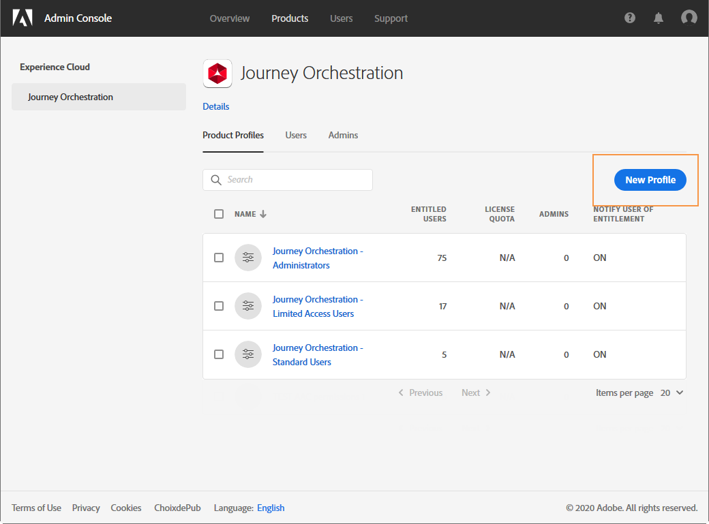

1. Add a **[!UICONTROL Profile Name]** and **[!UICONTROL Description]** for your new product profile. If you want your profile's **[!UICONTROL Display name]** to be different, uncheck **[!UICONTROL Same as Profile Name]** and type in your **[!UICONTROL Display name]**.

1. In the **[!UICONTROL User Notifications]** category, choose whether users will be notified by email when they are added or removed from this product profile.

1. When finished, click **[!UICONTROL Done]**. Your new product profile is now created.

    

1. Select your new product profile to start managing permissions. In the **[!UICONTROL Users]** tab, add users to your product profile. [Learn how to assign product profile](permissions.md#assigning-product-profile).

1. Carry out the same steps as detailed above to add **[!UICONTROL Admin]** to your product profile.

1. From the **[!UICONTROL Permissions]** tab, select one of the two categories **[!UICONTROL Sandbox]** or **[!UICONTROL Authoring]** to open the **[!UICONTROL Edit Permissions]** page and add or remove permissions for your product profile.

    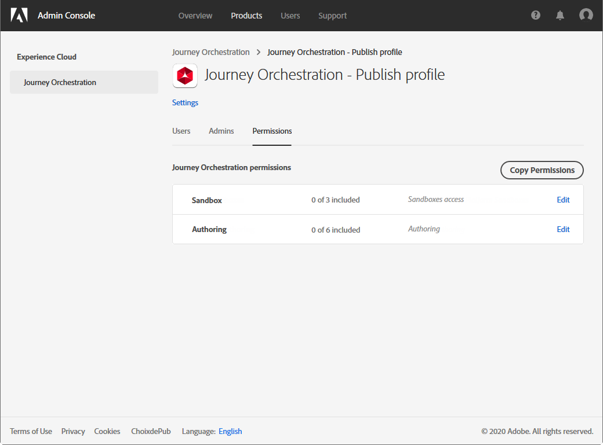

1. In the **[!UICONTROL Sandboxes]** permission category, choose which sandbox(es) to assign to your product profile. Under **[!UICONTROL Available Permissions Items]**, click the plus (+) icon to assign sandboxes to your profile. [Learn more about sandboxes](https://experienceleague.adobe.com/docs/experience-platform/sandbox/home.html).

    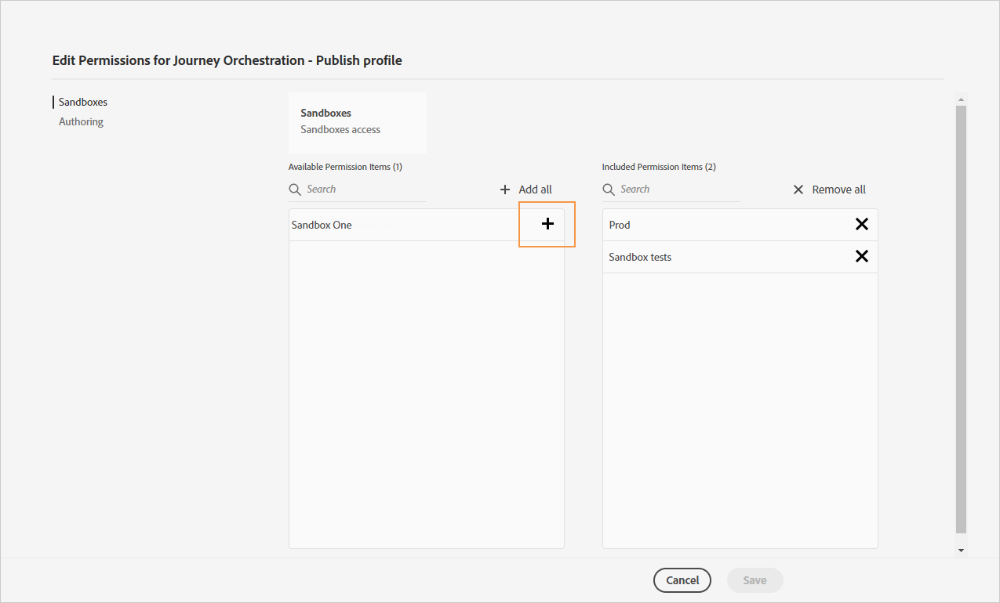

1. If needed, under **[!UICONTROL Included Permission Items]**, click the X icon next to remove permissions to your product profile.

    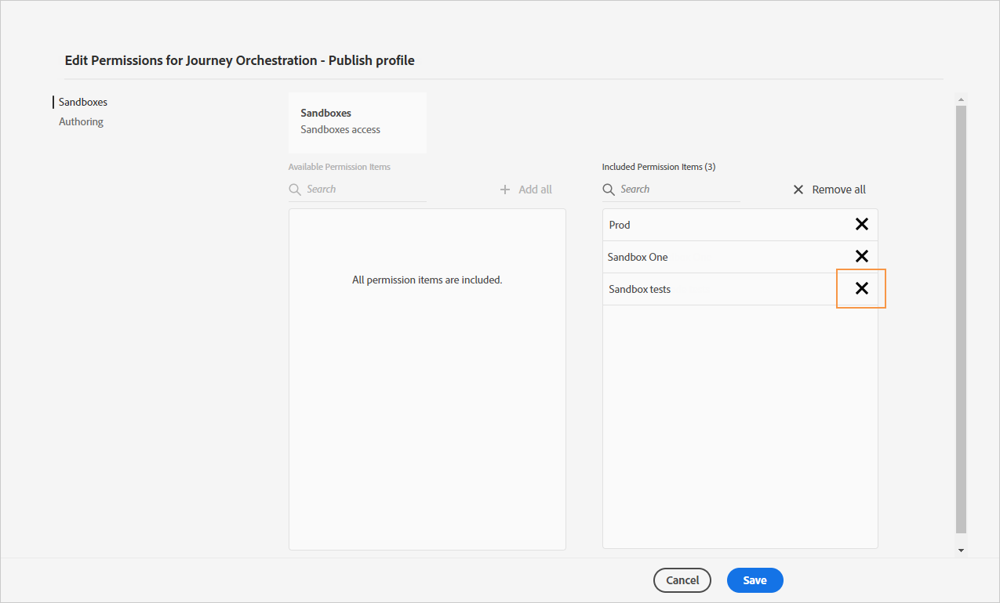

1. From the **[!UICONTROL Authoring]** permission category, carry out the same steps as above to add permissions to your product profile.

    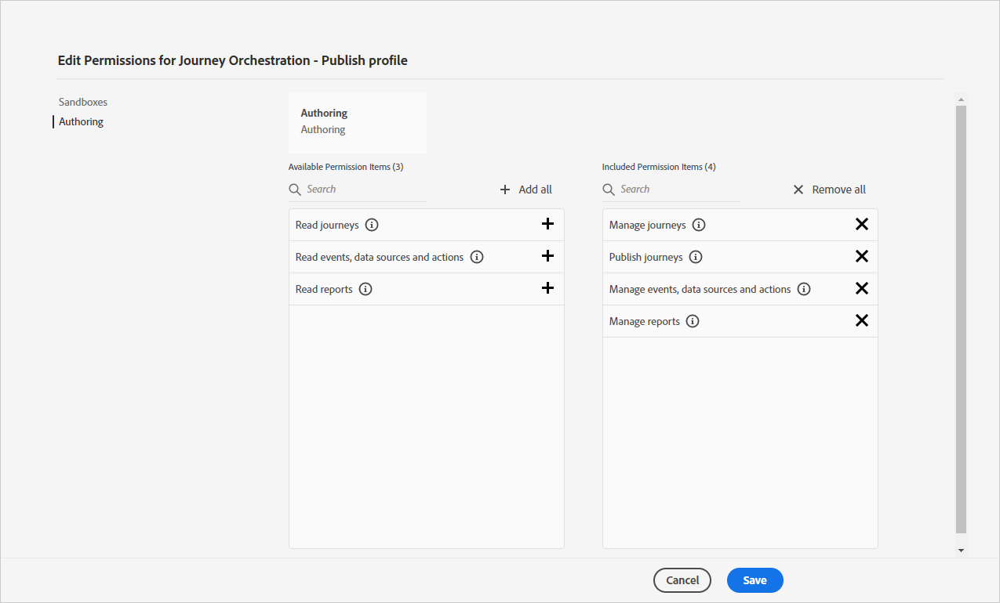

1. When finished, click **[!UICONTROL Save]**.

Your product profile is now created and configured. Users linked to this profile can now connect to [!DNL Customer Journey Management].

### Assigning a product profile {#assigning-product-profile}

Product profiles are assigned to a set of users that share the same permissions within your organization.
The list of every out-of-the-box product profiles with assigned permissions can be found in this section.

To assign a product profile for a user to access journeys:

1. In the Admin Console, select **[!UICONTROL Journey Orchestration]**.

    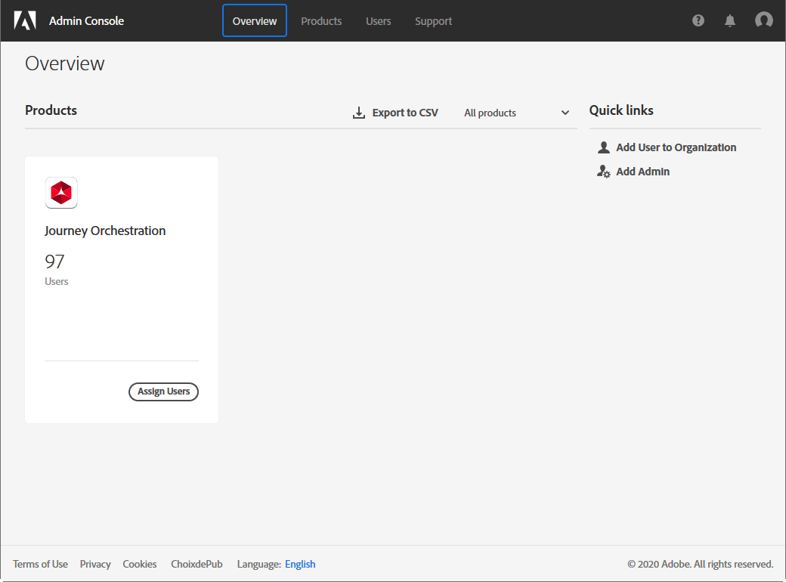

1. Select the product profile to which your new user will be linked to.

    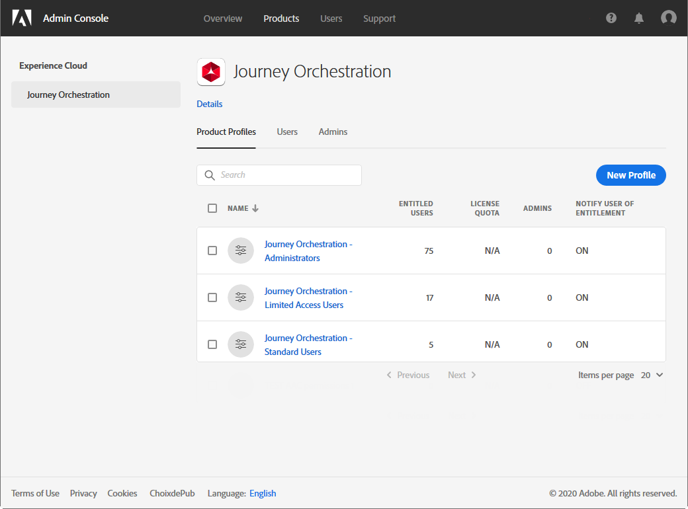

1. Click **[!UICONTROL Add user]**.

   You can also add your new user to a user group to fine-tune the shared set of permissions. [Learn more about user groups](https://helpx.adobe.com/enterprise/using/user-groups.html).

    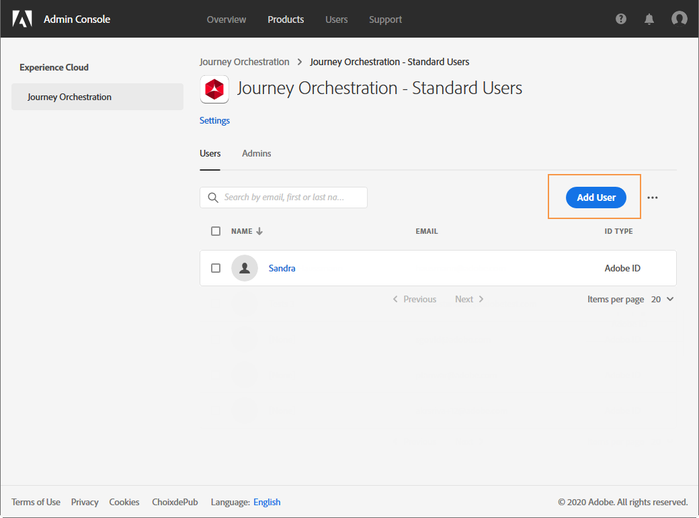

1. Type in the email address of your new user then click **[!UICONTROL Save]**.

    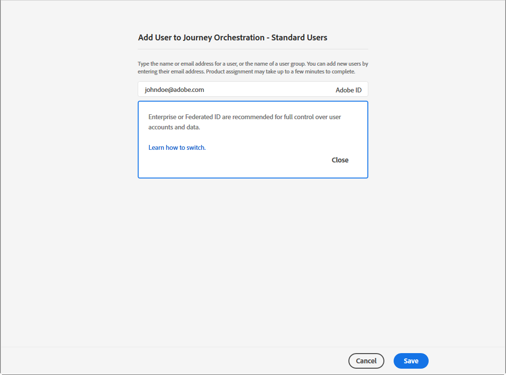

Your user should then receive an email redirecting to your instance.

## Using sandboxes {#sandboxes}

[!DNL Customer Journey Management] allows you to partition your instance into separated virtual environments called sandboxes.
Sandboxes are assigned through product profiles in the Admin console. [Learn how to assign sandboxes](permissions.md#create-product-profile).

[!DNL Customer Journey Management] reflects Adobe Experience Platform sandboxes which were created for a given organization.
Adobe Experience Platform sandboxes can be created or reset from your Adobe Experience Platform instance. [Learn more in the Sandbox user guide](https://experienceleague.adobe.com/docs/experience-platform/sandbox/ui/user-guide.html).

You can find the sandbox switcher control at the top-left of your screen. To switch from one sandbox to another, click the currently active sandbox in the switcher and select another sandbox from the drop-down list.

## Access to Content {#content-access}

To configure your content accessibility, you need to assign a content shared folder to each of your sandboxes. You can create and configure your shared folder in the **[!UICONTROL Storage]** tab displayed in the [!DNL Admin Console] for administrators. If you have access to the [!DNL Admin Console] as a system administrator, you can create shared folders and add delegates with different access level to your shared folders.

Note that for your content to sync with the correct sandbox, you have to follow the same syntax as the sandbox e.g. if your sandbox is called development your shared folder should have the same name.

[Learn how to manage shared folders](https://helpx.adobe.com/enterprise/admin-guide.html/enterprise/using/manage-adobe-storage.ug.html).

## Assets Essentials permissions {#assets-permissions}

Adobe Experience Manager Assets Essentials provides a single, centralized repository of assets that you can use to populate your messages.
Each asset is saved in folders or sub-folders. You can choose to share your folders and which level of access to assign.

1. From the **[!UICONTROL Assets]** tab, navigate through your folders to find the one you need to share.

1. Select your folder or asset and click **[!UICONTROL Share]**.

    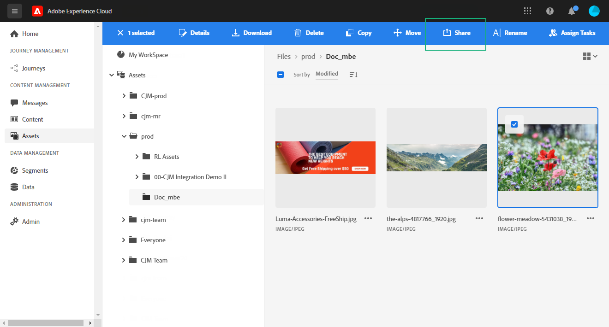

1. Enter the email address of the different person you want to share access to your folder with.

1. Choose between the different access level:

    * **[!UICONTROL Can view]**
    * **[!UICONTROL Can edit]**
    * **[!UICONTROL Has ownership (can share, edit, and delete)]**

    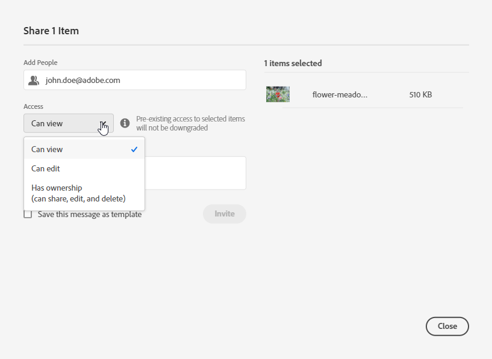

1. Add a message to your invite if needed.

1. Click **[!UICONTROL Invite]**.

    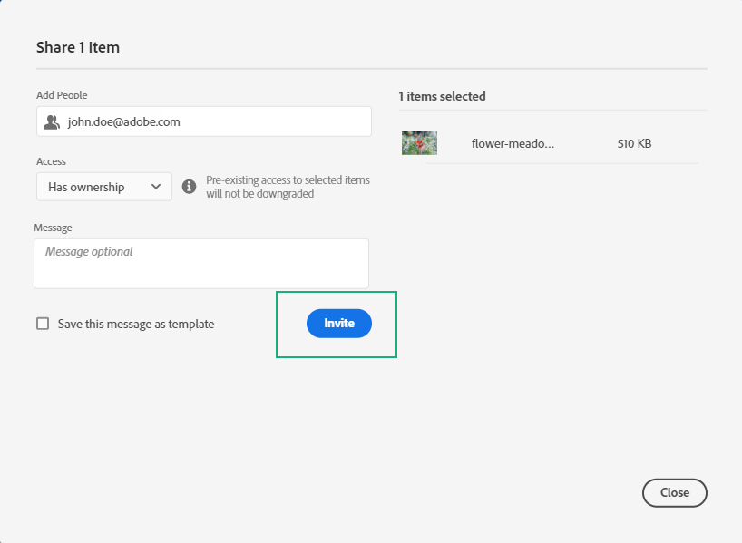
