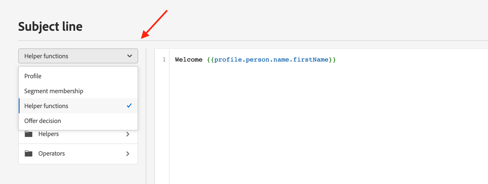

# Helper functions library{#functionsL}

Use [!DNL Journey Optimizer] templating language to perform operations on data, such as calculations, data formatting or conversions, conditions, and manipulate them in the context of personalization. Learn personalization syntax guidelines in [this page](../personalization-syntax.md).

➡️ [Discover how to use helper functions](#video) (video)

Templating language is leveraged in helper functions available in personalization drop-down list of the Expression Editor, as below:

In the [!DNL Journey Optimizer] Expression Editor, helper functions are grouped into three categories: [Functions](#functions-helper), [Helpers](#helper-helper) and [Operators](#operators-helper).

## Functions{#functions-helper}

### Array Functions
 
<table>
    <tr>
        <td><a href="aggregation.md#average">Average</a></td><td>This function returns the arithmetic mean of all the selected values within the array</td>
    </tr>
    <tr>
        <td><a href="arrays-list.md#in">In</a></td><td>This function is used to determine if an item is a member of an array or list</td>
    </tr>
    <tr>
        <td><a href="aggregation.md#min">Minimum</a></td><td>This function returns the smallest of all the selected values within the array</td>
    </tr>
    <tr>
        <td><a href="aggregation.md#count">Count</a></td><td>This function returns the number of elements within the given array</td>
    </tr>
    <tr>
        <td><a href="arrays-list.md#includes">Includes</a></td><td>This function determines if an array or list contains a given item</td>
    </tr>
    <tr>
        <td><a href="arrays-list.md#notin">Not in</a></td><td>This function determines if an item is not a member of an array or list</td>
    </tr>
    <tr>
        <td><a href="arrays-list.md#distinct">Distinct</a></td><td>This function gets values from an array or a list with duplicate values removed</td>
    </tr>
    <tr>
        <td><a href="arrays-list.md#intersects">Intersects</a></td><td>This function determines if two arrays or lists have at least one common member</td>
    </tr>
    <tr>
        <td><a href="arrays-list.md#subset">Subset of</a></td><td>This function determines if a specific array (array A) is a subset of another array (array B), i.e. if all elements in array A are elements of array B</td>
    </tr>
    <tr>
        <td><a href="arrays-list.md#head">First item</a></td><td>This function returns the first item in an array or a list</td>
    </tr>
    <tr>
        <td><a href="arrays-list.md#last-n">Last n in array</a></td><td>This function returns the last `N` items in an array, when sorted in ascending order based on the given numerical expression</td>
    </tr>
    <tr>
        <td><a href="aggregation.md#sum">Sum</a></td><td>This function returns the sum of all the selected values within the array</td>
    </tr>
    <tr>
        <td><a href="arrays-list.md#first-n">First n in array</a></td><td>This function returns the first `N` items in an array, when sorted in ascending order based on the given numerical expression</td>
    </tr>
    <tr>
        <td><a href="aggregation.md#max">Maximum</a></td><td>This function returns the largest of all the selected values within an array</td>
    </tr>
    <tr>
    <td><a href="arrays-list.md#superset">Superset of</a></td><td>This function determines if a specific array (array A) is a superset of another array (array B), i.e. if that array A contains all elements in array B</td>
    </tr>
</table>

### Date Time Functions{#date-functions}

<table>
    <tr>
        <td><a href="dates.md#age">Age</a></td><td>This function retrieves the age from a given date</td>
    </tr>
    <tr>
        <td><a href="dates.md#current">Current time in milliseconds</a></td><td>This function retrieves current time in epoch millisecond</td>
    </tr>
    <tr>
        <td><a href="dates.md#date-diff">Date difference</a></td><td>This function retrieves the difference between two dates in number of days</td>
    </tr>
    <tr>
        <td><a href="dates.md#day-week">Day of week</a></td><td>This function retrieves the day of week</td>
    </tr>
    <tr>
        <td><a href="dates.md#day-year">Day of year</a></td><td>This function retrieves the day of year</td>
    </tr>
    <tr>
        <td><a href="dates.md#format-date">Format date</a></td><td>This function formats a date time value</td>
    </tr>
    <tr>
        <td><a href="dates.md#set-days">Set days</a></td><td>This function sets the day of the month for the given date-time</td>
    </tr>
    <tr>
        <td><a href="dates.md#set-hours">Set days</a></td><td>This function sets the hour of the date-time</td>
    </tr>
    <tr>
        <td><a href="dates.md#to-utc">To UTC</a></td><td>This function converts a datetime to UTC</td>
    </tr>
    <tr>
        <td><a href="dates.md#week-of-year">Week of year</a></td><td>This function returns the week of the year</td>
    </tr>
</table>
</table>

### Map Functions

<table>
    <tr>
        <td><a href="maps.md#get">Get</a></td><td>This function is used to retrieve the value of a map for a given key</td>
    </tr>
    <tr>
        <td><a href="maps.md#keys">Keys</a></td><td>This function is used to retrieve all the keys for a given map</td>
    </tr>
    <tr>
        <td><a href="maps.md#values">Values</a></td><td>This function retrieves all the values of a given map</td>
    </tr>
</table>

**Object Functions**

<table>
    <tr>
        <td><a href="objects.md#isNotNull">Is not null</a></td><td>This function is used to determine if an object reference exists</td>
    </tr>
    <tr>
        <td><a href="objects.md#isNull">Is null</a></td><td>This function is used to determine if an object reference does not exist</td>
    </tr>
</table>

### String Functions

<table>
    <tr>
        <td><a href="string.md#camelCase">Camel Case</a></td><td>This function is used to capitalize the first letter of each word of a string</td>
    </tr>
    <tr>
        <td><a href="string.md#concat">Concat</a></td><td>This function is used to combine two strings into one</td>
    </tr>
    <tr>
        <td><a href="string.md#contains">Contains</a></td><td>This function is used to determine if a string contains a specified substring</td>
    </tr>
    <tr>
        <td><a href="string.md#doesNotContain">Does not contain</a></td><td>This function is used to determine if a string does not contain a specified substring</td>
    </tr>
    <tr>
        <td><a href="string.md#doesNotEndWith">Does not end with</a></td><td>This function is used to determine if a string does not end with a specified substring</td>
    </tr>
    <tr>
        <td><a href="string.md#doesNotStartWith">Does not start with</a></td><td>This function is used to determine if a string does not start with a specified substring</td>
    </tr>
    <tr>
        <td><a href="string.md#encode64">Encode 64</a></td><td>This function is used to encode or decode a string</td>
    </tr>
    <tr>
        <td><a href="string.md#endsWith">Ends with</a></td><td>This function is used to determine if a string ends with a specified substring</td>
    </tr>
        </tr>
    <tr>
        <td><a href="string.md#equals">Equals</a></td><td>This function is used to determine if a string does not start with a specified substring, with case sensitivity</td>
    </tr>
    <tr>
        <td><a href="string.md#equalsIgnoreCase">Equals Ignore Case</a></td><td>This function is used to determine if a string does not start with a specified substring, without case sensitivity</td>
    </tr>
    <tr>
        <td><a href="string.md#extractEmailDomain">Extract Email Domain</a></td><td>This function is used to extract the domain of an email address</td>
    </tr>
    <tr>
        <td><a href="string.md#isEmpty">IsEmpty</a></td><td>This function is used to check if a string or expression is empty.</td>
    </tr>
    <tr>
        <td><a href="string.md#leftTrim">Left trim</a></td><td>This function removes white spaces from beginning of a string</td>
    </tr>
    <tr>
        <td><a href="string.md#length">Length</a></td><td>This function is used to get the number of characters in a string or an expression</td>
    </tr>
    <tr>
        <td><a href="string.md#like">Like</a></td><td>This function is used to determine if a string matches a specified pattern</td>
    </tr>
    <tr>
        <td><a href="string.md#lower">Lower Case</a></td><td>This function converts a string to lower case letters</td>
    </tr>
    <tr>
        <td><a href="string.md#matches">Matches</a></td><td>This function is used to determine if a string matches a specific regular expression</td>
    </tr>
    <tr>
        <td><a href="string.md#notEqualTo">Not equals to</a></td><td>This function is used to determine if a string is not equal to the specified string</td>
    </tr>
    <tr>
        <td><a href="string.md#regexGroup">Regular expression group</a></td><td>This function is used to extract specific information, based on the regular expression provided</td>
    </tr>
    <tr>
        <td><a href="string.md#replace">Replace</a></td><td>This function replaces a given substring in a string with another substring</td>
    </tr>
    <tr>
        <td><a href="string.md#replaceAll">Replace all</a></td><td>This function replaces all substrings of a text that matches the "target" with the specified literal "replacement" string</td>
    </tr>
    <tr>
        <td><a href="string.md#rightTrim">Right trim</a></td><td>This function removes white spaces from end of a string </td>
    </tr>
    <tr>
        <td><a href="string.md#split">Split</a></td><td>This function is used to split a string by a given character</td>
    </tr>
    <tr>
        <td><a href="string.md#startsWith">Starts with</a></td><td>This function is used to determine if a string starts with a specified substring</td>
    </tr>
    <tr>
        <td><a href="string.md#titleCase">Title Case</a></td><td>This function is used to capitalize first letters of each words of a string</td>
    </tr>
    <tr>
        <td><a href="string.md#trim">Trim</a></td><td>This function removes white spaces from the beginning and from end of a string</td>
    </tr>
    <tr>
        <td><a href="string.md#upper">Upper case</a></td><td>This function converts a string to upper case letters</td>
    </tr>
</table>

## Helpers{#helper-helper}

Helpers are detailed in [this page](helpers.md).

<table>
    <tr>
        <td><a href="helpers.md#each">Each</a></td><td>This function is used to iterate over an array</td>
    </tr>
    <tr>
        <td><a href="helpers.md#if-function">If</a></td><td>This function is used to define a conditional block - if the expression evaluation returns true, the block is rendered</td>
    </tr>
    <tr>
        <td><a href="helpers.md#let">Let</a></td><td>This function allows an expression to be stored as a variable to be used later in a query</td>
    </tr>
   <tr>
        <td><a href="helpers.md#unless">Unless</a></td><td>This function is used to define a conditional block - if the expression evaluation returns false, the block is rendered</td>
    </tr>
    <tr>
        <td><a href="helpers.md#with">With</a></td><td>This function is used to change the evaluation token of template-part</td>
    </tr>
</table>

## Operators{#operators-helper}

### Arithmetic functions {#arithmetic-helper}

Arithmetic functions are used to perform basic calculations on values.

<table>
    <tr>
        <td><a href="arithmetic-functions.md#add">Addition</a></td><td>This operator is used to find the sum of two argument expressions</td>
    </tr>
    <tr>
        <td><a href="arithmetic-functions.md#divide">Divide</a></td><td>This operator is used to find the quotient of two argument expressions</td>
    </tr>
    <tr>
        <td><a href="arithmetic-functions.md#multiply">Multiplication</a></td><td>This operator is used to find the product of two argument expressions</td>
    </tr>
    <tr>
        <td><a href="arithmetic-functions.md#remainder">Remainder</a> </td><td>This operator is used to  find the remainder after dividing the two argument expressions</td>
    </tr>
    <tr>
        <td><a href="arithmetic-functions.md#substract">Subtraction</a> </td><td>This operator finds the difference between two expressions</td>
    </tr>
</table>

### Boolean functions

Boolean functions are used to perform boolean logic on different elements.

<table>
    <tr>
        <td><a href="operators.md#and">And</a></td><td>This operator creates a logical conjunction</td>
    </tr>
    <tr>
        <td><a href="operators.md#not">If</a></td><td>This operator resolves an expression depending on whether a specified condition is true</td>
    </tr>
    <tr>
        <td><a href="operators.md#not">Not</a></td><td>This operator creates a logical negation</td>
    </tr>
    <tr>
        <td><a href="operators.md#or">Or</a></td><td>This operator creates a logical disjunction</td>
    </tr>
</table>

### Comparison functions

Comparison functions are used to compare between different expressions and values, returning true or false accordingly.

<table>
    <tr>
        <td><a href="operators.md#and">Equals to</a></td><td>This operation checks if values are equal</td>
    </tr>
    <tr>
        <td><a href="operators.md#greaterthan">Greater than</a></td><td>This operator checks if first value is greater than the second value</td>
    </tr>
    <tr>
        <td><a href="operators.md#greaterthanorequal">Greater or equals to</a></td><td>This operator checks if first value is greater than or equal to the second value</td>
    </tr>
    <tr>
        <td><a href="operators.md#notequal">Not equals to</a></td><td>This operator checks if given expression not equal to give value</td>
    </tr>
    <tr>
        <td><a href="operators.md#lessthanorequal">Less than or equals to</a> </td><td>This operator checks if first value is smaller than or equal to the second value</td>
    </tr>
</table>

## How-to video{#video}

Learn how to transform personalization values using personalization helper functions and understand different use cases for helper functions.

>[!VIDEO](https://video.tv.adobe.com/v/334244?quality=12)
