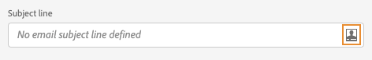
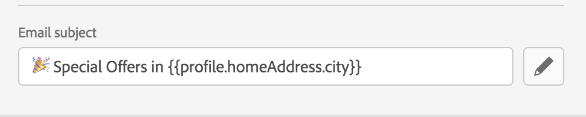
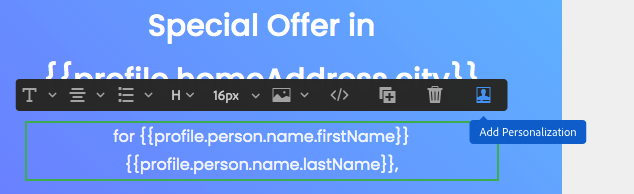
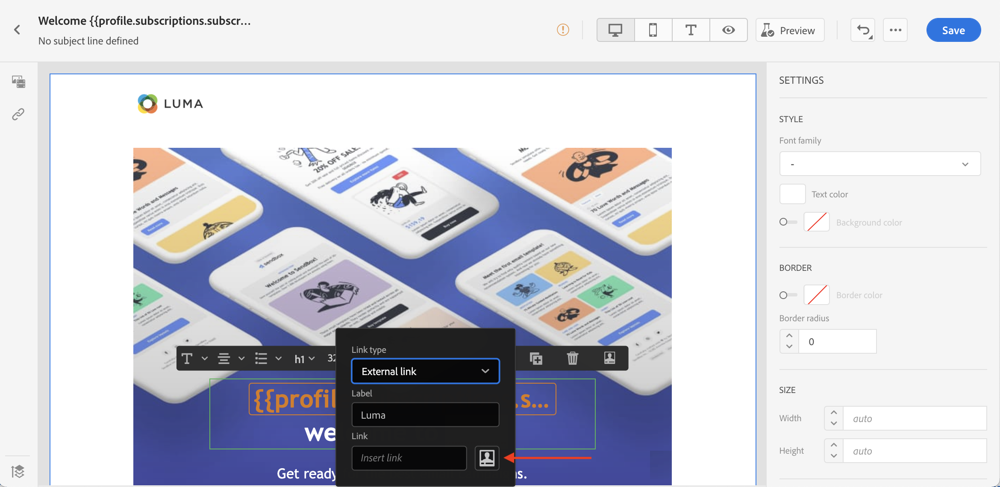
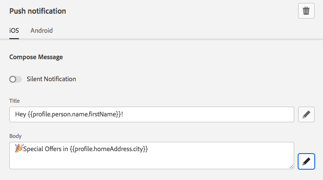
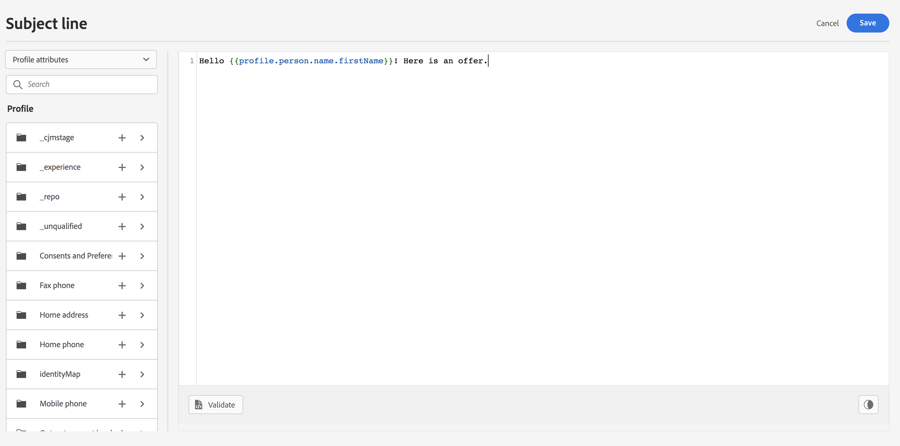
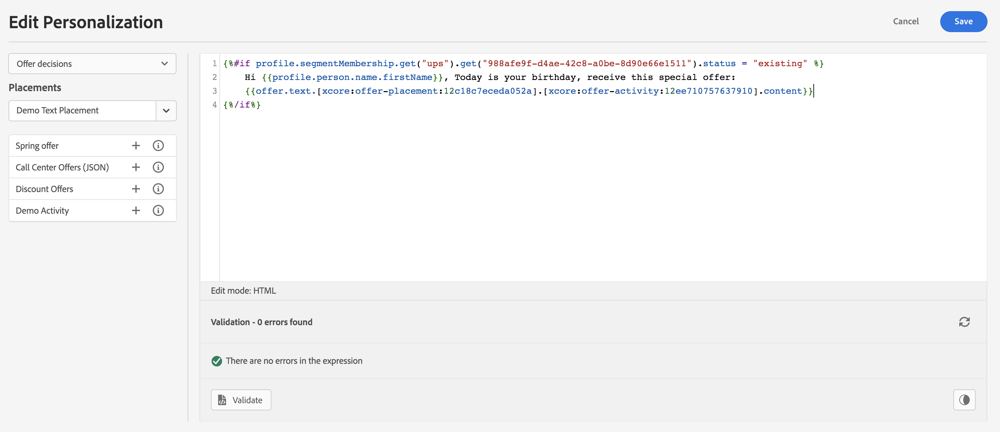

# Personalization areas {#personalization-areas}

The content and display of messages delivered by Journey Optimizer can be personalized in several different ways.

All the fields associated with the editor icon can open the personalization editor and receive personalization content.

## Personalize your emails

During email channel message creation, the **Email subject** field is personalizable.

In the Email designer, you can personalize the content:

* In the **message**: click inside a text block, click the **Personalize** icon from the contextual toolbar and select **Insert personalization** field. For more on the Email Designer interface, see this [section](../design-emails.md).
    
    

* For a **link**: select some text or image inside a text block, click the **Insert link** icon from the contextual toolbar. In the window, you can add a personalization block by clicking on the **Add personalization** icon.

    

## Personalize push notifications

In the **Push channel**, the personalization lets you fine-tune your push notification.

You can add personalization in the following fields:

* **Title**
* **Body**
* **Custom sound**
* **Badges**
* **Custom data**

For a complete documentation about Push notification configuration, refer to [this section](../configure-push.md).

## Use the expression editor

The expression editor is the centerpiece of the personalization in Journey Optimizer.

It is available in every context where you need to define personalization like emails, push and offers.

In the expression editor interface, you will select, arrange, customize and validate all the data to create a customized personalization for your content.

 

The left part of the screen displays a domain selector that lets you select the source for personalization.

* **Profile** : lists all the references associated to the profile schema described in [Adobe Experience Platform Data Model (XDM) documentation](https://experienceleague.adobe.com/docs/experience-platform/xdm/home.html).
* **Segment membership** : lists all the segments created in the Adobe Experience Platform Segmentation service. More information on segmentation available [here](https://experienceleague.adobe.com/docs/experience-platform/segmentation/home.html?lang=en).
* **Offers** : lists all the offers associated to a specific placement. Select the placement then insert the offers in your content. For a complete documentation on how to manage offers, refer to [this section](../../using/offers/get-started/starting-offer-decisioning.md).

On selection, the reference is added in the editor. 

>[!NOTE]
>
>The info icon next to "+" icon opens up a tooltip providing more details for each variable.

In the following example, the expression editor lets you select the profiles that have their birthday today then complete the customization by inserting a specific offer corresponding to this day.

 

