# Personalization use case: cart abandonment email {#personalization-use-case-helper-functions}

In this example, you will personalize the body of an email message. This message targets customers who have left items in their shopping cart, but have not completed their purchase.

You will use these types of helper functions:

* The `upperCase` string function, to insert the customer's first name in capital letters. [Learn more](functions/string.md#upper).
* The `each` helper, to list the items that are in the cart. [Learn more](functions/helpers.md#each).
* The `if` helper, to insert a product-specific note if the related product is in the cart. [Learn more](functions/helpers.md#if-function).
<!-- **Context**: personalization based on contextual data from the journey -->

Before you start, ensure you know how to configure these elements:
* An email message. [Learn more](../create-message.md)
* The body of an email. [Learn more](../create-email-content.md).
* A unitary event. [Learn more](../event/about-events.md).
* A journey that starts with an event. [Learn more](../building-journeys/using-the-journey-designer.md).

Follow these steps:
1. [Create an email message](#configure-email).
2. [Insert the customer's first name in capital letters](#uppercase-function).
3. [Create the initial event and the journey](#create-context).
4. [Add the cart content to the email](#each-helper).
5. [Insert a product-specific note](#if-helper).
6. [Test and publish the journey](#test-and-publish).

## Step 1: Create the email{#configure-email}

1. Create or modify an email message, then click **[!UICONTROL Email Designer]**.
   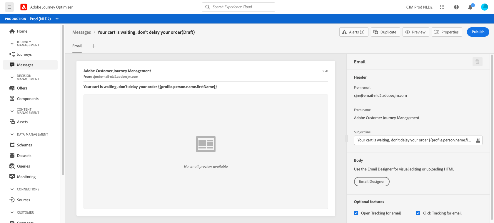

2. From the left palette of the Email Designer home page, drag and drop three structure components onto the body of the message.
   
3. Drag and drop an HTML content component onto each new structure component.

   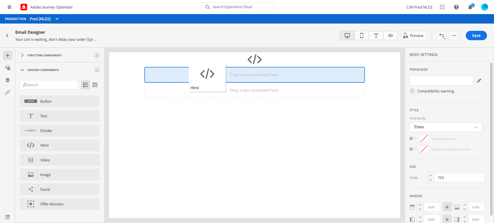

## Step 2: Insert the customer's first name in capital letters {#uppercase-function}

1. On the Email Designer home page, click on the HTML component where you want to add the customer's first name.
2. On the contextual toolbar, click **[!UICONTROL Show the source code]**.
   
   

3. In the **[!UICONTROL Edit HTML]** window, add the `upperCase` string function:
   1. In the list, select **[!UICONTROL Helper functions]**.
   2. Use the search field to find "uppercase".
   3. From the search results, add the `upperCase` function. To do this, click the Plus (+) sign next to `: string`.

      The Expression editor shows this expression:

      ```handlebars
      
      ``` 
      
      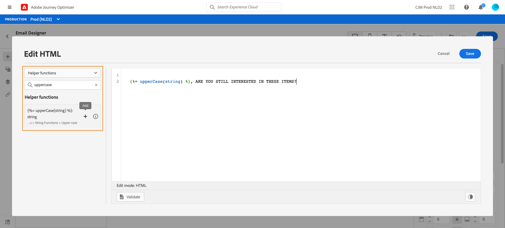
   
4. Remove the "string" placeholder from the expression.
5. Add the first name token:
   1. In the list, select **[!UICONTROL Profile]**.
   2. Select **[!UICONTROL Profile]** > **[!UICONTROL Person]** > **[!UICONTROL Full name]**.
   3. Add the **[!UICONTROL First name]** token to the expression.
      
      The Expression editor shows this expression:

      ```handlebars
      
      ``` 
   
      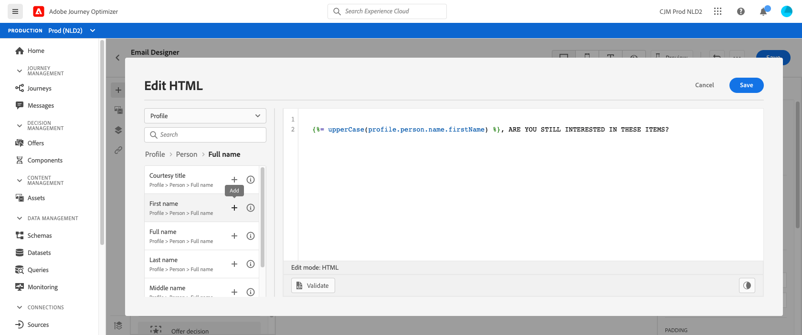

      Learn more about the person name data typein [Adobe Experience Plaform documentation](https://experienceleague.adobe.com/docs/experience-platform/xdm/data-types/person-name.html){target="_blank"}.

6. Click **[!UICONTROL Validate]**, then click **[!UICONTROL Save]**.
   
   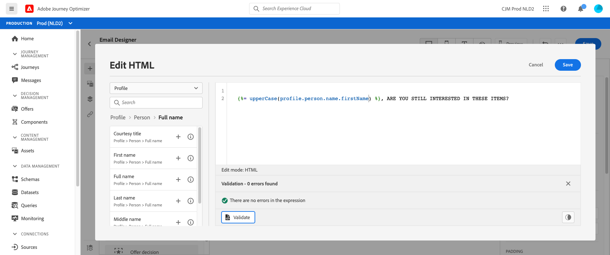
7. Save the message.

## Step 3: Create the initial event and the related journey {#create-context}

The cart content is contextual information from the journey. Therefore, you must add an initial event and the email to a journey before you can add cart-specific information to the email.

1. Create an event whose schema includes the `productListItems` array.
2. Define all the fields from this array as payload fields for this event.

   Learn more about the product list item data typein [Adobe Experience Platform documentation](https://experienceleague.adobe.com/docs/experience-platform/xdm/data-types/product-list-item.html){target="_blank"}.

3. Create a journey that starts with this event.
4. Add the message to the journey.
5. End the journey with an end activity.

   Because you have not yet published the message, you cannot neither test nor publish the journey.
   
   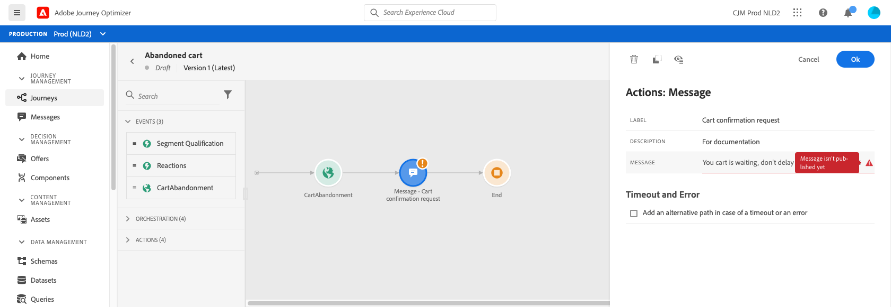

6. Click **[!UICONTROL OK]**.

   A message informs you that the journey context has been passed to the message.

   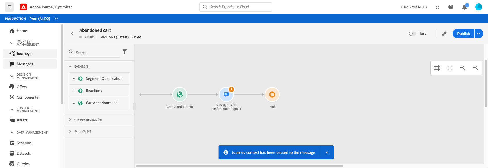

## Step 4: Insert the list of items from the cart {#each-helper}

1. Reopen the message.
   
   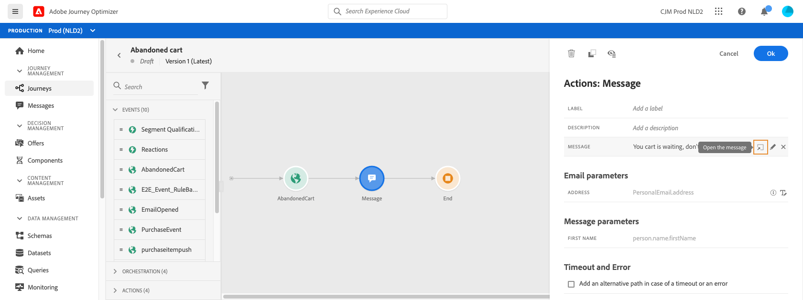

2. On the Email Designer home page, click on the HTML component where you want to list the cart content.
3. On the contextual toolbar, click **[!UICONTROL Show the source code]**.
   
   

4. In the **[!UICONTROL Edit HTML]** window, add the `each` helper:
   1. In the list, select **[!UICONTROL Helper functions]**.
   2. Use the search field to find "each".
   3. From the search results, add the `each` helper.

      The Expression editor shows this expression:
      ```handlebars
      {{#each someArray as |variable|}} {{/each}}
      ```
   
      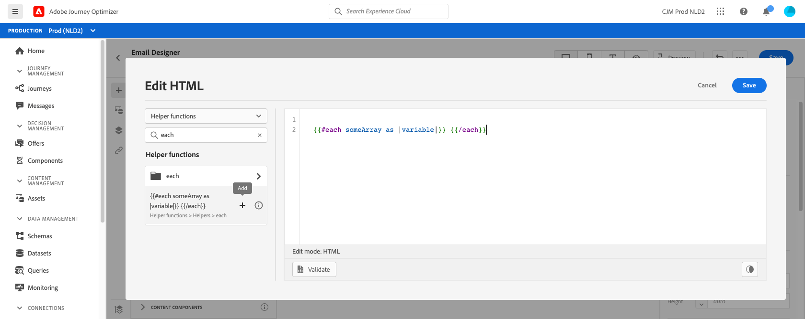

5. Add the `productListItems` array to the expression:

   1. Remove the "someArray" placeholder from the expression.
   2. In the list, select **[!UICONTROL Context]**.
   
      The **[!UICONTROL Context]** option is available only after the journey context has been passed to the message.
   
   3. Select **[!UICONTROL Journey Orchestration]** > **[!UICONTROL Events]** > ***[!UICONTROL event_name]***, then expand the **[!UICONTROL productListItems]** node.
   
      In this example, *event_name* represents the name of your event.

   4. Add the **[!UICONTROL Product]** token to the expression.

      The Expression editor shows this expression:

      ```handlebars
      {{#each context.journey.events.event_ID.productListItems.product as |variable|}} {{/each}}
      ```
      In this example, *event_ID* represents the ID of your event.

      

   5. Modify the expression:
      1. Remove the ".product" string.
      2. Replace the "variable" placeholder with "product".

      This example shows the modified expression:

      ```handlebars
      {{#each context.journey.events.event_ID.productListItems as |product|}}
      ```
6. Paste this code between the opening `{{#each}}` tag and the closing `{/each}}` tag:

   ```html
   <table>
      <tbody>
         <tr>
            <td><b>#name</b></td>
            <td><b>#quantity</b></td>
            <td><b>$#priceTotal</b></td>
         </tr>
      </tbody>
   </table>
   ```

7. Add the personalization tokens for the item name, the quantity, and the price:

   1. Remove the placeholder "#name" from the HTML table.
   2. From the previous search results, add the **[!UICONTROL Name]** token to the expression.
   
   Repeat these steps twice:
      * Replace the placeholder "#quantity" with the **[!UICONTROL Quantity]** token.
      * Replace the placeholder "#priceTotal" with the **[!UICONTROL Total price]** token.
   
   This example shows the modified expression:

      ```handlebars
      {{#each context.journey.events.event_ID.productListItems as |product|}}
         <table>
            <tbody>
               <tr>
                  <td><b>{{context.journey.events.event_ID.productListItems.name}}</b></td>
                  <td><b>{{context.journey.events.event_ID.productListItems.quantity}}</b></td>
                  <td><b>${{context.journey.events.event_ID.productListItems.priceTotal}}</b></td>
               </tr>
            </tbody>
         </table>
      {{/each}}
      ```
8. Click **[!UICONTROL Validate]**, then click **[!UICONTROL Save]**.
   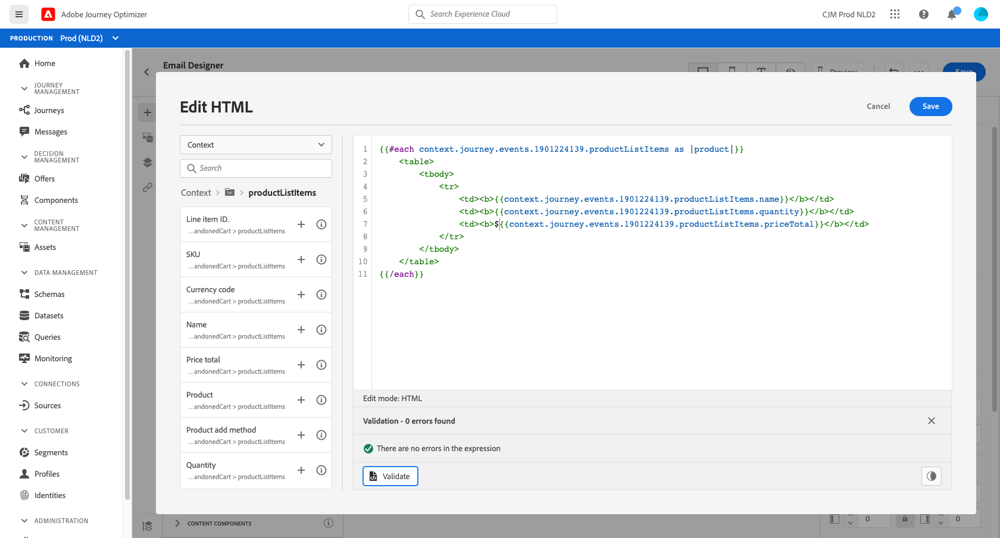
   
## Step 5: Insert a product-specific note {#if-helper}

1. On the Email Designer home page, click on the HTML component where you want to insert the note.
2. On the contextual toolbar, click **[!UICONTROL Show the source code]**.

   

3. In the **[!UICONTROL Edit HTML]** window, add the `if` helper:
   1. In the list, select **[!UICONTROL Helper functions]**.
   2. Use the search field to find "if".
   3. From the search results, add the `if` helper.

      The Expression editor shows this expression:
      ```handlebars
       render_1
          render_2
          default_render
      
      ```
      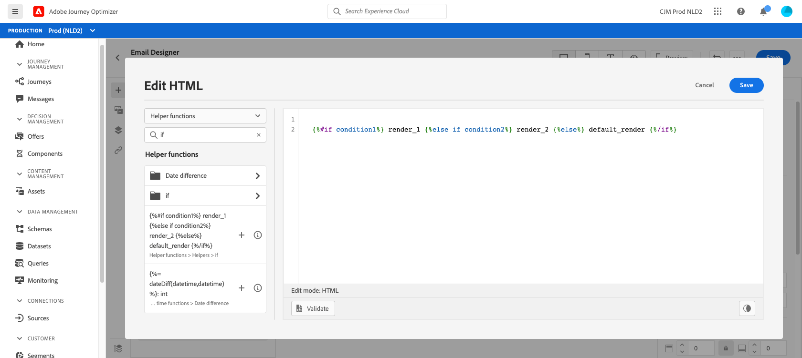

4. Remove this condition from the expression:
   
   ```handlebars
    render_2
   ```

   This example shows the modified expression:

   ```handlebars
    render_1
       default_render
   
   ```

5. Add the product name token to the condition:
   1. Remove the "condition1" placeholder from the expression.
   2. In the list, select **[!UICONTROL Context]**.
   3. Select **[!UICONTROL Journey Orchestration]** > **[!UICONTROL Events]** > ***[!UICONTROL event_name]***, then expand the **[!UICONTROL productListItems]** node.
   
      In this example, *event_name* represents the name of your event.

   4. Add the **[!UICONTROL Name]** token to the expression.

      The Expression editor shows this expression:
      ```handlebars
      
         render_1
          default_render
      
      ```
      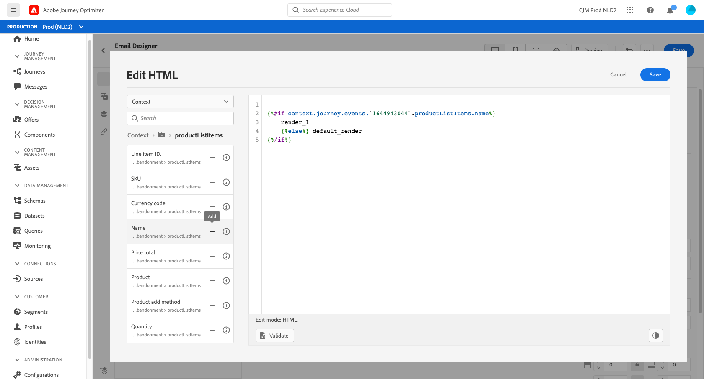

6. Modify the expression:
   1. In the Expression editor, specify the product name after the `name` token.
         
      Use this syntax, where *product_name* represents the name of your product:

      ```javascript
      = "product_name"
      ```

      In this example, the product name is "Juno Jacket":
      ```handlebars
      
         render_1
          default_render
      
      ```

   2. Replace the "render_1" placeholder with the text of the note.
         
      Example:
      ```handlebars
      
         Due to longer than usual lead times on the Juno Jacket, please expect item to ship two weeks after purchase.
          default_render
      
      ```
   3. Remove the "default_render" placeholder from the expression.
7. Click **[!UICONTROL Validate]**, then click **[!UICONTROL Save]**.

   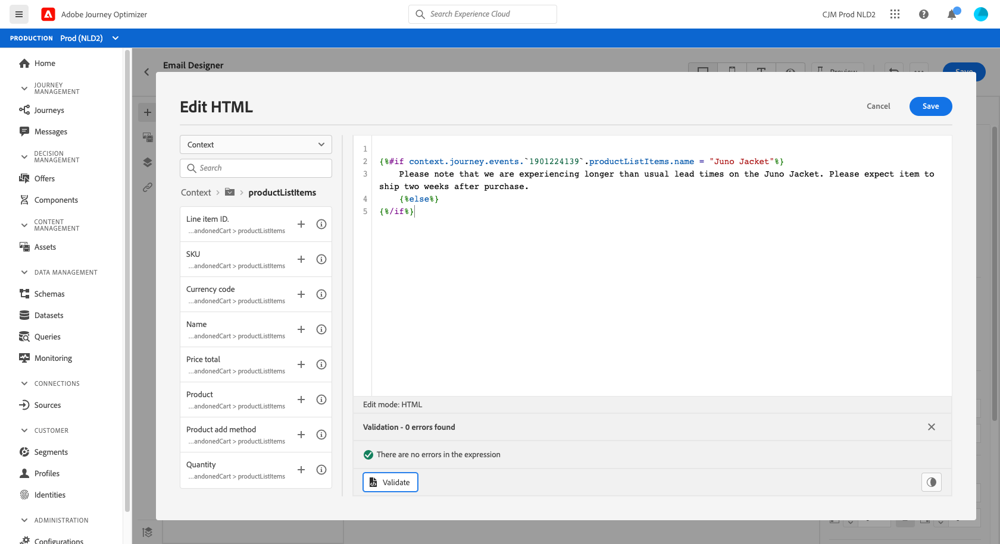

8.  Save and publish the message.

## Step 6: Test and publish the journey {#test-and-publish}

1. Open the journey. If the journey is already open, then refresh the page.
2. Turn on the **[!UICONTROL Test]** toggle, then click **[!UICONTROL Trigger an event]**.

   You can turn on the test mode only after you have published the message.

   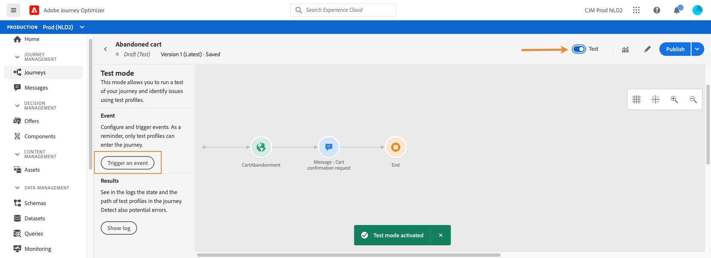

3. In the **[!UICONTROL Event configuration]** window, enter the input values, then click **[!UICONTROL Send]**.
   
   The test mode works only with test profiles.

   

   The email is sent to the address of the test profile.
   
   In this example, the email contains the note about the Juno Jacket because this product is in the cart:

   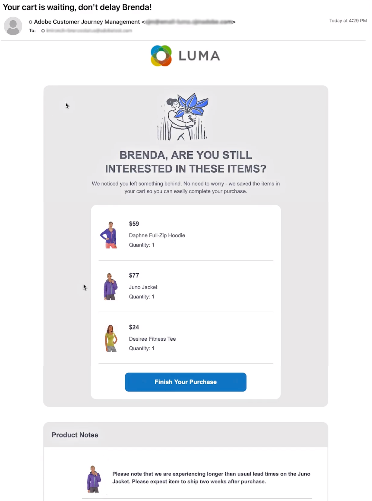

4. Verify that there is no error, then publish the journey.


## Related topics

### Handlebars functions

* [Helpers](functions/helpers.md)

* [String functions](functions/string.md)

### Use cases

* [Personalization with profile information, context, and offer](personalization-use-case.md)

* [Personalization with decision-based offer](../offers/offers-e2e.md)

## Tutorial video{#helper-functions-video}

>[!VIDEO](https://video.tv.adobe.com/v/334244?quality=12)