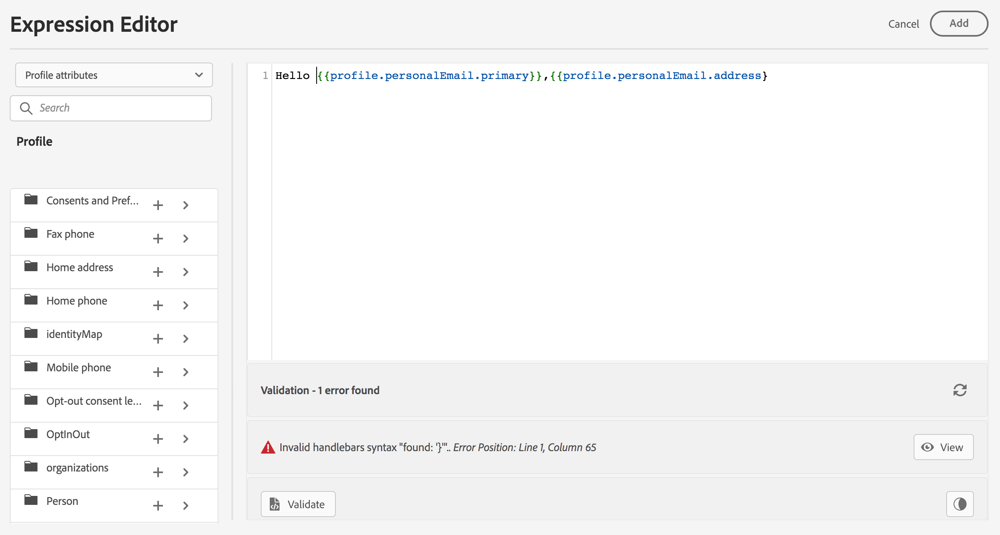

# Personalization validation {#personalization-validation}

## Validation mechanisms

In the **Expression Editor** screen, use the **Validate** button to check your personalization syntax.

>[!NOTE]
> The validation is automatically executed when you click on the **Add** button to close the editor window.
>



>[!IMPORTANT]
> If the personalization syntax is not valid, you cannot close the expression editor window.
>

## Common errors

* **Path "XYZ" not found**

When trying to reference a field that is not defined in the schema.

In this case **firstName1** is not defined as attribute in the profile schema:

```

{{profile.person.name.firstName1}}

```

* **Type mismatch for variable "XYZ". Expected array. Found string.**

 When trying to iterate over a string instead of array:
 
 In this case **product** is not an array:

 ```
 {{each profile.person.name.firstName as |product|}}
  {{product.productName}}
 {{/each}}
 ```

* **Invalid handlebars syntax. Found `‘[XYZ}}’`**

 When invalid handlebars syntax is used.

  Handlebars expressions are surrounded with **{{expression}}**

 ```
    {{[profile.person.name.firstName}}
 ```

* **Invalid segment definition**

```
No segment definition found for 988afe9f0-d4ae-42c8-a0be-8d90e66e151
```

## Specific errors related to offers

The errors related to offers integration in an Email or Push message have the following pattern : 

```
Offer.<offerType>.[PlacementID].[ActivityID].<offer-attribute>
```

The validation is performed during the message publication or during personalization content validation in the Expression editor.

<table> 
 <thead> 
  <tr> 
   <th> Error title<br /> </th> 
   <th> Validation / Resolution <br /> </th> 
  </tr> 
 </thead> 
 <tbody> 
  <tr> 
   <td>Resource with id placementID and type OfferPlacement not found <br/>
Resource with id activityID and type OfferActivity not found<br/></td> 
   <td>Check if ActivityID and/or PlacementID are available</td> 
  </tr> 
   <tr> 
   <td>Resource could not be validated.</td> 
   <td>The componentType in the Placement should match the offerType offer</td> 
  </tr> 
   <tr> 
   <td>The public URL is not present in offer offerId.</td> 
   <td>The Image Offers (all Personalized and fallback associated with the decision and placement pair) should have public URL populated (deliveryURL should not be empty).</td> 
  </tr> 
  <tr> 
   <td>The decision (previously known as offer activity) contains non-profile attributes.</td> 
   <td>Offers Model usage should contain only the profile attributes.</td> 
  </tr> 
  <tr> 
   <td>An error occurred while fetching the decision usage.</td> 
   <td>This error could occur when the API is trying to fetch the offer model.</td> 
  </tr>
  <tr> 
   <td>Offer Attribute offer-attribute is invalid.</td> 
   <td>Check if the offer-attribute referenced in offer drp is valid. Following are the valid attributes: <br/>
Image: deliveryURL, linkURL<br/>
Text: content<br/>
HTML: content<br/></td> 
  </tr> 
 </tbody> 
</table>

