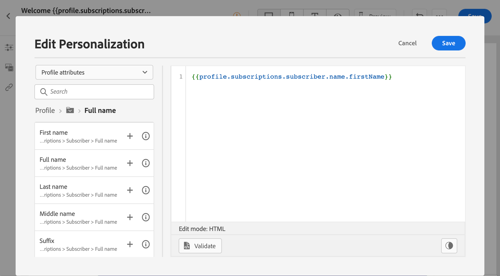
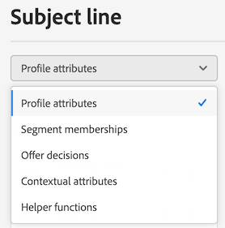
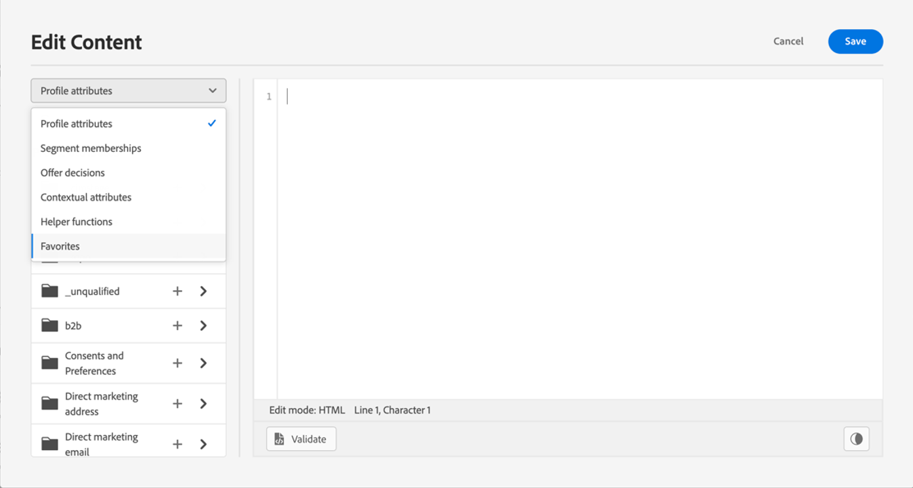
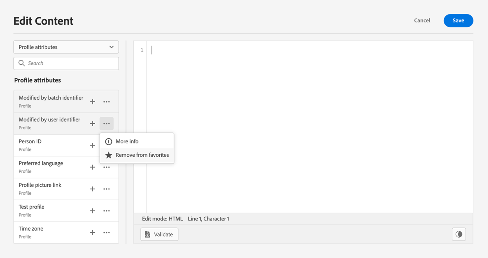

# Get started with personalization{#add-personalization}

Discover [!DNL Adobe Journey Optimizer] personalization capabilities to adapt your messages to each specific recipient by leveraging the data and information you have about them. It can be their first name, interests, where they live, what they bought, and more.

➡️ [Learn how to personalize a message in these videos](#video-perso)

[!DNL Journey Optimizer] uses an **inline** simple personalization syntax based on Handlebars which allows you to create expressions with contents enclosed by double curly braces **{{}}**. You can add multiple expressions in the same content or field without restrictions. Learn more in [Personalization syntax](personalization-syntax.md).

The personalization is based on the profile data that are managed by the **XDM Individual Profile** schema defined in Adobe Experience Platform. Learn more in [Adobe Experience Platform Data Model (XDM) documentation](https://experienceleague.adobe.com/docs/experience-platform/xdm/home.html){target="_blank"}.

>[!CAUTION]
>The **XDM Individual Profile** schema is the only schema you can use to personalize content in [!DNL Journey Optimizer].

**Examples:**

* `Hello {{profile.person.name.firstName}} {{profile.person.name.lastName}}`

* `Hello {{profile.person.name.fullName}}`

When processing the message (email and push), Journey Optimizer replaces the expression with the data contained in the Experience Cloud Platform database:  `Hello {{profile.person.name.firstName}} {{profile.person.name.lastName}}` becomes “Hello John Doe”.

## Personalization contexts{#personalization-areas}

The content and display of messages delivered by [!DNL Journey Optimizer] can be personalized in several different ways.

In every fields with the editor icon, you can open the personalization editor (also known as Expression Editor) and define personalization.

### Personalize your emails

When you create an email, you can add personalization in the **[!UICONTROL Subject line]** field of the message.

In the Email designer, you can personalize the content:

* In the **message**: click inside a text block, click the **Personalize** icon from the contextual toolbar and select **Insert personalization** field. For more on the Email Designer interface, see this [section](../design-emails.md).
    
    

* For a **link**: select some text or image inside a text block, click the **Insert link** icon from the contextual toolbar. In the window, you can add a personalization block by clicking on the **Add personalization** icon.

    

In both cases, you access the personalization editor.

### Personalize your push notifications

You can also personalize your **Push notifications** in the following fields:

* **Title**
* **Body**
* **Custom sound**
* **Badges**
* **Custom data**

Learn more about Push notification configuration in [this section](../push-gs.md).

### Personalize your offers {#personalize-offers}

You can also access the personalization editor when adding text-type content to your offers' representations.

Learn more on managing content with Decision management in [this section](../offers/offer-library/creating-personalized-offers.md#custom-text).

## Use the Expression Editor {#use-expression-editor}

The expression editor is the centerpiece of the personalization in [!DNL Journey Optimizer].

It is available in every context where you need to define personalization like emails, push and offers.

In the expression editor interface, you will select, arrange, customize and validate all the data to create a customized personalization for your content.

 

The left part of the screen displays a domain selector that lets you select the source for personalization. 

 

Available sources are:

* **[!UICONTROL Profile attributes]** : lists all the references associated to the profile schema described in [Adobe Experience Platform Data Model (XDM) documentation](https://experienceleague.adobe.com/docs/experience-platform/xdm/home.html){target="_blank"}.
* **[!UICONTROL Segment memberships]** : lists all the segments created in the Adobe Experience Platform Segmentation service. More information on segmentation available [here](https://experienceleague.adobe.com/docs/experience-platform/segmentation/home.html){target="_blank"}.
* **[!UICONTROL Offer decisions]** : lists all the offers associated to a specific placement. Select the placement then insert the offers in your content. For a complete documentation on how to manage offers, refer to [this section](../deliver-personalized-offers.md).
* **[!UICONTROL Contextual attributes]** : when the **Message** is used in a journey, contextual journey fields are available through this menu. Learn more in [this section](personalization-use-case.md).
* **[!UICONTROL Helper functions]** : lists all the helper functions available to perform operations on data, such as calculations, data formatting or conversions, conditions, and manipulate them in the context of personalization. Learn more in [this section](functions/functions.md).

On selection, the reference is added in the editor. 

>[!NOTE]
>
>The info icon next to "+" icon opens up a tooltip providing more details for each variable.

In the following example, the expression editor lets you select the profiles that have their birthday today then complete the customization by inserting a specific offer corresponding to this day.

 

### Add to favorites{#fav}

Adding different attributes to your favorites menu provides quick access to your most frequency used items. To add an attribute to your favorites click the ellipse menu and choose **[!UICONTROL Add to favorites]**.

To access items you have favorited use the **[!UICONTROL Favorites]** menu option in the drop-down menu.

From this list you can quickly add the personalization object to your current expression.

If you wish to no longer see an item in your favorites list you can remove from favorites.

## How-to videos{#video-perso}

Learn how to use contextual event information from a journey to personalize a message.

>[!VIDEO](https://video.tv.adobe.com/v/334165?quality=12)

Learn how to use contextual event information from a journey to personalize a message.

>[!VIDEO](https://video.tv.adobe.com/v/334078?quality=12)
