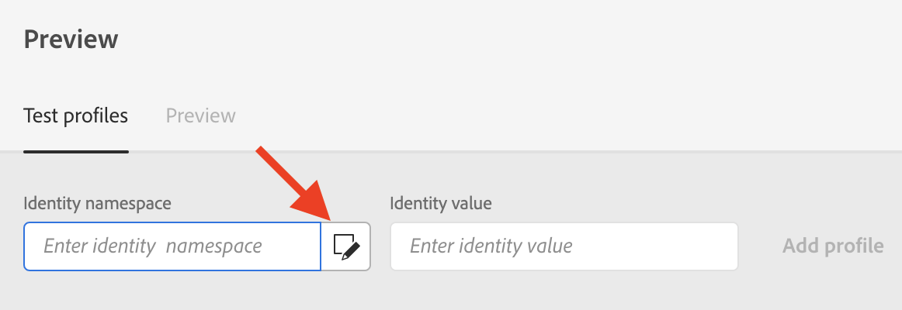

# Preview your messages

Once your message content has been defined, you can use test profiles to preview and test it. If you inserted [personalized content](personalization/personalize.md), you will be able to check how this content is displayed in the message, leveraging test profile data.

>[!CAUTION]
>
>You need to have test profiles available to be able to preview your messages. [Learn more](building-journeys/testing-the-journey.md#create-test-profile).

To test your message content, you need to select test profiles and then check the message preview.

## Select test profiles

To select test profiles, follow the steps below: 

1. Click **[!UICONTROL Preview]** to access the test profile selection.

    

1. Select the namespace to use to identify test profiles by clicking the **[!UICONTROL Identity namespace]** selection icon. 

    

    Learn more about Adobe Experience Platform identity namespaces [in this section](https://experienceleague.adobe.com/docs/experience-platform/identity/namespaces.html?lang=en#getting-started).
    
    In the example below, we will use the **Email** namespace.

1. Use the search field to find the namespace, select it and click **[!UICONTROL Select]** 

    

1. Enter the value to identify the test profile and click **[!UICONTROL Add profile]**.

    

1. If you added personalization in your message, add other profiles so that you can test different variants of the message depending on profile data. Once added, profiles are listed under the selection fields.

    

    Based on the message personalization elements, this list displays data for each test profile in the related columns.

## Preview messages

1. Click the **[!UICONTROL Preview]** tab to test your message. 

1. Select a test profile. You can check the values available in the columns. Use the right/left arrows to browse data.

    

1. Click the **[!UICONTROL Select data]** icon above the list to add or remove columns.

    
    
    You can see personalization fields specific to the current message at the end of the list. In this example, the profile city, first name and last name. Select those fields and make sure these values are populated in your test profiles.

1. In the message preview, personalized elements are replaced by the selected test profile data.

    For example, for this message, both email content and email subject are personalized:

    

1. Select other test profiles to preview email rendering for each variant of your message.

For a push notification preview:

1. Switch to the **[!UICONTROL Push]** channel from the **[!UICONTROL Channels]** drop-down list on the top left of the **[!UICONTROL Preview]** screen.

    

1. Apply the same steps as described above to select a test profile, and select the type of device to preview content: **[!UICONTROL iOS]** or **[!UICONTROL Android]**

    

1. In the push preview, test profile data is leveraged in the message content.

    For example, for this push notification, both title and body are personalized:

    
