# Preview and test your messages{#preview-and-proof}

Once your message content has been defined, you can use test profiles to preview and test it. If you inserted [personalized content](personalization/personalize.md), you will be able to check how this content is displayed in the message, leveraging test profile data.

To detect possible errors in email content or personalization settings, send proofs to test profiles. A proof should be sent each time a change is made, to validate latest content. 

>[!CAUTION]
>
>You need to have test profiles available to be able to preview your messages and send proofs. [Learn more](building-journeys/testing-the-journey.md#create-test-profile).

To test your message content, you need to:

* [select test profiles](#select-test-profiles)
* [check the message preview](#preview-your-messages)

You will then be able to [send proofs](#send-proofs) to your test profiles.

In addition, leverage your **Litmus** account into [!DNL Journey Optimizer] to instantly preview your **email rendering** in popular email clients. You can then ensure your email content looks great and works properly in every inbox. Learn how to unlock Litmus Email Previews in [this section](#email-rendering)

## Select test profiles{#select-test-profiles}

Test profiles allow you to target additional recipients who do not match the defined targeting criteria.

To select test profiles, follow the steps below: 

1. In the message interface or in the email designer, click the **[!UICONTROL Preview]** button to access the test profile selection.

    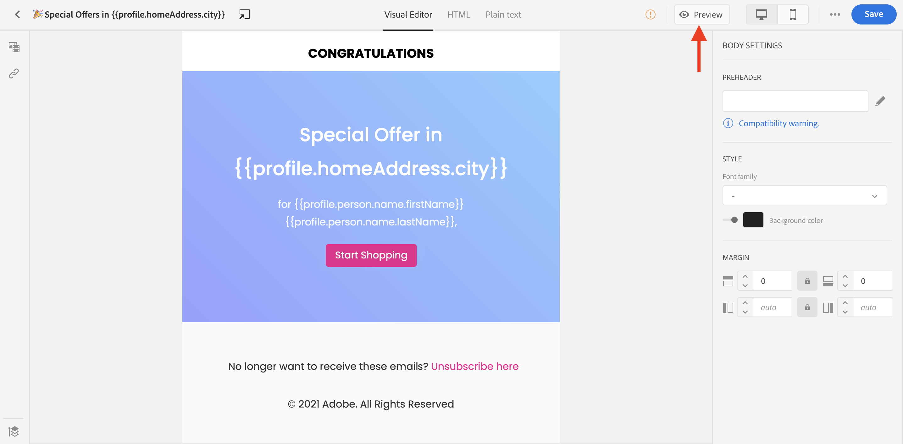

1. Select the namespace to use to identify test profiles by clicking the **[!UICONTROL Identity namespace]** selection icon. 

    

    Learn more about Adobe Experience Platform identity namespaces [in this section](https://experienceleague.adobe.com/docs/experience-platform/identity/namespaces.html?lang=en#getting-started).
    
    In the example below, we will use the **Email** namespace.

1. Use the search field to find the namespace, select it and click **[!UICONTROL Select]** 

    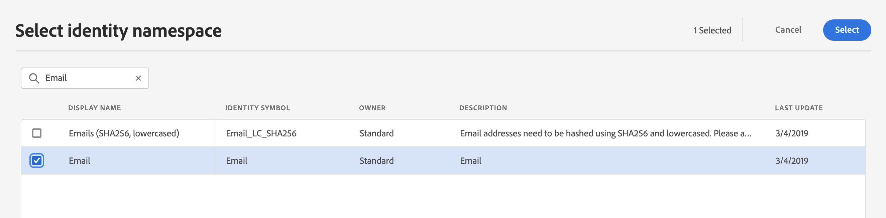

1. Enter the value to identify the test profile and click **[!UICONTROL Find test profile]**.

    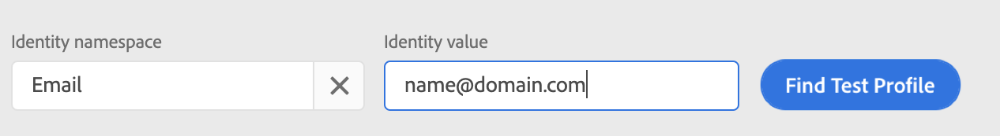

1. If you added personalization in your message, add other profiles so that you can test different variants of the message depending on profile data. Once added, profiles are listed under the selection fields.

    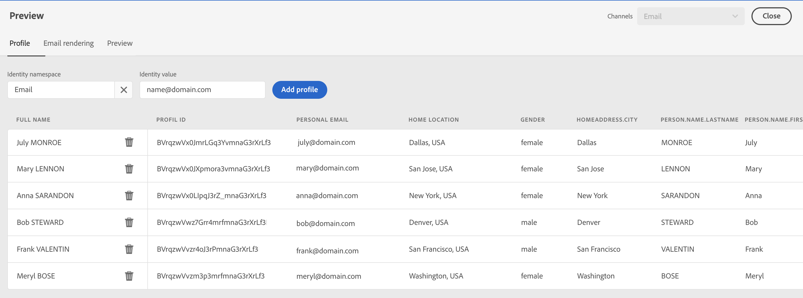

    Based on the message personalization elements, this list displays data for each test profile in the related columns.

## Preview messages{#preview-your-messages}

Once [test profiles](#select-test-profiles) are selected, you can preview your messages and check content.

1. Click the **[!UICONTROL Preview]** tab to test your message. 

1. Select a test profile. You can check the values available in the columns. Use the right/left arrows to browse data.

    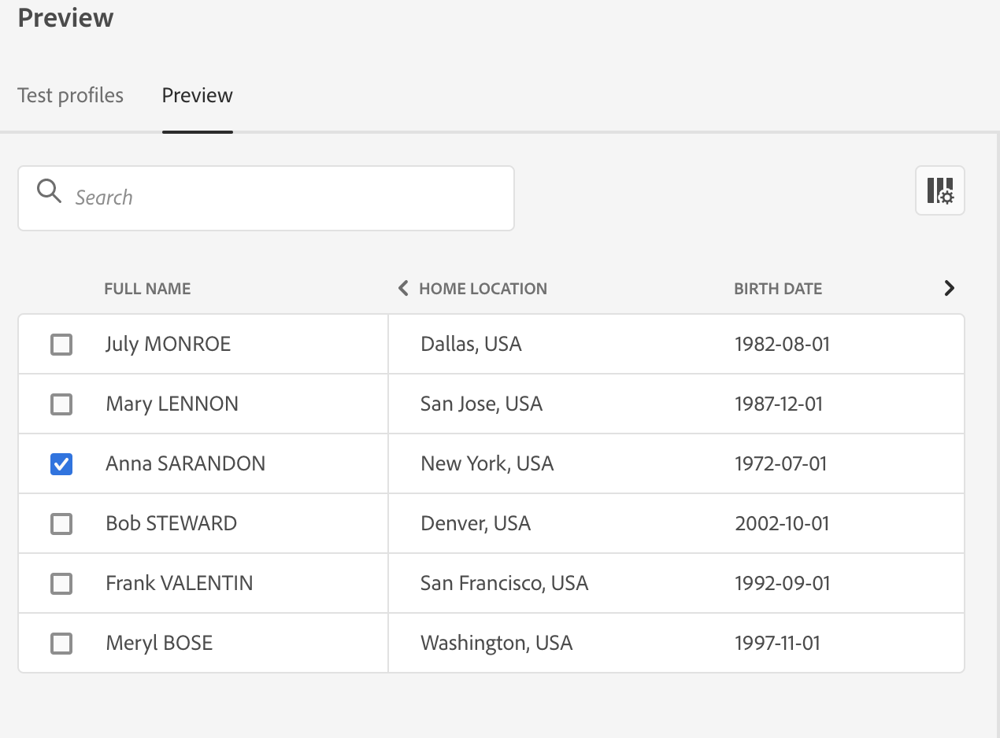

1. Click the **[!UICONTROL Select data]** icon above the list to add or remove columns.

    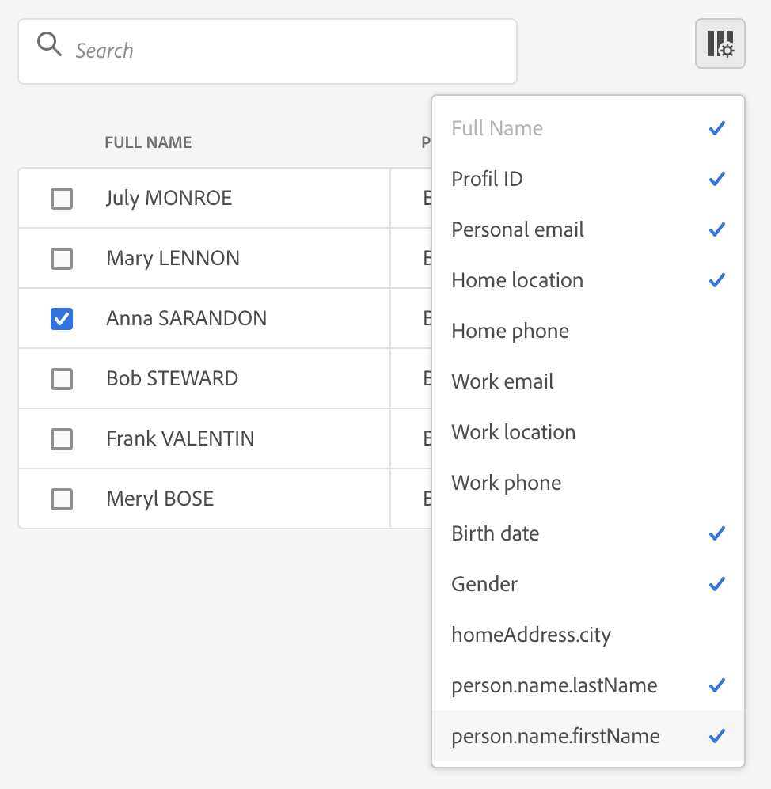
    
    You can see personalization fields specific to the current message at the end of the list. In this example, the profile city, first name and last name. Select those fields and make sure these values are populated in your test profiles.

1. In the message preview, personalized elements are replaced by the selected test profile data.

    For example, for this message, both email content and email subject are personalized:

    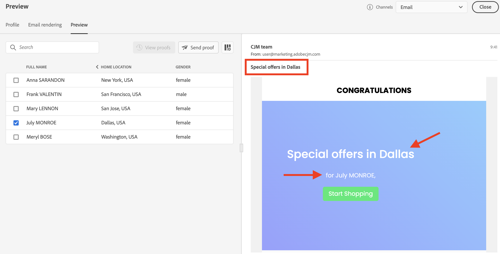

1. Select other test profiles to preview email rendering for each variant of your message.

For a push notification preview:

1. Switch to the **[!UICONTROL Push]** channel from the **[!UICONTROL Channels]** drop-down list on the top left of the **[!UICONTROL Preview]** screen.

    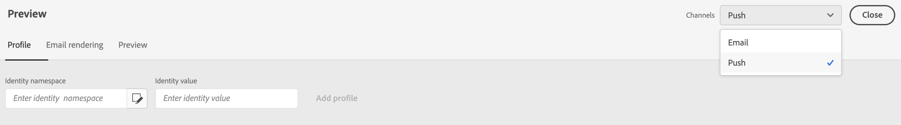

1. Apply the same steps as described above to select a test profile, and select the type of device to preview content: **[!UICONTROL iOS]** or **[!UICONTROL Android]**

    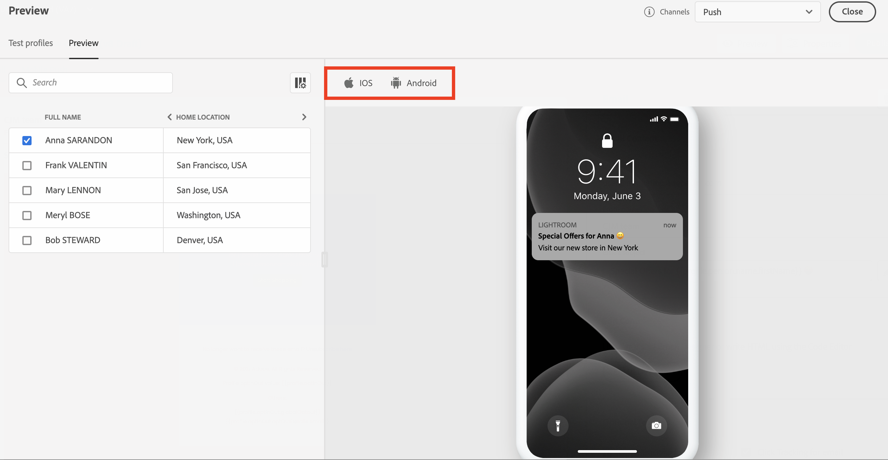

1. In the push preview, test profile data is leveraged in the message content.

    For example, for this push notification, both title and body are personalized:

    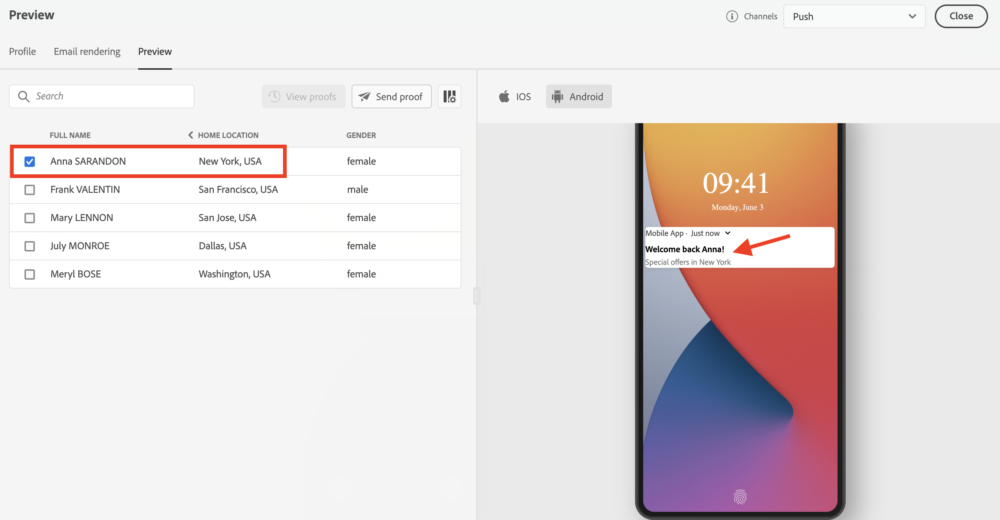

## Send proofs{#send-proofs}

A proof is a specific message that allows you to test a message before sending it to the main audience. Recipients of the proof are in charge of approving the message: rendering, content, personalization settings, configuration.

Once [test profiles](#select-test-profiles) are selected, you can send proofs.

1. In the **[!UICONTROL Preview]** screen, click the **[!UICONTROL Send proof]** button.

    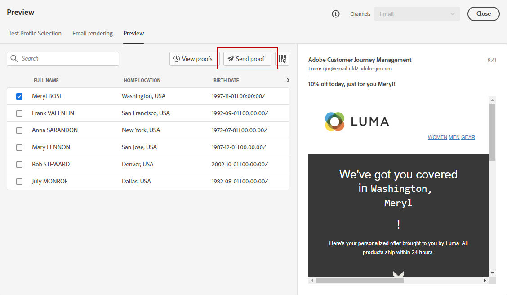

1. Select the test profiles who will receive the proof and click **[!UICONTROL Send proof]**. You can add a prefix to the subject line of the proof if needed.

    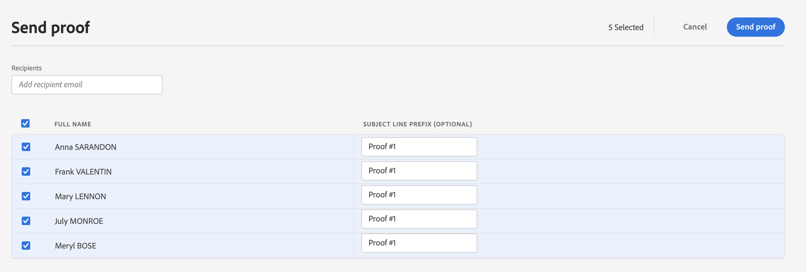

1. Back in the  **[!UICONTROL Preview]** screen, click the  **[!UICONTROL View proofs]** button to check status.

    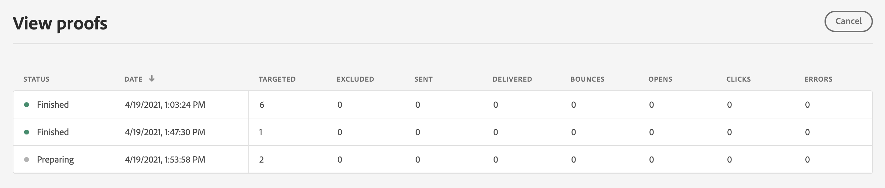

You need to send proofs after any modification to the message content.

## Email rendering{#email-rendering}

You can leverage your **Litmus** account into [!DNL Journey Optimizer] to instantly preview your **email rendering** in popular email clients.

To access Email rendering capabilities, you need to:

* Have a Litmus account
* [Select test profiles](#select-test-profiles)

Then, follow the steps below:

1. In the Email Designer, click the **[!UICONTROL Preview]** button and select the **[!UICONTROL Email rendering]** tab.

1. Click **Connect your Litmus account** on the upper right section.

    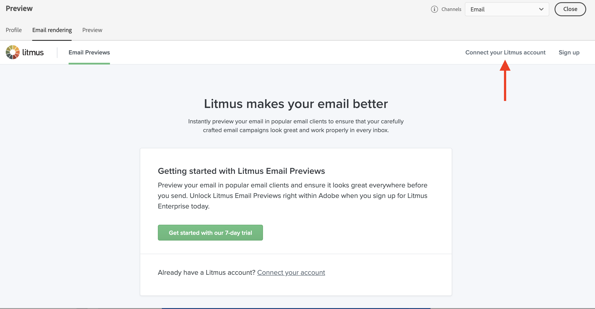

1. Enter your credentials and sign in.

    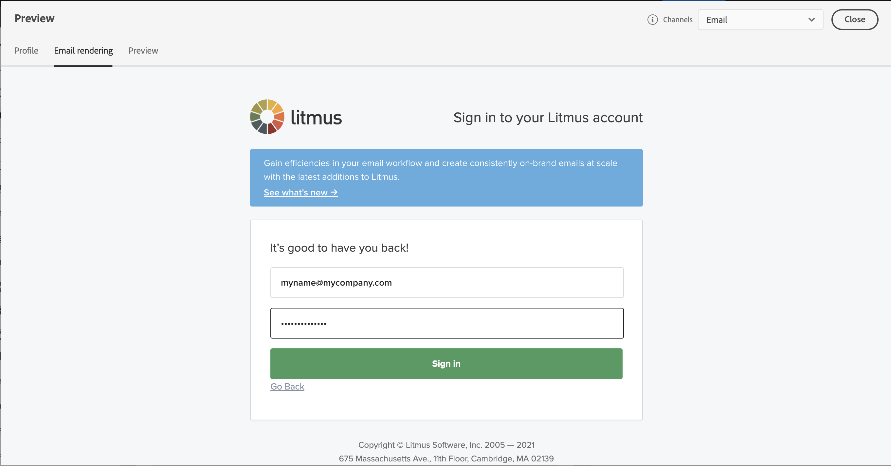

1. Click the **Run test** button to generate email previews.

1. Check your email content in popular desktop, mobile and web-based clients.

    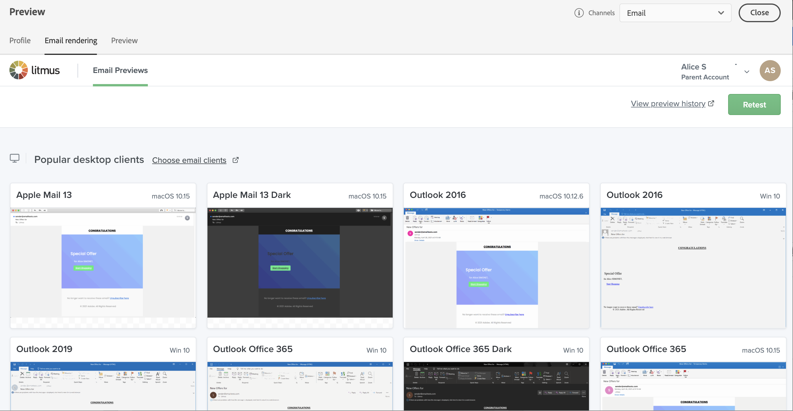

>[!CAUTION]
>
>When connecting your **Litmus** account with [!DNL Journey Optimizer], you agree that test messages are sent to Litmus: once sent, these emails are no longer managed by Adobe. As a consequence, Litmus data retention email policy applies to these emails, including personalization data that may be included in these test messages.
>
