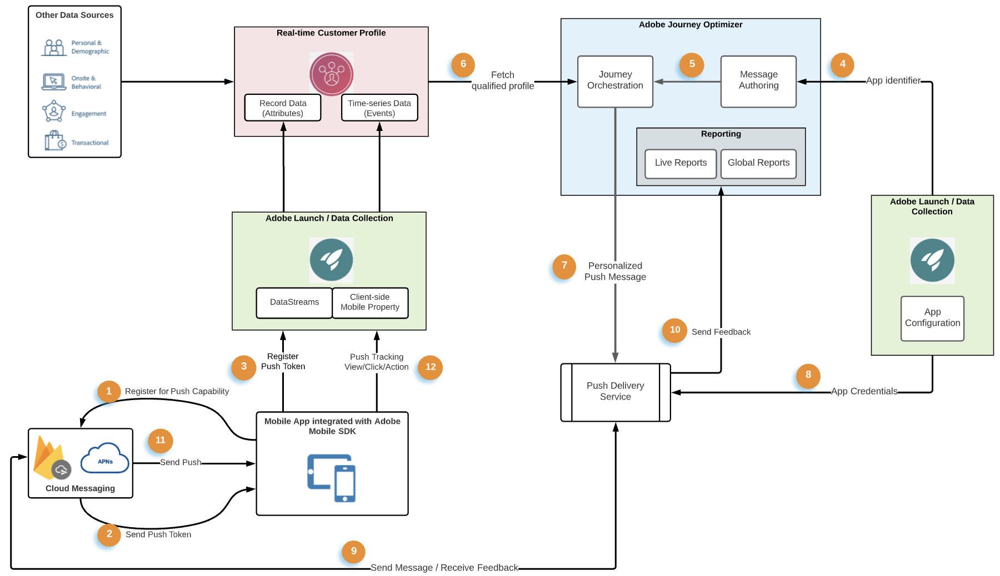
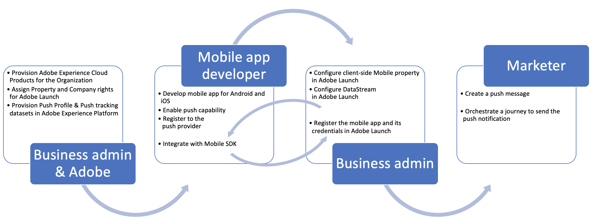

# Get started with push configuration {#get-started-push}

Push notifications help you reach your mobile app users at any time - especially when they are not actively using your app. Push notifications may help you achieve a variety of use cases such as providing updates about your service, ask a user to take action, alert the user to a new deal, etc. Device platforms require opt-in before end-users may receive or view your notifications. User opt-in may be received as early as after the app is launched for the first time post-install or in a subsequent session or workflow as appropriate. [!DNL Journey Optimizer] supports push notifications and helps you send highly relevant notifications at industry-leading throughput rates. Push notifications may include personalization and Journey-based context in order to leverage data insights your brand has with Adobe Experience Cloud.

This page will help you setup and understand key services & workflows involved with push notifications in [!DNL Journey Optimizer].

Steps to configure push channel in [!DNL Adobe Journey Optimizer] are detailed in [this page](push-configuration.md).

## Push Notifications and [!DNL Adobe Journey Optimizer]

The following pictorial shows the systems and services involved with associated data flows highlighting how push notifications are delivered from an end-to-end service standpoint.

1. Registration of your branded mobile app (Android or iOS) with Apple's APNs and Google FCM push messaging messaging services
1. Messaging services generate a push token, which, is an identifier that [!DNL Adobe Journey Optimizer] will use to target the specific device with a push notification.
1. The previously generated push token is passed to Adobe Experience Platform and synchronized with the Real-time Customer Profile; this is done OOTB with an easy to integrate client SDK
1. Push messages are authored in [!DNL Adobe Journey Optimizer], push messages are created against a message preset
1. Push messages may be included on the orchestration canvas in Journeys
1. Upon Journey publication, customer profiles based on Journey conditions are qualified to receive push notifications, push messaging payloads are personalized at this step
1. Personalized push payloads are forwarded to an internal push messaging delivery service
1. This internal service then validates the credentials of the app associated with the message, and
1. Sends the message to Apple & Google messaging services for final delivery
1. Feedback from messaging services are noted, errors and successes are logged for reporting in Journey Live & Global reports
1. Push notifications are delivered to end-user devices
1. End-user push notification interactions are send in as Experience Events from the end-user client via SDK integration

## Roles of Key Services in Push Notifications

* **Push notification service providers** are the core component web services that deliver notifications from remote servers to mobile apps.
    
    [!DNL Adobe Journey Optimizer]  supports both Android and iOS platforms and consequently integrate with following:
    * [Firebase Cloud Messaging (FCM)](https://firebase.google.com/docs/cloud-messaging) - to send notifications to Android mobile app
    * [Apple Push Notification Service (APNs)](https://developer.apple.com/library/archive/documentation/NetworkingInternet/Conceptual/RemoteNotificationsPG/APNSOverview.html) - to send notifications to iOS mobile app

* **Adobe Experience Platform Mobile SDK** which provides client-side integration APIs for your mobiles via Android and iOS compatible SDKs. The SDK provides an [!DNL Adobe Journey Optimizer] extension exposing a variety of APIs specific for push messaging and enable data flow like registering the push token or sending push tracking events or any other custom experience events to Adobe Experience Platform. The SDK also provides a variety of other extensions that enable other Adobe Experience Cloud as well as 3rd party partner capabilities.

    SDK integration also requires setup of Adobe Experience Platform [Data Collection](https://experienceleague.adobe.com/docs/launch/using/home.html) services such as:

    * Creating a datastream to configure the profile and experience event datasets against which the data flows into Adobe Experience Platform
    * Creating client-side mobile property and adding extensions. The SDK closely integrates with these extensions to provide a seamless data collection experience.
    * Registering the mobile app bundle identifier and app credentials

* **Adobe Experience Platform Real-time Customer Profile**  maintains a holistic view of each individual customer by combining data from multiple channels, including web, mobile, CRM, and third party. Profile allows you to consolidate your customer data into a unified view offering an actionable, timestamped account of every customer interaction. The push token for a given app user is stored against the user's profile as record data while the interactions the user does with push notifications are tracked as time-series events data. [Learn more about Adobe Experience Platform Real-time Customer Profile](https://experienceleague.adobe.com/docs/experience-platform/profile/home.html)

* **[!DNL Adobe Journey Optimizer]** : once your mobile app integrations with above mentioned components are in place and your customer profiles in Adobe Experience Platform, you may author and orchestrate push notifications in [!DNL Adobe Journey Optimizer] to engage with your users.

## Push Technical Setup and Practitioner Workflows

The following pictorial shows the various steps, end-to-end, involved in configuring the components that form the skeleton of push data flow. The action items have been categorized based on the role performing the configuration and the component being configured. 

