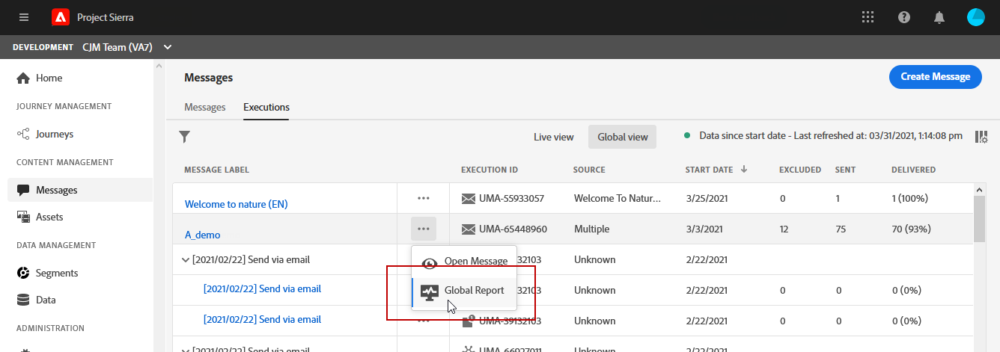
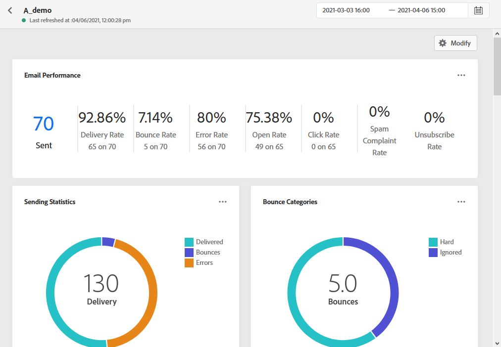
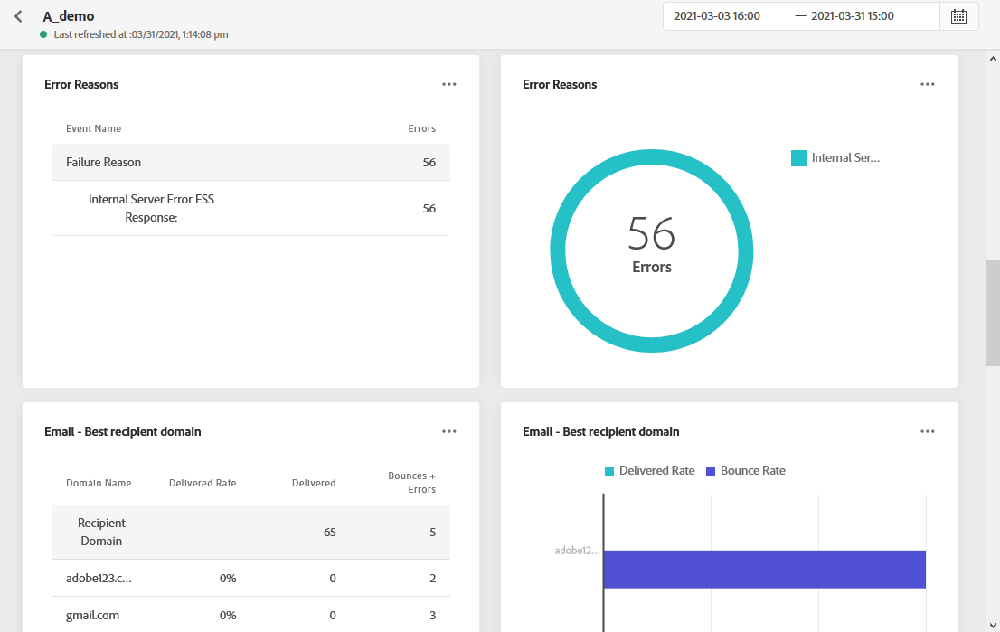
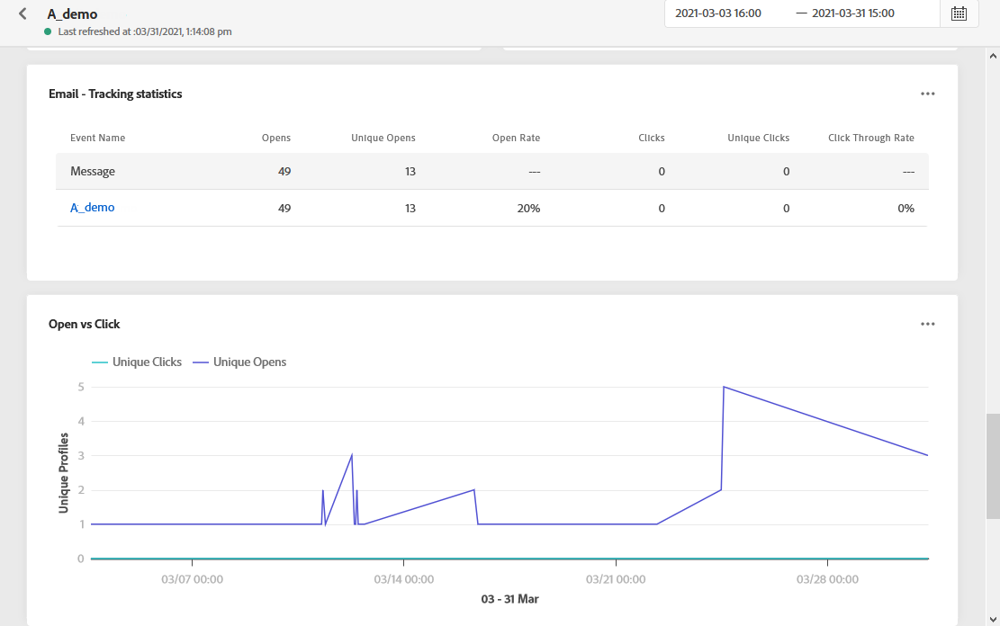

# Email Global report {#email-global-report}

The email **[!UICONTROL Global report]** only targets a specific email delivery. 

From the **[!UICONTROL Executions]** tab of the **[!UICONTROL Messages]** menu, select **[!UICONTROL Global view]** then from the advanced menu of the selected delivery select **[!UICONTROL Global report]**.

The email **[!UICONTROL Global report]** is divided into different widgets detailing your delivery's success and errors. Each widget can be resized and deleted if needed. For more information on this refer to this [section](global-report.md#modify-dashboard).

**[!UICONTROL Email performance]** details the main information relative to your message with KPIs:

* **[!UICONTROL Sent]**: Total number of sends for the delivery.

* **[!UICONTROL Delivery Rate]**: Percentage of messages successfully sent.

* **[!UICONTROL Bounce Rate]**: Percentage of emails that bounced compared to emails sent.

* **[!UICONTROL Error Rate]**: Percentage of errors that occurred during a delivery preventing it from being sent compared to emails sent.

* **[!UICONTROL Open Rate]**: Percentage of opened messages.

* **[!UICONTROL Click Rate]**: Percentage of clicks in a delivery.

* **[!UICONTROL Spam Complaint Rate]**: Percentage of emails that were marked as spam by recipients compared to the delivered messages. For more information on complaints, refer to the [Deliverability Best Practice Guide](https://experienceleague.adobe.com/docs/deliverability-learn/deliverability-best-practice-guide/metrics-for-deliverability/complaints.html#metrics-for-deliverability){target="_blank"}.

* **[!UICONTROL Unsubscribe Rate]**: Percentage of unique unsubscriptions compared to the number of delivered messages. This indicator does not rely on the number of clicks on the unsubscription link but is based on the number of unsubscriptions initiated by recipients. Learn more about unsubscriptions in this [page](../consent.md).

The **[!UICONTROL Email - Tracking statistics]** contains the available data for recipient activity for your delivery:

* **[!UICONTROL Opens]**: Number of times the delivery was opened in a delivery.

* **[!UICONTROL Unique Opens]**: Percentage of opened deliveries.

* **[!UICONTROL Open Rate]**: Total number of opened emails compared to the number of delivered emails.

* **[!UICONTROL Clicks]**: Number of times a content was clicked in an email.

* **[!UICONTROL Unique Clicks]**:Number of recipients who clicked on a content in an email.

* **[!UICONTROL Click through rate]**: Percentage of users who interacted with the journey.

The **[!UICONTROL Sending Statistics]** graph details the success of your delivery:

* **[!UICONTROL Delivered]**: Number of messages successfully sent, in relation to the total number of sent messages.

* **[!UICONTROL Bounces]**: Total of errors cumulated during delivery and automatic return processing in relation to the total number of sent messages.

* **[!UICONTROL Errors]**: Total number of errors that occurred during a delivery preventing it from being sent to profiles.

The **[!UICONTROL Bounce Reasons]** and **[!UICONTROL Bounce categories]** widgets contain the data available related to bounced messages, such as:

* **[!UICONTROL Hard bounce]**: The total number of permanent errors, such as a wrong email address. This involves an error message that explicitly states that the address is invalid, such as Unknown user.

* **[!UICONTROL Soft bounce]**: The total number of temporary errors, such as a a full inbox.

* **[!UICONTROL Ignored]**: The total number of temporary, such as out of office, or a technical error, for example if the sender type is postmaster.

For more information on bounces, refer to the [Suppression list](../suppression-list.md) page.

The **[!UICONTROL Error Reasons]** graph and table allow you to see which error occurred during your delivery.

The **[!UICONTROL Email - Top recipient domain]** graph and table details which domains are the most used by recipients to open the email.

The **[!UICONTROL Email - Top Url]** graph and table details which URLs from your delivery are the most visited.

The **[!UICONTROL Open vs Click]** identifies your recipients' interaction with the delivery:

* **[!UICONTROL Unique Clicks]**:Number of recipients who clicked on a content in an email.

* **[!UICONTROL Unique Opens]**: Number of recipients who opened the delivery.

>[!NOTE]
>
>The profiles with **[!UICONTROL Suppressed]** or **[!UICONTROL Not allowed]** status are excluded during the message sending process. Therefore, while the **Journey reports** will show these profiles as having moved through the journey ([Read Segment](../building-journeys/read-segment.md) and [Message](../building-journeys/journeys-message.md) activities), the **Email reports** will not include them in the **[!UICONTROL Sent]** metrics as they are filtered out prior to email sending.
>
>Learn more on the [Suppression list](../suppression-list.md) and [Allowed list](../allow-list.md).
