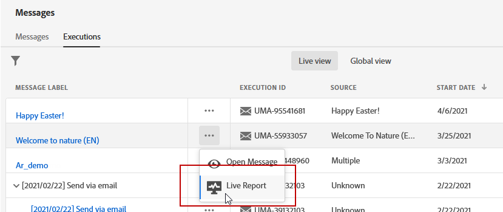
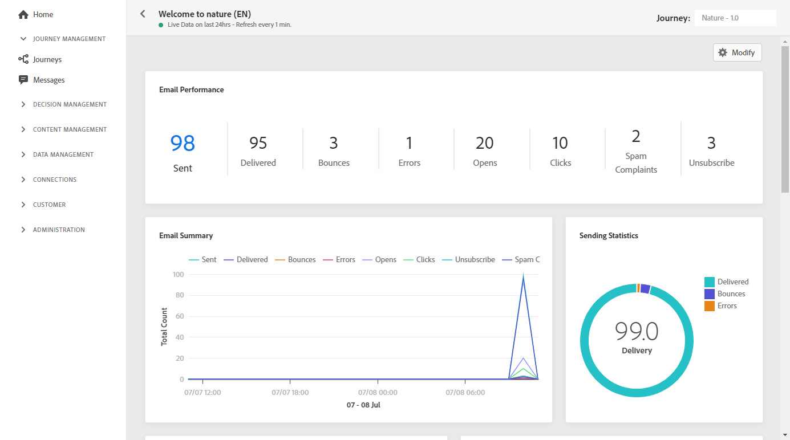
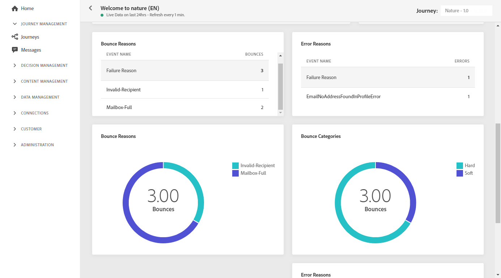

# Email live report {#email-live-report}

The email **[!UICONTROL Live report]** only targets a specific email delivery. 

From the **[!UICONTROL Executions]** tab of the **[!UICONTROL Messages]** menu, select **[!UICONTROL Live view]** then from the advanced menu of the selected delivery select **[!UICONTROL Live report]**.

The email **[!UICONTROL Live report]** is divided into different widgets detailing your delivery's success and errors. Each widget can be resized and deleted if needed. For more information on this refer to this [section](live-report.md#modify-dashboard).

**[!UICONTROL Email performance]** and **[!UICONTROL Email summary]** widgets details the main information relative to your message with a graph and KPIs:

* **[!UICONTROL Sent]**: Total number of sends for the delivery.

* **[!UICONTROL Delivered]**: Number of messages successfully sent, in relation to the total number of sent messages.

* **[!UICONTROL Bounces]**: Total of errors cumulated during delivery and automatic return processing in relation to the total number of sent messages.

* **[!UICONTROL Errors]**: Total number of errors that occurred during a delivery preventing it from being sent to profiles.

* **[!UICONTROL Opens]**: Number of times a message was opened in a delivery.

* **[!UICONTROL Clicks]**: Number of times a content was clicked in a delivery.

The **[!UICONTROL Sending Statistics]** graph details the success of your delivery:

* **[!UICONTROL Delivered]**: Number of messages successfully sent, in relation to the total number of sent messages.

* **[!UICONTROL Bounces]**: Total of errors cumulated during delivery and automatic return processing in relation to the total number of sent messages.

* **[!UICONTROL Errors]**: Total number of errors that occurred during a delivery preventing it from being sent to profiles.

The **[!UICONTROL Error Reasons]** graph and table allow you to see which error occurred during your delivery.

The **[!UICONTROL Bounce Reasons]** and **[!UICONTROL Bounce categories]** widgets contain the data available related to bounced messages, such as:

* **[!UICONTROL Hard bounce]**: The total number of permanent errors, such as a wrong email address. This involves an error message that explicitly states that the address is invalid, such as Unknown user.

* **[!UICONTROL Soft bounce]**: The total number of temporary errors, such as a a full inbox.

* **[!UICONTROL Ignored]**: The total number of temporary, such as Out of office, or a technical error, for example if the sender type is postmaster.

>[!NOTE]
>
>The profiles with **[!UICONTROL Suppressed]** or **[!UICONTROL Not allowed]** status are excluded during the message sending process. Therefore, while the **Journey reports** will show these profiles as having moved through the journey ([Read Segment](building-journeys/read-segment.md) and [Message](building-journeys/journeys-message.md) activities), the **Email reports** will not include them in the **[!UICONTROL Sent]** metrics as they are filtered out prior to email sending.
>
>Learn more on the [Suppression list](../suppression-list.md) and [Allowed list](../allow-list.md).