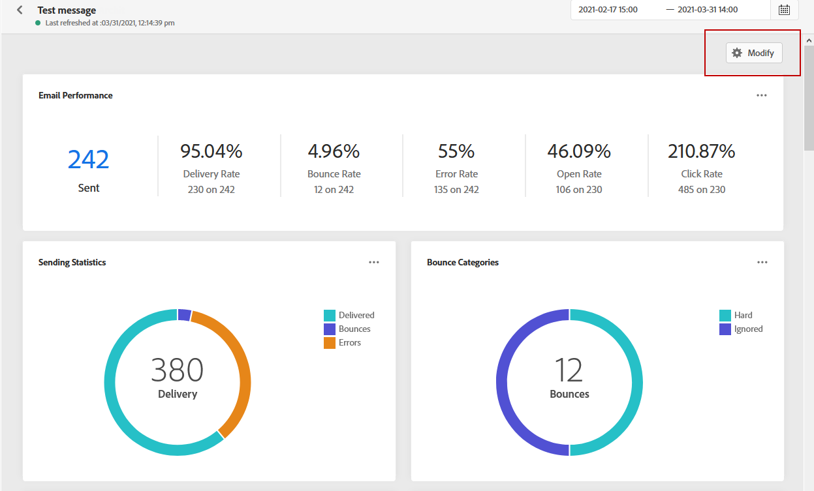
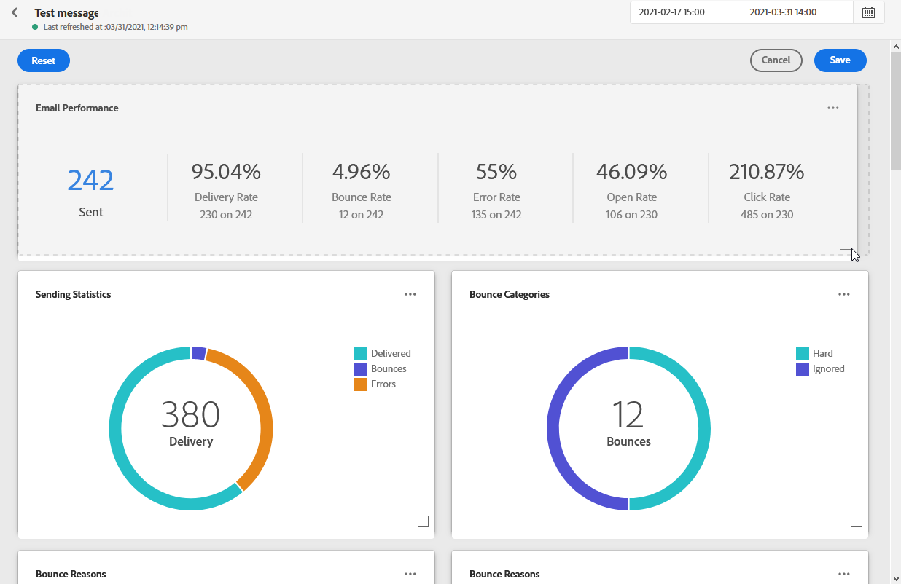
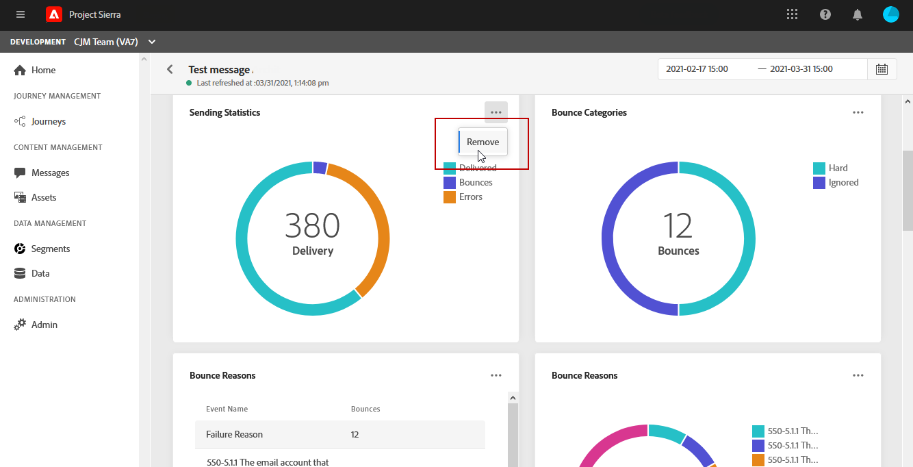

# Global Report {#global-report}

The **[!UICONTROL Global report]** allows you to measure the effectiveness of your journeys and deliveries over a selected time period.

* If you want to target a journey or deliveries in a journey, from the **[!UICONTROL Journeys]** menu, access your journey and click the **[!UICONTROL Global report]** icon. You can then find the Journey, Email and Push **[!UICONTROL Global report]**.

* If you want to target a specific delivery, from the **[!UICONTROL Global view]** of the **[!UICONTROL Executions]** tab of your messages, select **[!UICONTROL Global Report]** from the advanced menu of your selected delivery.

## Modify dashboard {#modify-dashboard}

Each reporting dashboard can be modified by resizing or removing widgets or changing the targeted time frame. Changing the widgets only impacts the current user's dashboard. Other users will see their own dashboards or the ones set by default. 

1. From your **[!UICONTROL Global report]** dashboard, click the scheduler button.

1. Select the start and end dates. You can further fine-tune your reports by selecting a **[!UICONTROL Start time]** and **[!UICONTROL End time]**.

    

1. click **[!UICONTROL Modify dashboard]**.

    

1. Adjust the widgets size by dragging its bottom-right corner.

    

1. Click **[!UICONTROL Remove]** to remove other widgets that you don't need to track bounces.

    

1. Once you are satisfied with the display order and the size of your widgets, click **[!UICONTROL Save]**.

Your dashboard is now saved. Your different changes will be reapplied for a later use of your global reports. If needed, use the **[!UICONTROL Reset]** option to restore the default widgets and widgets' order.
