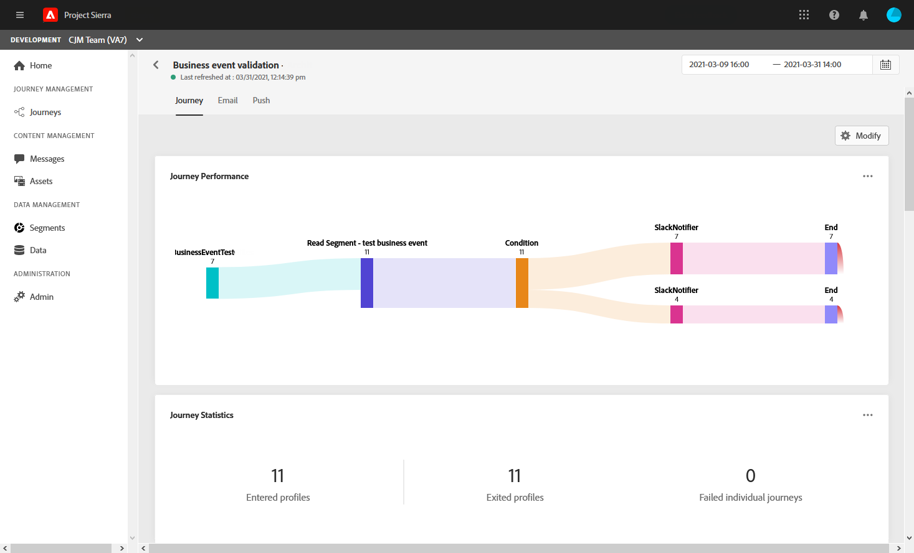
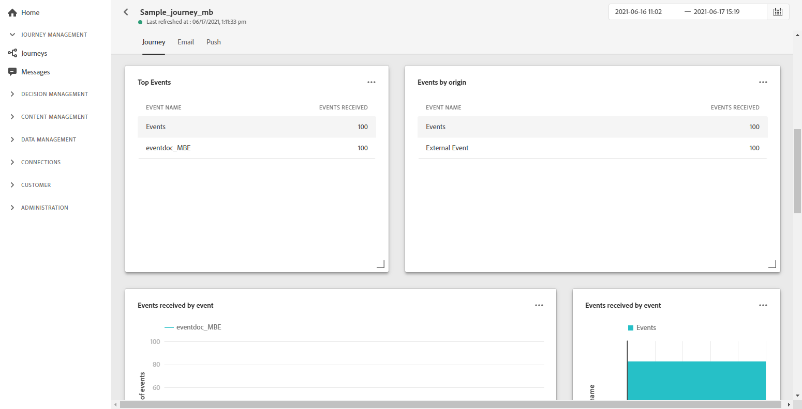
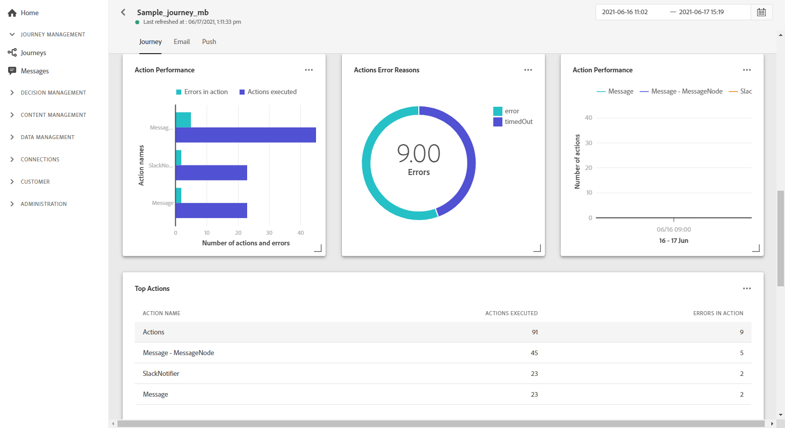
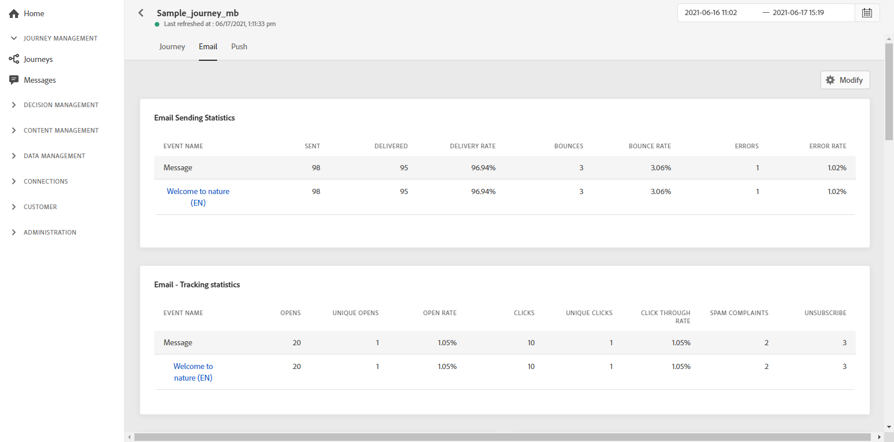
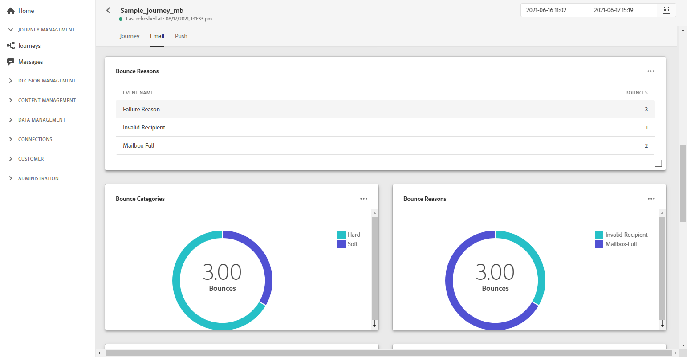
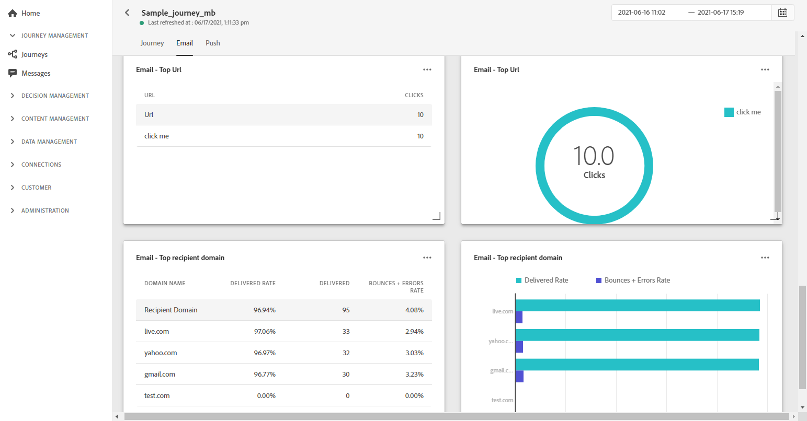
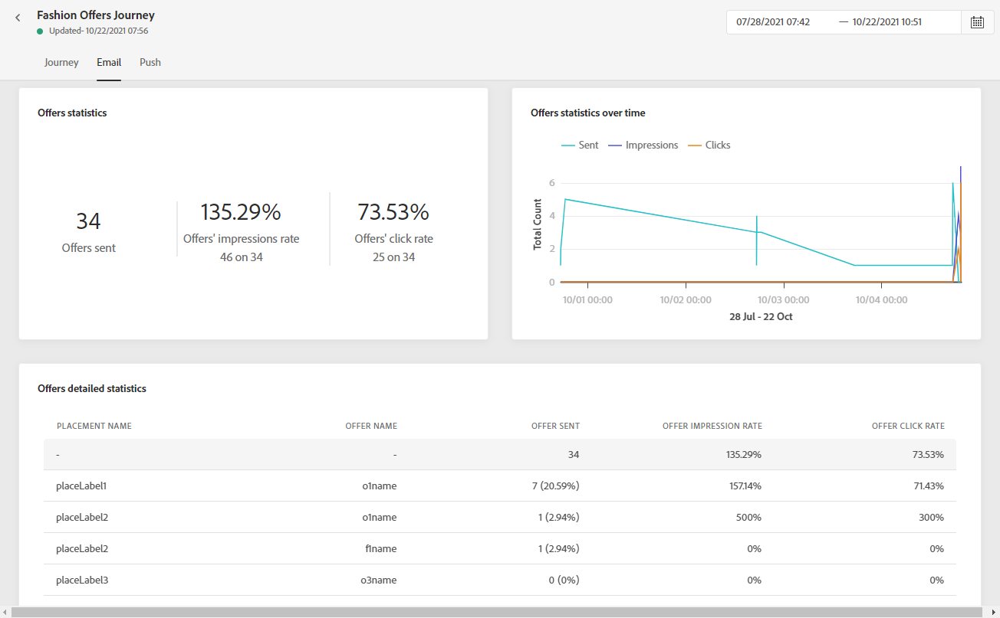
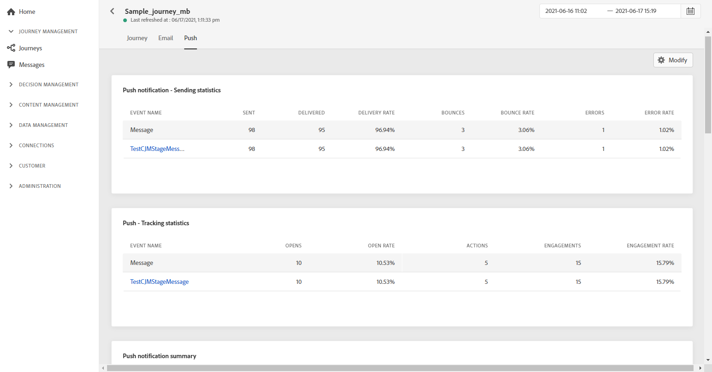
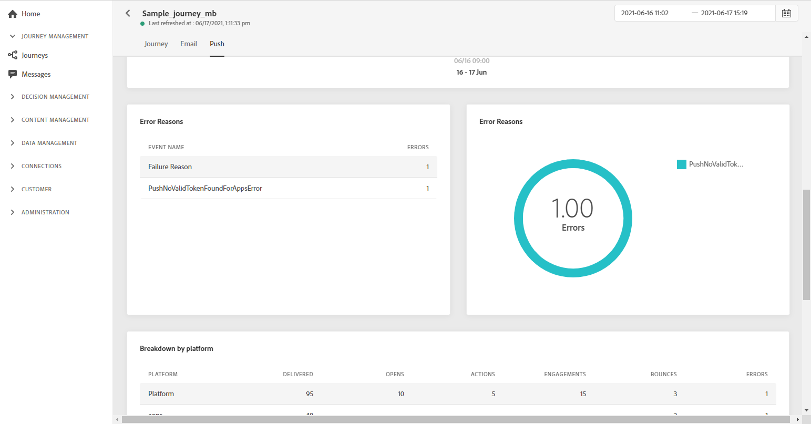
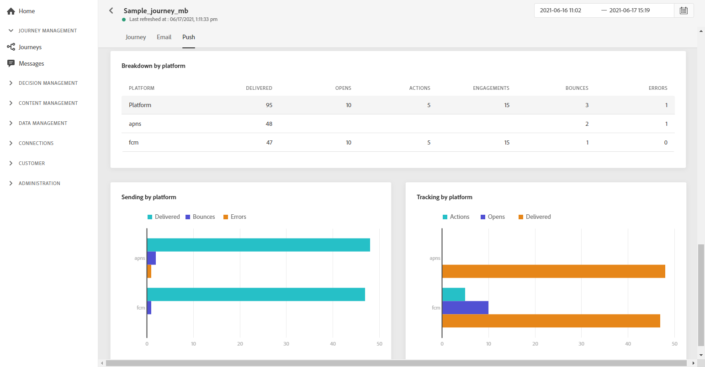

# Journey Global report {#journey-global-report}

Journey global report can be accessed directly from your journey with the **[!UICONTROL Global report]** button. 

The journey **[!UICONTROL Global report]** page will be displayed with the following tabs:

* [Journey](#journey-global)
* [Email](#email-global)
* [Push](#push-global)

The journey **[!UICONTROL Global report]** is divided into different widgets detailing your journey's success and errors. Each widget can be resized and deleted if needed. For more information on this, refer to this [section](global-report.md#modify-dashboard).

## Journey tab {#journey-global}

From your journey **[!UICONTROL Global report]**, the **[!UICONTROL Journey]** tab gives you a clear view of the most important tracking data about your journey.

The **[!UICONTROL Journey Performance]** widget allows you to see the path of your targeted profiles step-by-step through your journey.

The **[!UICONTROL Journey Statistics]** widget displays the following KPIs:

* **[!UICONTROL Entered profiles]**: Total number of individuals who reached the entry event of the journey.

* **[!UICONTROL Exited profiles]**: Total number of individuals who exited the journey.

* **[!UICONTROL Failed individual journey]**: Total number of individual journeys that were not successfully executed.

The **[!UICONTROL Events received by event]**, **[!UICONTROL Events by origin]** and **[!UICONTROL Top events]** widgets allow you to see which one of your **[!UICONTROL Events]** was successfully executed through graphs and table.

**[!UICONTROL Action Performance]**, **[!UICONTROL Action Error Reasons]** and **[!UICONTROL Top Actions]** widgets represent the most successful action and errors which occurred when your **[!UICONTROL Actions]** were triggered. 

The **[!UICONTROL Top Actions]** table contains the data available for **[!UICONTROL Actions]**, such as:

* **[!UICONTROL Actions successfully executed]**: Total number of **[!UICONTROL Actions]** successfully executed for a journey.

* **[!UICONTROL Error in action]**: Total number of errors that occurred for **[!UICONTROL Actions]**.

## Email tab {#email-global}

From your journey **[!UICONTROL Global report]**, the **[!UICONTROL Email]** tab details the main information relative to the email deliveries sent in your journey.

For a detailed report on a specific email delivery, refer to the [Email global report](#email-global-report) section.

The **[!UICONTROL Email Sending Statistics]** graph details the success of your delivery:

* **[!UICONTROL Sent]**: Total number of sends for the delivery.

* **[!UICONTROL Delivered]**: Number of messages successfully sent, in relation to the total number of sent messages.

* **[!UICONTROL Delivery Rate]**: Percentage of messages successfully sent.

* **[!UICONTROL Bounces]**: Total of errors cumulated during delivery and automatic return processing in relation to the total number of sent messages.

* **[!UICONTROL Bounce Rate]**: Percentage of emails that bounced compared to emails sent.

* **[!UICONTROL Errors]**: Total number of errors that occurred during a delivery preventing it from being sent to profiles.

* **[!UICONTROL Error Rate]**: Percentage of errors that occurred during a delivery preventing it from being sent compared to emails sent.

The **[!UICONTROL Email - Tracking statistics]** contains the available data for recipient activity for your delivery:

* **[!UICONTROL Opens]**: Number of times the delivery was opened in a delivery.

* **[!UICONTROL Unique Opens]**: Percentage of opened deliveries.

* **[!UICONTROL Open Rate]**: Total number of opened emails compared to the number of delivered emails.

* **[!UICONTROL Clicks]**: Number of times a content was clicked in an email.

* **[!UICONTROL Unique Clicks]**:Number of recipients who clicked on a content in an email.

* **[!UICONTROL Click through rate]**: Percentage of users who interacted with the journey.

* **[!UICONTROL Unsubscribe]**: Number of clicks on the unsubscription link.

* **[!UICONTROL Spam complaints]**: Number of times a message was declared as spam or junk.

The **[!UICONTROL Sending Statistics]** graph contains the data available for sent emails, such as:

* **[!UICONTROL Delivered]**: Number of messages successfully sent, in relation to the total number of sent messages.

* **[!UICONTROL Bounces]**: Total of errors cumulated during delivery and automatic return processing in relation to the total number of sent messages.

* **[!UICONTROL Errors]**: Total number of errors that occurred during a delivery preventing it from being sent to profiles.

The **[!UICONTROL Bounce Reasons]** and **[!UICONTROL Bounce categories]** widgets contain the data available related to bounced messages, such as:

* **[!UICONTROL Hard bounce]**: The total number of permanent errors, such as a wrong email address. This involves an error message that explicitly states that the address is invalid, such as Unknown user.

* **[!UICONTROL Soft bounce]**: The total number of temporary errors, such as a a full inbox.

* **[!UICONTROL Ignored]**: The total number of temporary, such as Out of office, or a technical error, for example if the sender type is postmaster.

For more information on bounces, refer to the [Suppression list](../suppression-list.md) page.

The **[!UICONTROL Email - Top Url]** graph and table details which URLs from your delivery are the most visited.

The **[!UICONTROL Email - Top recipient domain]** graph and table details which domains are the most used by recipients to open the email.

<!-->

>[!NOTE]
>
>The Offers widgets and metrics are only available if a decision was inserted in an email. For more information on Decision Management, refer to this [page](../offers/get-started/starting-offer-decisioning.md).

The **[!UICONTROL Offers statistic]** and **[!UICONTROL Offers statistics]** over time widgets measure your offer's success and impact on your targeted audience. It detail the main information relative to your message with KPIs:

* **[!UICONTROL Offer sent]**: Total number of sends for the offer.

* **[!UICONTROL Offer impression]**: Number of times the offer was opened in a delivery.

* **[!UICONTROL Offer clicks]**: Number of times an offer was clicked on in a delivery.

The **[!UICONTROL Offers detailed statistic]** table contains the available data for recipient activity with your offer:

* **[!UICONTROL Placement name]**: Name of your placement used to display your offer. For more information on placement, refer to this [page](../offers/offer-library/creating-placements.md).

* **[!UICONTROL Offer name]**: Name of the offer added in the delivery. For more information on placement, refer to this [page](../offers/offer-library/creating-personalized-offers.md).

* **[!UICONTROL Offer sent]**: Total number of sends for the offer.

* **[!UICONTROL Offer impression rate]**: Percentage of opened offers compared to the number of sent offers.

* **[!UICONTROL Offer click rate]**: Percentage of users who interacted with the offer.
-->

## Push tab {#push-global}

From your journey **[!UICONTROL Global report]**, the **[!UICONTROL Push]** tab details the main information relative to the push deliveries sent in your journey.

For a detailed report on a specific push delivery, refer to this the [Push Global report](#push-global-report).

The **[!UICONTROL Push notification - Sending statistics]** table details the main information relative to your push notifications with graph and KPIs:

* **[!UICONTROL Sent]**: Total number of sends for the delivery.

* **[!UICONTROL Delivered]**: Number of messages successfully sent, in relation to the total number of sent messages.

* **[!UICONTROL Delivery Rate]**: Percentage of messages successfully sent.

* **[!UICONTROL Bounces]**: Total of errors cumulated during delivery and automatic return processing in relation to the total number of sent messages.

* **[!UICONTROL Bounce Rate]**: Percentage of push notifications that bounced compared to push notifications sent.

* **[!UICONTROL Errors]**: Total number of errors that occurred during a delivery preventing it from being sent to profiles.

* **[!UICONTROL Error Rate]**: Percentage of errors that occurred during a delivery preventing it from being sent compared to push notifications sent.

The **[!UICONTROL Push - Tracking statistics]** contains the available data for recipient activity for your delivery:

* **[!UICONTROL Opens]**: Number of times a message was opened in a delivery.

* **[!UICONTROL Open Rate]**: Percentage of opened push notifications.

* **[!UICONTROL Actions]**: Total number of actions on the push notification delivered, e.g. button click or dismissal.

* **[!UICONTROL Engagements]**: Total number of opens and actions for this push notification, i.e. if the profile opened the push or if a button was clicked on.

* **[!UICONTROL Engagement Rate]**: Percentage of opens and actions for this push notification, i.e. if the profile opened the push or if a button was clicked on.

The **[!UICONTROL Push notification summary]** graph contains the data available for sent push notifications, such as:

* **[!UICONTROL Opens]**: Number of times a message was opened in a delivery.

* **[!UICONTROL Actions]**: Total number of actions on the push notification delivered, e.g. button click or dismissal.

* **[!UICONTROL Bounces]**: Total of errors cumulated during delivery and automatic return processing in relation to the total number of sent messages.

* **[!UICONTROL Delivered]**: Number of messages successfully sent, in relation to the total number of sent messages.

* **[!UICONTROL Errors]**: Total number of errors that occurred during a delivery preventing it from being sent to profiles.

The **[!UICONTROL Error Reasons]** graph and table allow you to see which error occurred during your delivery.

The **[!UICONTROL Tracking by platform]**, **[!UICONTROL Sending by platform]** and **[!UICONTROL Breakdown by platform]** graphs and tables details the success of your push notification depending on your recipient's operational system.
