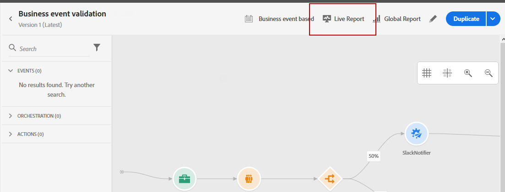
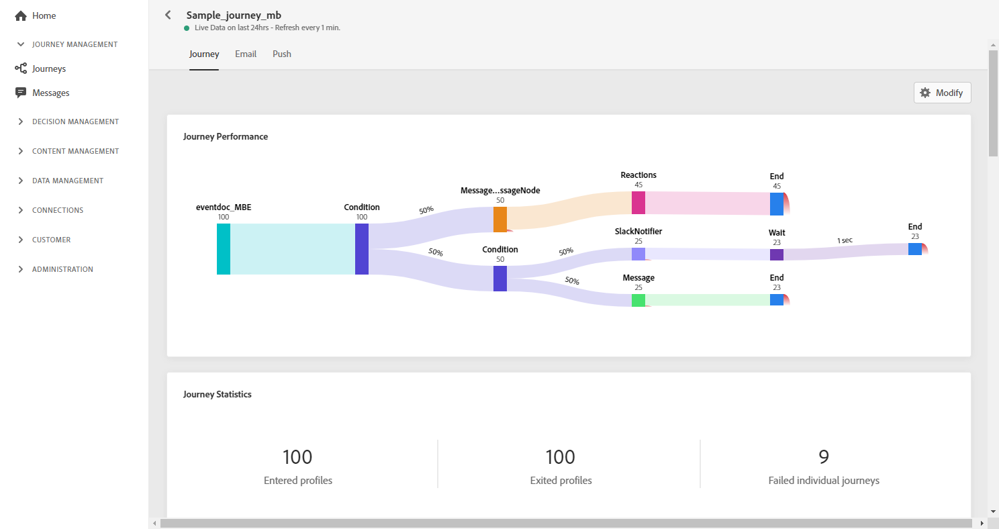
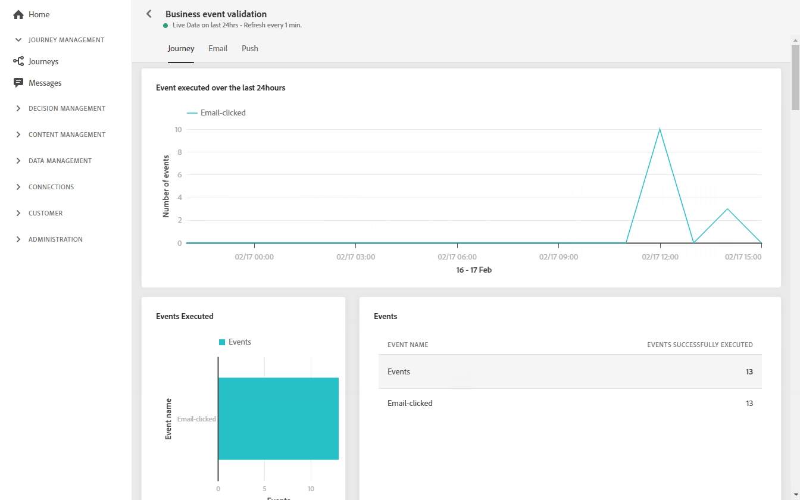
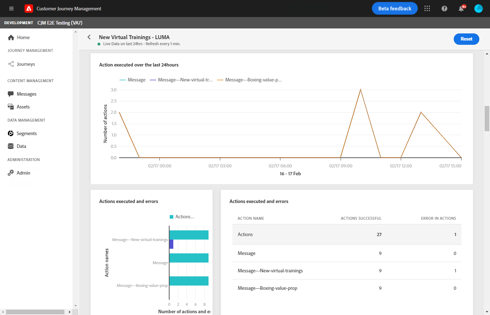
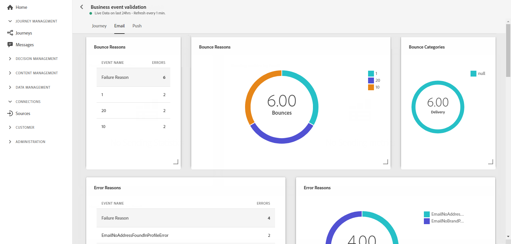
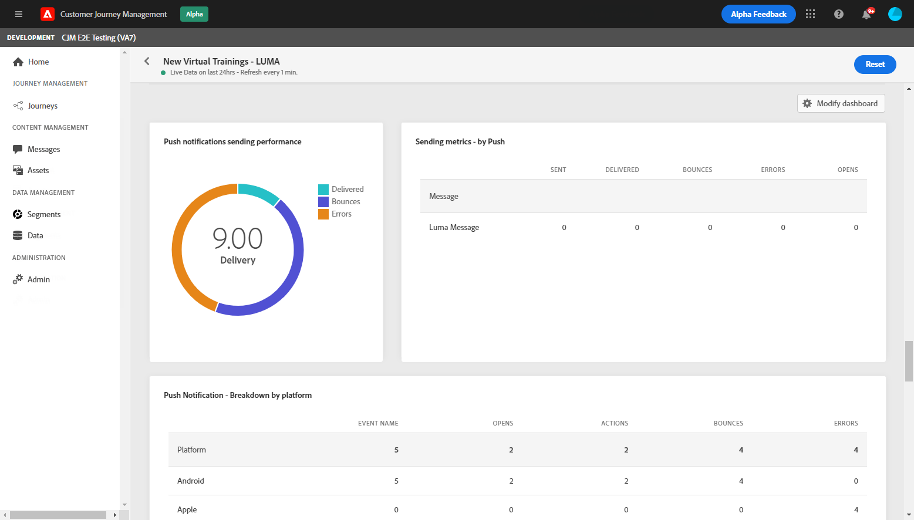
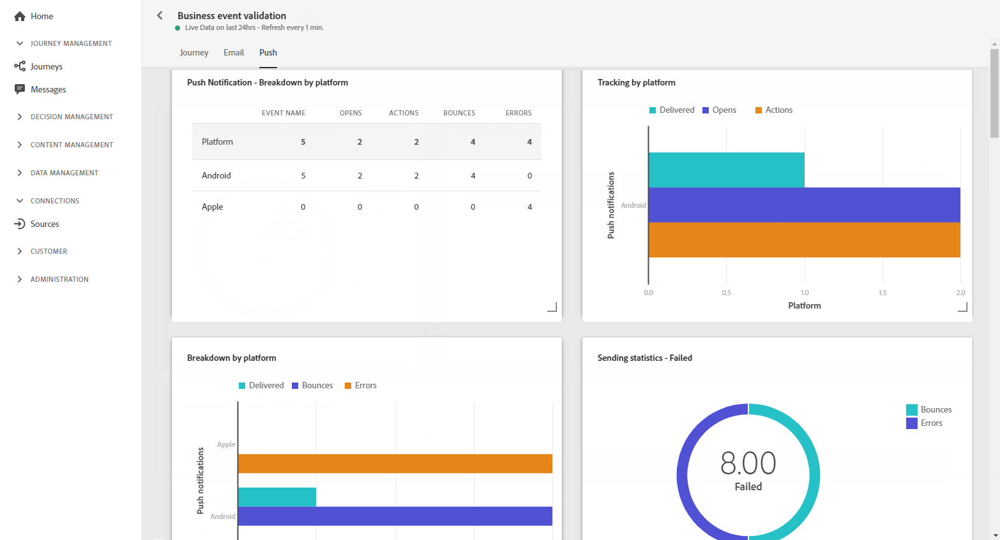

# Journey live report {#journey-live-report}

Journey live report can be accessed directly from your journey with the **[!UICONTROL Live report]** button. 

The journey **[!UICONTROL Live report]** page will be displayed with the following tabs:

* [Journey](#journey-live)
* [Email](#email-live)
* [Push](#push-live)

The journey **[!UICONTROL Live report]** is divided into different widgets detailing your journey's success and errors. Each widget can be resized and deleted if needed. For more information on this, refer to this [section](live-report.md#modify-dashboard).

## Journey tab {#journey-live}

From your journey **[!UICONTROL Live report]**, the **[!UICONTROL Journey]** tab gives you a clear view of the most important tracking data about your journey.

**[!UICONTROL Journey`s performance]** allows you to see the path of your targeted profiles step-by-step through your journey.

The **[!UICONTROL Journey`s statistics]** widget displays the following KPIs:

* **[!UICONTROL Entered profiles]**: Total number of individuals who reached the entry event of the journey.

* **[!UICONTROL Exited profiles]**: Total number of individuals who exited the journey.

* **[!UICONTROL Failed individual journey]**: Total number of individual journeys that were not successfully executed.

The **[!UICONTROL Event executed over the last 24 hours]**, **[!UICONTROL Events executed]** and **[!UICONTROL Events]** widgets allow you to see which one of your events was successfully executed through summary number, graph and table.

**[!UICONTROL Action executed over the last 24 hours]** and **[!UICONTROL Actions executed and errors]** widgets represent the most successful action and errors which occurred when your actions were triggered. The Action graph, table and summary numbers contain the data available for actions, such as:

* **[!UICONTROL Actions successfully executed]**: Total number of actions successfully executed for a journey.

* **[!UICONTROL Error in action]**: Total number of errors that occurred for actions.

## Email tab {#email-live}

From your journey **[!UICONTROL Live report]**, the **[!UICONTROL Email]** tab details the main information relative to the email deliveries sent in your journey.

For a detailed report on a specific email delivery, refer to the [Email live report](email-live-report.md) section.

The **[!UICONTROL Sending Statistics]** and **[!UICONTROL Sending metrics by Email]** widgets details the success of your delivery:

* **[!UICONTROL Delivered]**: Number of messages successfully sent, in relation to the total number of sent messages.

* **[!UICONTROL Bounces]**: Total of errors cumulated during delivery and automatic return processing in relation to the total number of sent messages.

* **[!UICONTROL Errors]**: Total number of errors that occurred during a delivery preventing it from being sent to profiles.

<!--Hard and bounce - by Email-->

The **[!UICONTROL Email summary]** graph details the main information relative to your message:

* **[!UICONTROL Sent]**: Total number of sends for the delivery.

* **[!UICONTROL Delivered]**: Number of messages successfully sent, in relation to the total number of sent messages.

* **[!UICONTROL Bounces]**: Total of errors cumulated during delivery and automatic return processing in relation to the total number of sent messages.

* **[!UICONTROL Errors]**: Total number of errors that occurred during a delivery preventing it from being sent to profiles.

* **[!UICONTROL Opens]**: Number of times a message was opened in a delivery.

* **[!UICONTROL Clicks]**: Number of times a content was clicked in a delivery.

The **[!UICONTROL Bounce Reasons]** and **[!UICONTROL Bounce categories]** widgets contain the data available related to bounced messages, such as:

* **[!UICONTROL Hard bounce]**: The total number of permanent errors, such as a wrong email address. This involves an error message that explicitly states that the address is invalid, such as Unknown user.

* **[!UICONTROL Soft bounce]**: The total number of temporary errors, such as a a full inbox.

* **[!UICONTROL Ignored]**: The total number of temporary, such as Out of office, or a technical error, for example if the sender type is postmaster.

The **[!UICONTROL Error Reasons]** graph and table allow you to see which error occurred during your delivery.

## Push tab {#push-live}

From your journey **[!UICONTROL Live report]**, the **[!UICONTROL Push]** tab details the main information relative to the push deliveries sent in your journey.

For a detailed report on a specific push delivery, refer to the [Push live report](push-live-report.md) section.

**[!UICONTROL Push notification sending performance]**, **[!UICONTROL Push notification summary]** and **[!UICONTROL Sending metrics - by Push]** widgets details the main information relative to your message:

* **[!UICONTROL Sent]**: Total number of sends for the delivery.

* **[!UICONTROL Delivered]**: Number of messages successfully sent, in relation to the total number of sent messages.

* **[!UICONTROL Bounces]**: Total of errors cumulated during delivery and automatic return processing in relation to the total number of sent messages.

* **[!UICONTROL Errors]**: Total number of errors that occurred during a delivery preventing it from being sent to profiles.

* **[!UICONTROL Opens]**: Number of times a message was opened in a delivery.

* **[!UICONTROL Actions]**: Total number of actions on the push notification delivered, e.g. button click or dismissal.

* **[!UICONTROL Engagements]**: Total number of opens and actions for this push notification, i.e. if the profile opened the push or if a button was clicked on.

The **[!UICONTROL Error Reasons]** graph and table allow you to see which error occurred during your delivery.

The **[!UICONTROL Tracking by platform]**, **[!UICONTROL Sending by platform]** and **[!UICONTROL Breakdown by platform]** graphs and tables details the success of your push notification depending on the operational system.

The **[!UICONTROL Sending statistics - Failed]** widget allows you to see how many error and bounce occurred.
