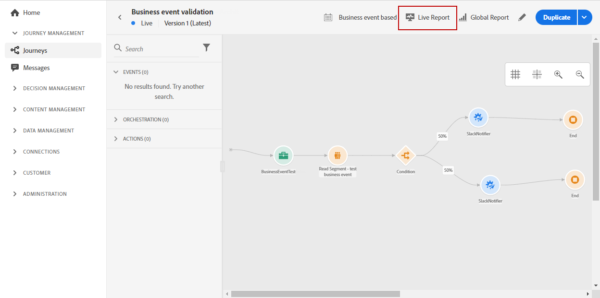
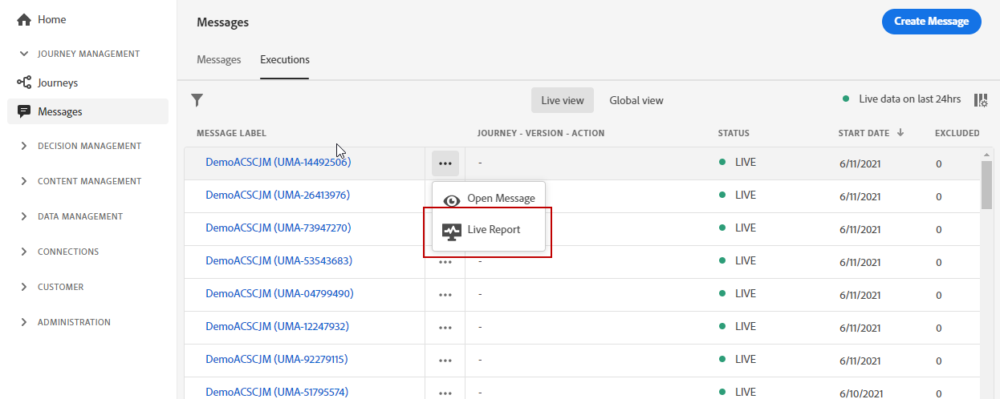
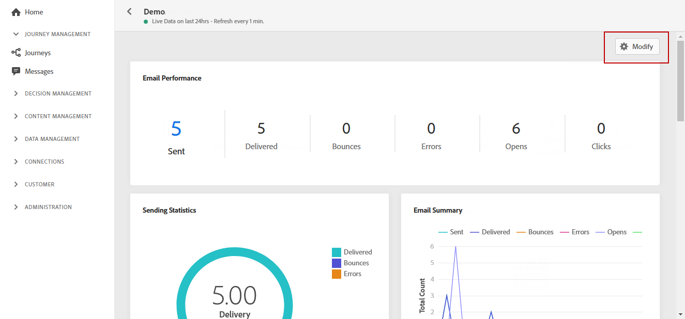
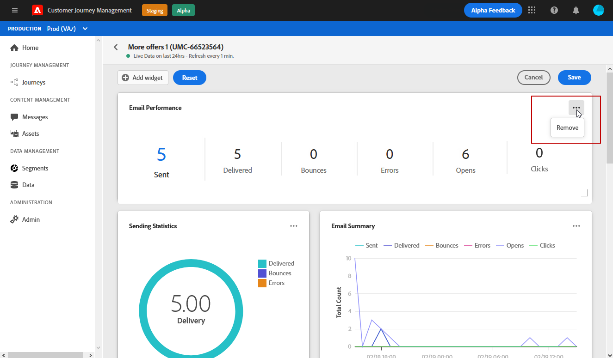

# Live Report {#live-report}

The **[!UICONTROL Live report]** allows you to measure and visualize in real-time the effectiveness of your journeys and your messages performances with a built-in dashboard.
Your deliveries' data will be available in the **[!UICONTROL Live report]** as soon as your delivery or journey is executed. 

* If you want to target a journey or deliveries in a journey, from the **[!UICONTROL Journeys]** menu, access your journey and click the **[!UICONTROL Live report]** icon. You can then find the Journey, Email and Push live reports.

    

* If you want to target a specific delivery, from the **[!UICONTROL Live view]** of the **[!UICONTROL Executions]** tab of your messages, select **[!UICONTROL Live Report]** from the advanced menu of your selected delivery.

    

## Modify dashboard {#modify-dashboard}

Each reporting dashboard can be modified by resizing or removing widgets. Changing the widgets only impacts the current user's dashboard. Other users will see their own dashboards or the ones set by default. 

1. From your live report, click **[!UICONTROL Modify]**.

    

1. Adjust the widgets size by dragging its bottom-right corner.

    

1. Click **[!UICONTROL Remove]** to remove other widgets that you don't need to track bounces.

    

1. Once you are satisfied with the display order and the size of your widgets, click **[!UICONTROL Save]**.

Your dashboard is now saved. Your different changes will be reapplied for a later use of your live reports. If needed, use the **[!UICONTROL Reset]** option to restore the default widgets and widgets' order.
