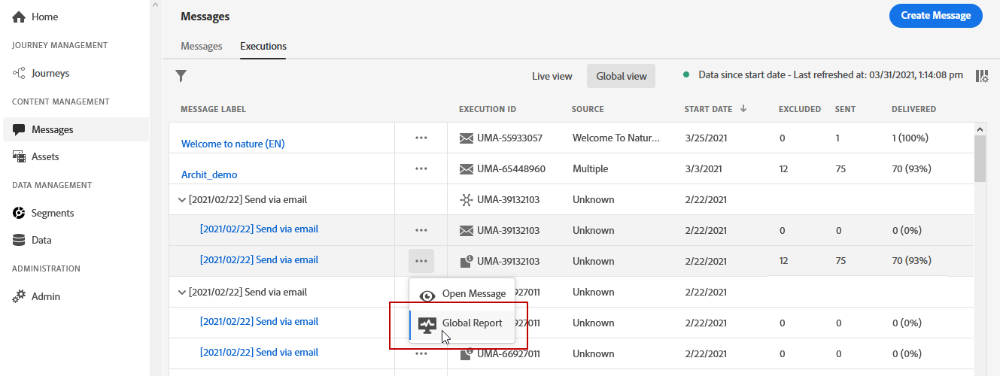
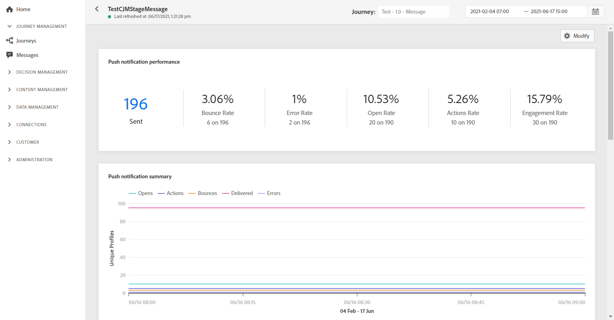
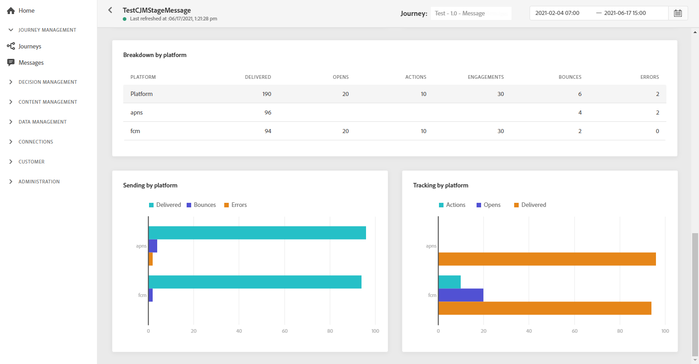

# Push Global report {#push-global-report}

The push **[!UICONTROL Global report]** only targets one specific push delivery. 

From the **[!UICONTROL Executions]** tab of the **[!UICONTROL Messages]** menu, select **[!UICONTROL Global view]** then from the advanced menu of the selected delivery select **[!UICONTROL Global report]**.

The push **[!UICONTROL Global report]** is divided into different widgets detailing your delivery's success and errors. Each widget can be resized and deleted if needed. For more information on this refer to this [section](global-report.md#modify-dashboard).

The **[!UICONTROL Push notification performance]** widget details the main information relative to your push notifications with KPIs:

* **[!UICONTROL Sent]**: Total number of sends for the delivery.

* **[!UICONTROL Bounce Rate]**: Percentage of push notifications that bounced compared to push notifications sent.

* **[!UICONTROL Error Rate]**: Percentage of errors that occurred during a delivery preventing it from being sent compared to push notifications sent.

* **[!UICONTROL Actions Rate]**: Percentage of actions on the push notification delivered, e.g. button click or dismissal.

* **[!UICONTROL Engagement Rate]**: Percentage of opens and actions for this push notification, i.e. if the profile opened the push or if a button was clicked on.

The **[!UICONTROL Push notification summary]** graph contains the data available for sent push notifications, such as:

* **[!UICONTROL Opens]**: Number of times a message was opened in a delivery.

* **[!UICONTROL Actions]**: Total number of actions on the push notification delivered, e.g. button click or dismissal.

* **[!UICONTROL Bounces]**: Total of errors cumulated during delivery and automatic return processing in relation to the total number of sent messages.

* **[!UICONTROL Delivered]**: Number of messages successfully sent, in relation to the total number of sent messages.

* **[!UICONTROL Errors]**: Total number of errors that occurred during a delivery preventing it from being sent to profiles.

The **[!UICONTROL Error Reasons]** graph and table allow you to see which error occurred during your delivery.

The **[!UICONTROL Tracking by platform]**, **[!UICONTROL Sending by platform]** and **[!UICONTROL Breakdown by platform]** graphs and tables details the success of your push notification depending on your recipient's operational system.
