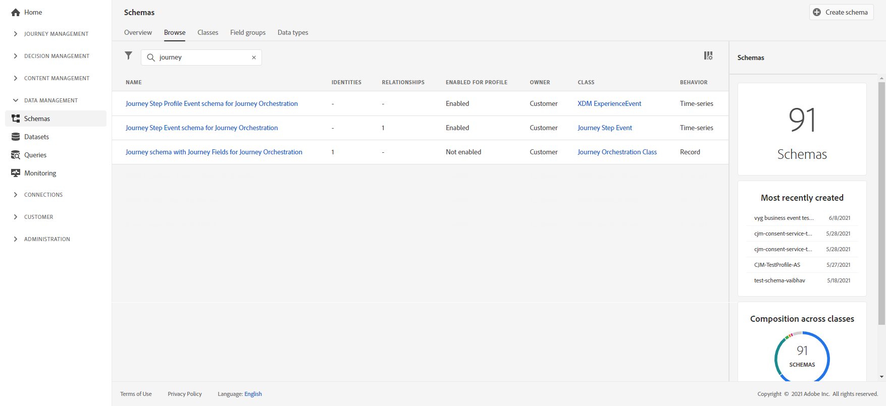
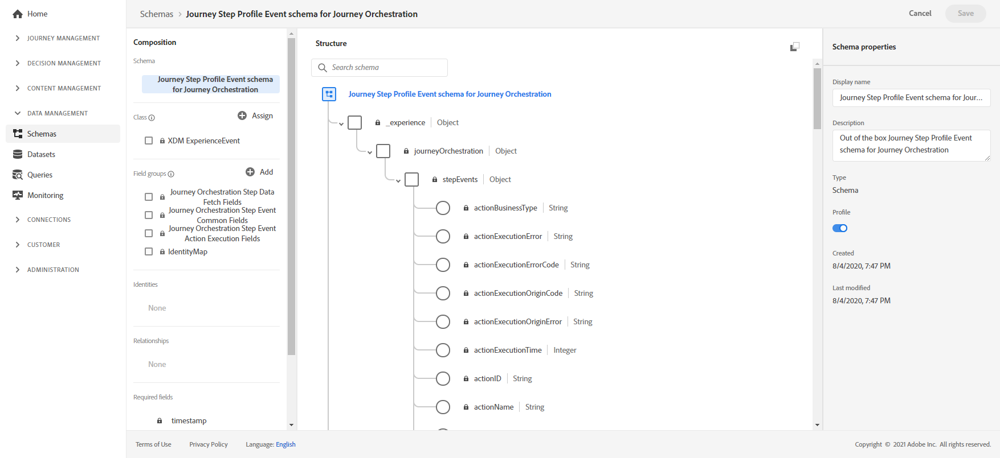
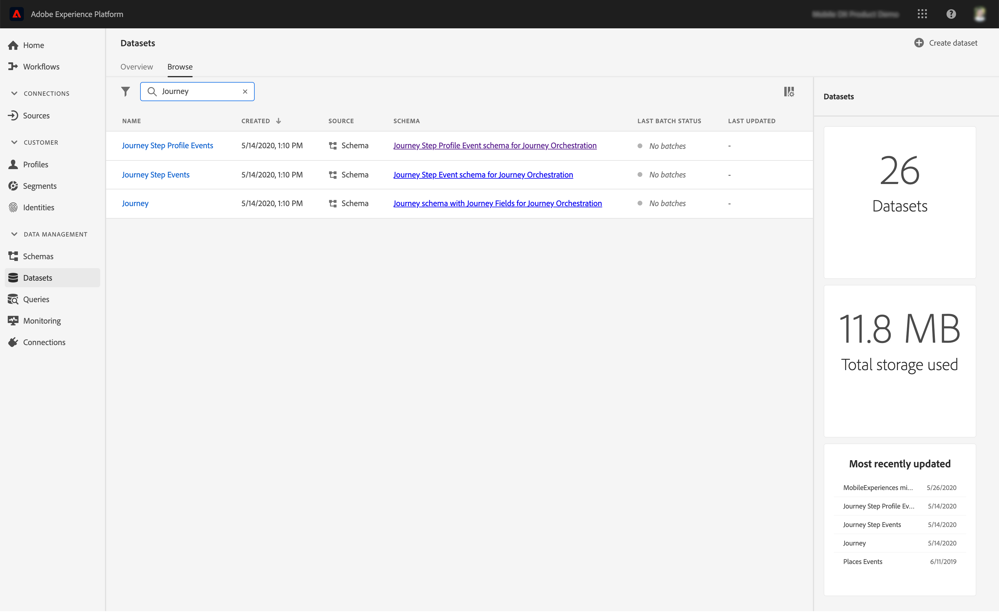

# Create journey reports{#design-jo-reports}

In addition to [real-time reports](live-report.md) and built-in [global reporting capabilities](global-report.md), [!DNL Customer Journey Management] can automatically send journey performance data to Adobe Experience Platform so it can be combined with other data for analysis purposes. 

>[!NOTE]
>
>This feature is not activated by default on all newly deployed instances. The activation is upon request.

For example, you have set up a journey that sends multiple emails. This capability allows you to combine [!DNL Customer Journey Management] data with downstream event data like how many conversions occurred, how much engagement happened on the website, or how many transactions happened in the store. The journey information can be combined with data on Adobe Experience Platform, either from other digital properties or from offline properties to give a more comprehensive view of performance.

[!DNL Customer Journey Management] automatically creates the necessary schemas and streams into datasets to Adobe Experience Platform for each step an individual takes in a journey. A step event corresponds to an individual moving from one node to another in a journey. For example, in a journey that has an event, a condition and an action, three step events are sent to Adobe Experience Platform. 

The list of XDM fields that are passed is comprehensive. Some contain system generated codes and others have human readable friendly names. Examples include the label of the journey activity or the step status: how many times an action timed out or ended in error.

>[!CAUTION]
>
>Datasets cannot not be turned on for real time profile service. Please make sure that the **[!UICONTROL Profile]** toggle is turned off.

Journeys sends data as it occurs, in a streaming way. You can query this data using the Query Service. You can connect to Customer Journey Analytics or other BI tools to view data related to these steps.

The following schemas are created:

* Journey Step Profile Event schema for [!DNL Journey Orchestration] – Experience Events for steps taken in a Journey along with an Identity Map to be used for mapping to an individual Journey Participant.
* Journey Step Event schema for [!DNL Journey Orchestration] – Journey step event that is tied to a Journey Metadata.
* Journey schema with Journey Fields for [!DNL Journey Orchestration] – Journey Metadata to describe Journeys.

The following datasets are passed:

* Journey Step Profile Event schema for [!DNL Journey Orchestration]
* Journey Step Events
* Journeys

The lists of XDM fields passed to Adobe Experience Platform are detailed here:

* [journeySteps events common fields](../reports/sharing-common-fields.md)
* [journeyStep events action execution fields](../reports/sharing-execution-fields.md)
* [journeyStep events data fetch fields](../reports/sharing-fetch-fields.md)
* [journeyStep event identity fields](../reports/sharing-identity-fields.md)
* [journey fields](../reports/sharing-journey-fields.md)

For more information on step events reporting to Adobe Experience Platform, watch this [tutorial video](https://experienceleague.adobe.com/docs/journey-orchestration-learn/tutorials/reporting-step-events-to-adobe-experience-platform.html).
