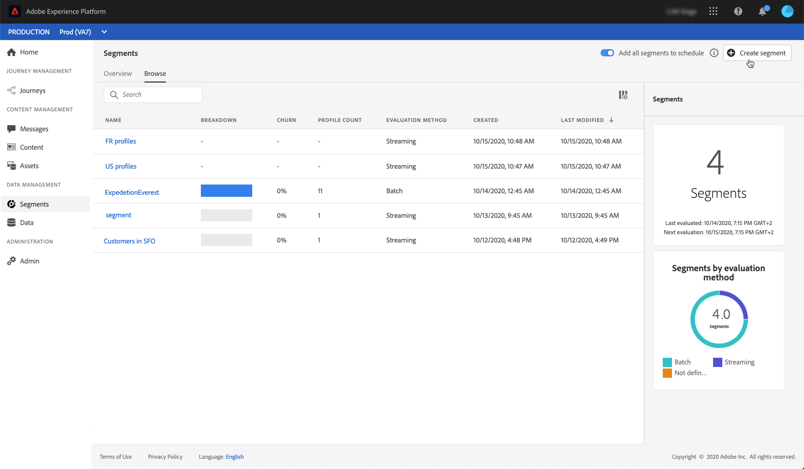
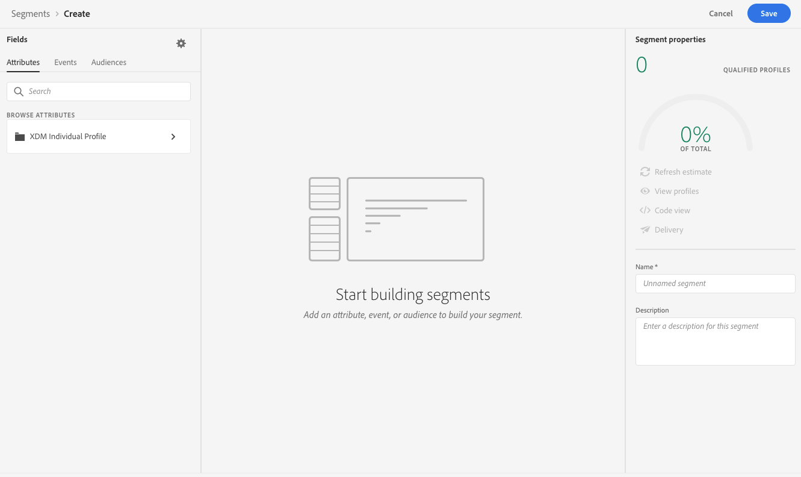
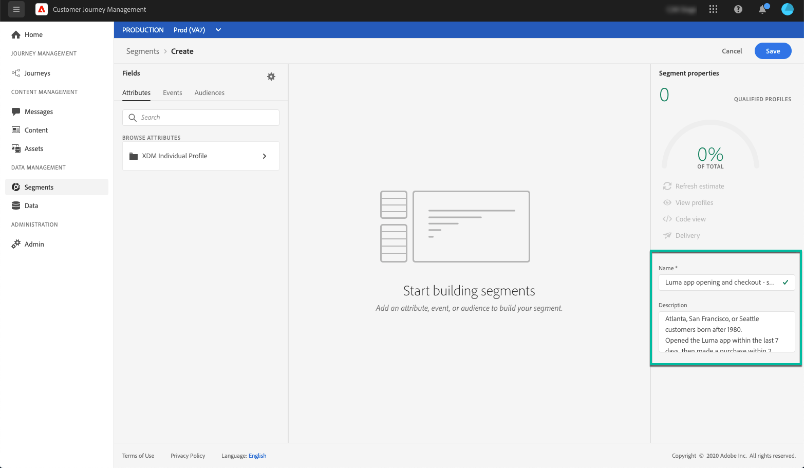
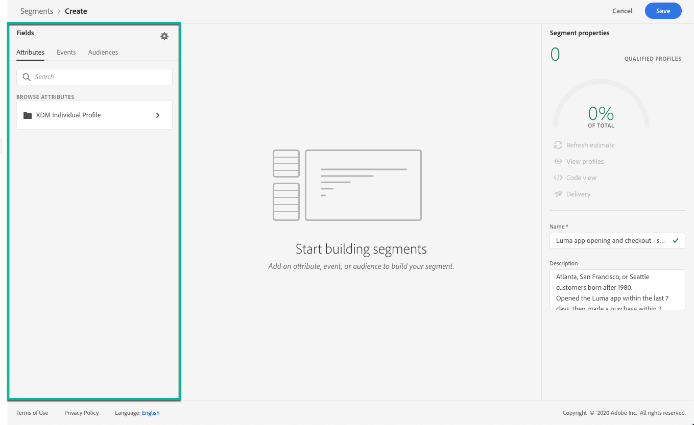
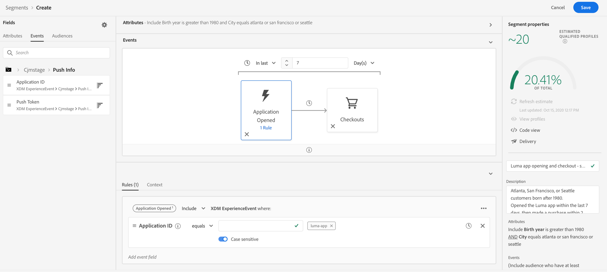
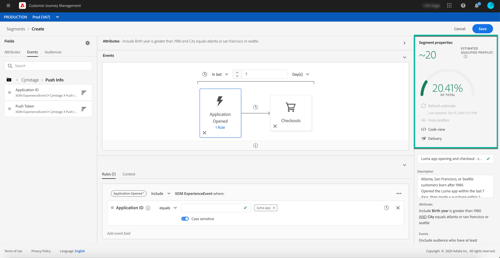

# Build segments {#build-segments}

In this example, we will build a segment to target all customers living in Atlanta, San Francisco, or Seattle and born after 1980. All these customers should have opened the Luma application within the last 7 days, then made a purchase within 2 hours after opening the application.

1. Access the **[!UICONTROL Segments]** menu, then click the **[!UICONTROL Create segment]** button.
    
    

    The segment definition screen allows you to configure all the required fields to define your segment. Learn how to configure segments in the [Segmentation Service documentation](https://experienceleague.adobe.com/docs/experience-platform/segmentation/ui/overview.html){target="_blank"}.

    

1. In the **[!UICONTROL Segment properties]** pane, provide a name and a description (optional) for the segment.

    

1. Drag and drop the desired fields from the left pane into the center workspace, then configure them according to your needs.

    >[!NOTE]
    >
    >Note that the fields available in the left pane vary depending on how the **XDM Individual Profile** and **XDM ExperienceEvent** schemas have been configured for your organization.  Learn more in the [Experience Data Model (XDM) documentation](https://experienceleague.adobe.com/docs/experience-platform/xdm/home.html){target="_blank"}.

    

    In this example, we need to rely on **Attributes** and **Events** fields to build the segment:

    * **Attributes**: profiles living in Atlanta, San Francisco or Seattle born after 1980

        
        
    * **Events**: profiles who opened the Luma application within the last 7 days, then made a purchase within 2 hours after opening the application.

        

1. As you are adding and configuring new fields in the workspace, the **[!UICONTROL Segment Properties]** pane is automatically updated with information on the estimated profiles belonging to the segment.

    

1. Once the segment is ready, click **[!UICONTROL Save]**. It displays in the list of Adobe Experience Platform segments. Note that a search bar is available to help you search a specific segment in the list.

The segment can now be used in your journeys. For more on this, refer to [this section](../segment/about-segments.md).

## Tutorial video{#create-segment-video}

>[!VIDEO](https://video.tv.adobe.com/v/334281?quality=12)
