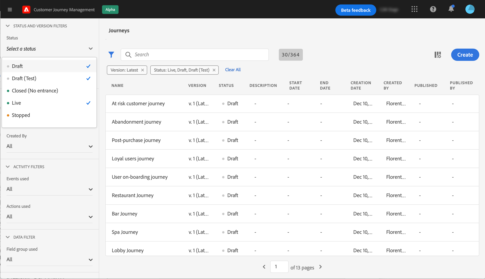

# User interface {#cjm-user-interface}

This documentation is frequently updated to reflect recent changes in the product. However, some screenshots can slightly differ from your user interface.

## Workspace {#cjm-workspace}

Once connected to [Adobe Experience Cloud](http://experience.adobe.com), browse to [!DNL Journey Optimizer].

>[!NOTE]
>
>Key concepts when browsing the user interface are detailled in [Adobe Experience Platform documentation](https://experienceleague.adobe.com/docs/experience-platform/landing/platform-ui/ui-guide.html?lang=en#adobe-experience-platform-ui-guide).

Use the links on the left to browse capabilities. 

>[!NOTE]
>
>Available capabilities may vary depending on your permissions and licence agreement.

You can find below the full list of services and capabilities available in the left navigation and links to associated documentation.

**Home**

[!DNL Journey Optimizer] home page contains key links and resources to start. The **[!UICONTROL Recents]** list provides shortcuts to the recently created or updated messages, events and journeys. This list shows their creation and modification dates and status.

**[!UICONTROL JOURNEY MANAGEMENT]**

* **[!UICONTROL Journeys]** - Create, configure and orchestrate your customer journeys. Learn more [in this section](building-journeys/journey-gs.md#jo-build)

* **[!UICONTROL Messages]** - Create, design, test and publish email and push messages. Learn more [in this section](create-message.md)
        
**[!UICONTROL DECISION MANAGEMENT]**

* **[!UICONTROL Offers]** - Access your recent sources and datasets from this menu. Use this section to create new offers. [Learn more](offers/offer-library/creating-personalized-offers.md)

* **[!UICONTROL Components]** - Create placements, rules and tags. Learn more in [this section](offers/offer-library/key-steps.md)

**[!UICONTROL CONTENT MANAGEMENT]**

* **[!UICONTROL Assets]** - [!DNL Adobe Experience Manager Assets Essentials] is a centralized repository of assets that you can use to populate your messages. Learn more in [this section](assets-essentials.md)

**[!UICONTROL DATA MANAGEMENT]**

* **[!UICONTROL Schemas]** - Use Adobe Experience Platform to create and manage Experience Data Model (XDM) schemas in an interactive visual canvas called the Schema Editor. [Learn more in this documentation](https://experienceleague.adobe.com/docs/experience-platform/xdm/tutorials/create-schema-ui.html)

* **[!UICONTROL Datasets]** - All data that is ingested into Adobe Experience Platform is persisted within the Data Lake as datasets. A dataset is a storage and management construct for a collection of data, typically a table, that contains a schema (columns) and fields (rows). [Learn how to preview and create a dataset in this documentation](https://experienceleague.adobe.com/docs/experience-platform/catalog/datasets/user-guide.html)

* **[!UICONTROL Queries]** - Use Adobe Experience Platform Query Service to write and execute queries, view previously executed queries, and access queries saved by users within your organization. [Learn more in this documentation](https://experienceleague.adobe.com/docs/experience-platform/query/ui/overview.html)

* **[!UICONTROL Monitoring]** - Use this menu to monitor your data ingestion within Adobe Experience Platform user interface. [Learn more in this documentation](https://experienceleague.adobe.com/docs/experience-platform/ingestion/quality/monitor-data-ingestion.html)

**[!UICONTROL CONNECTIONS]**

* **[!UICONTROL Sources]** - Use this menu to ingest data from a variety of sources - such as Adobe applications, cloud-based storages, databases, and more -, and structure, label and enhance incoming data. [Learn more in this documentation](https://experienceleague.adobe.com/docs/experience-platform/sources/home.html)

**[!UICONTROL CUSTOMER]**

* **[!UICONTROL Segments]** - Create and manage Experience Platform segment definitions and leverage them into your journeys. Learn more in [this page](segment/about-segments.md)

* **[!UICONTROL Profiles]** - Real-time Customer Profile creates a holistic view of each of your individual customers, combining data from multiple channels including online, offline, CRM, and third-party data. [Learn more in this documentation](https://experienceleague.adobe.com/docs/experience-platform/profile/ui/user-guide.html)

* **[!UICONTROL Identities]** - Adobe Experience Platform Identity Service manages the cross-device, cross-channel, and near real-time identification of your customers in what is known as an identity graph within Adobe Experience Platform. [Learn how to create an identity namespace in this documentation](https://experienceleague.adobe.com/docs/experience-platform/identity/namespaces.html?lang=en#manage-namespaces)

**[!UICONTROL ADMINISTRATION]**

* **[!UICONTROL Journey Administration]** - Use this menu to configure [events](event/about-events.md), [data sources](datasource/about-data-sources.md) and [actions](action/action.md) to use in your journeys.

* **[!UICONTROL Sandboxes]** - Adobe Experience Platform provides sandboxes which partition a single instance into separate virtual environments to help develop and evolve digital experience applications. [Learn more about sandboxes in this documentation](https://experienceleague.adobe.com/docs/experience-platform/sandbox/ui/user-guide.html)

## Browser and language support 

Adobe [!DNL Journey Optimizer] interface is designed to work optimally in the latest version of Google Chrome. You might have trouble using certain features on older versions or other browsers.

User interface is currently available in the following languages:

* English
* French
* German

Your default interface language is determined by the preferred language specified in your user profile.

To change your language:

* Click **Edit Preferences** from your avatar, on the top right.
* Then click **Visit Adobe Account** to access your Adobe profile.
* Select the **Notifications** tab on the top and click **Preferences**.
* Select your preferred language and click **Save**.

>[!NOTE]
>
>You need to sign out and sign in again to [!DNL Journey Optimizer] to apply changes.

## Search and filter{#section_lgm_hpz_pgb}

In the most of the lists, a search bar allows you to search for an item.

The **[!UICONTROL Filters]** can be accessed by clicking on the filter icon on the top left of the list. The filter menu allows you to filter the displayed elements according to different criteria. You can choose to display only elements of a certain type or status, the ones you created, or the ones modified in the last 30 days.

In the journey list, in addition to the **[!UICONTROL Creation filters]**, you can also filter the displayed journeys according to their status and version (**[!UICONTROL Status and version filters]**). You can choose to display only journeys which use a particular event, field group or action (**[!UICONTROL Activity filters]** and **[!UICONTROL Data filters]**). The **[!UICONTROL Publication filters]** let you select a publication date or a user. You can choose, for example, to display the latest versions of live journeys that were published yesterday. [Learn more](building-journeys/using-the-journey-designer.md).

>[!NOTE]
>
>Note that columns displayed can be personalized using the configuration button on the top right of the lists. Personalization is saved for each user.

Use the **[!UICONTROL Last update]** and **[!UICONTROL Last update by]** columns to check when happened the last update of your journeys and who saved it.

In the Event, Data source and Action configuration panes, the **[!UICONTROL Used in]** field displays the number of journeys that use that particular event, field group or action. You can click the **[!UICONTROL View journeys]** button to display the list of corresponding journeys.

In the different lists, you can perform basic actions on each element. For example, you can duplicate or delete an item.

## Browse through Adobe Experience Platform fields {#friendly-names-display}

When defining [event payload](event/about-creating.md#define-the-payload-fields), [field group payload](datasource/configure-data-sources.md#define-field-groups) and selecting fields in the [expression editor](https://experienceleague.adobe.com/docs/journeys/using/building-advanced-conditions-journeys/expressionadvanced.html), the display name is displayed in addition to the field name. This information is retrieved from the schema definition in the Experience Data Model.

If descriptors such as "xdm:alternateDisplayInfo" are provided while setting up schemas, the user-friendly names will replace display names. It is especially useful when working with “eVars” and generic fields. You can configure friendly name descriptors via an API call. For more information, see the [Schema Registry developer guide](https://experienceleague.adobe.com/docs/experience-platform/xdm/api/getting-started.html).

 

If a friendly name is available, then the field will be displayed as `<friendly-name>(<name>)`. If no friendly name is available, the display name will appear, for example `<display-name>(<name>)`. If none of them are defined, only the technical name of the field will be displayed `<name>`.

>[!NOTE]
>
>Friendly names are not retrieved when you select fields from a union of schemas.

## Accessibility{#cjm-accessibility}

Here are the different shortcuts available in the [!DNL Journey Optimizer]'s interface.

_In the list of journeys, actions, data sources or events:_

* Press **c** to create a new journey, action, data source or event.

_When configuring an activity in a journey:_

The canvas is automatically saved. You can see, on the top left of the canvas, the saving status.

* Press **escape** to close the configuration pane and discard the changes made. This is the equivalent of the **[!UICONTROL Cancel]** button.
* Press **Enter** or click outside the pane to close the configuration pane. Changes are saved. This is the equivalent of the **[!UICONTROL Ok]** button.
* If you press **Delete** or **backspace**, you can then press **Enter** to confirm the deletion.

_In pop-ups:_

* Press **escape** to close it (equivalent of the **[!UICONTROL Cancel]** button).
* Press **Enter** to save or confirm (equivalent of the **[!UICONTROL Ok]** or **[!UICONTROL Save]** button).

_In the event, data source or action configuration pane:_

* Press **escape** to close the configuration pane without saving.
* Press **Enter** to save modifications and close the configuration pane.
* Press **tab** to jump between the different fields to configure.

_In the simple expression editor_

* Double-click on a field, on the left, to add a query (equivalent to drag & drop).

_When browsing through XDM fields:_

* Checking a "node" will select all the fields of the node.

_In all text areas:_

* Use the **Ctrl/Command + A** key combination to select the text. In the payload preview, it selects the payload.

_In a screen with a search bar:_

* Use the **Ctrl/Command + F** key combination to select the search bar.

_In the canvas of a journey:_

* Use the **Ctrl/Command + A** key combination to select all activities.
* When one or several activities are selected, press **Delete** or **backspace** to delete them. Then you can press **Enter** to confirm in the confirmation pop-up.
* Double-click on an activity from the left palette to add it at the first available position (from top to bottom).

_In a journey:_

* Press **T** to enable/disable the test mode.
* In an event-based journey in test mode, press **E** to trigger an event.
* In a segment-based journey, when the **Single profile at a time** option is selected in test mode, press **P** to trigger an event.
* In test mode, press **L** to display the logs.
