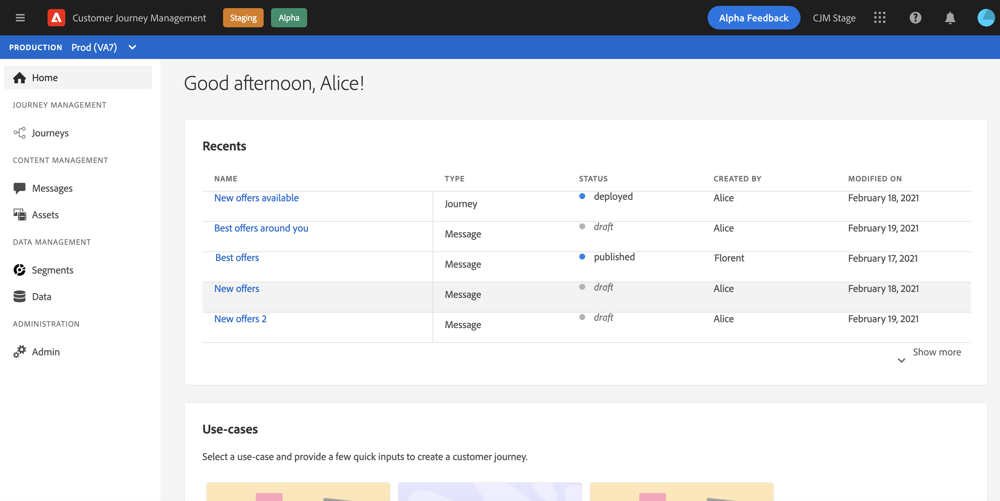
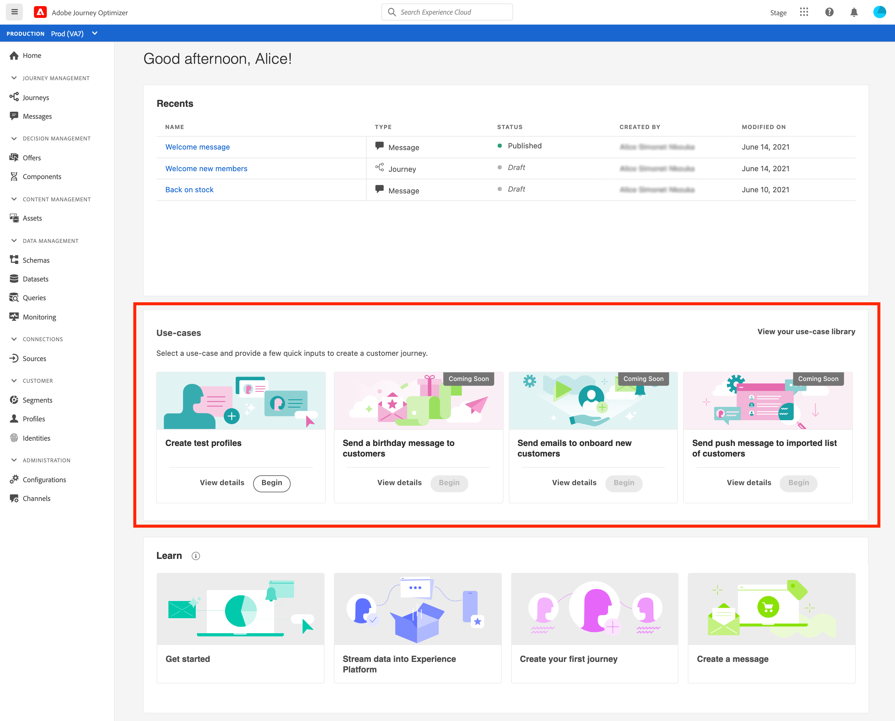
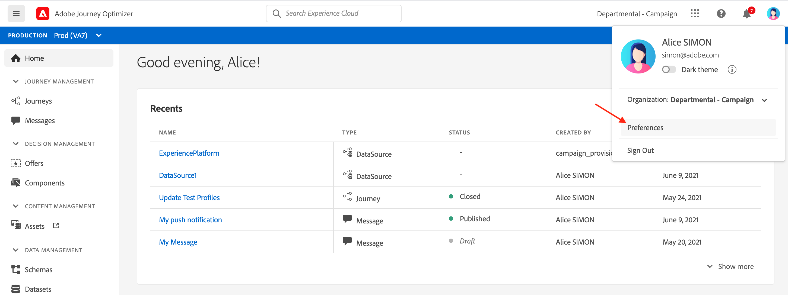
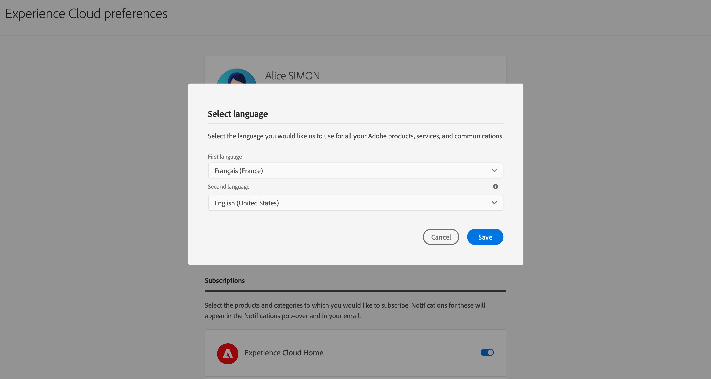
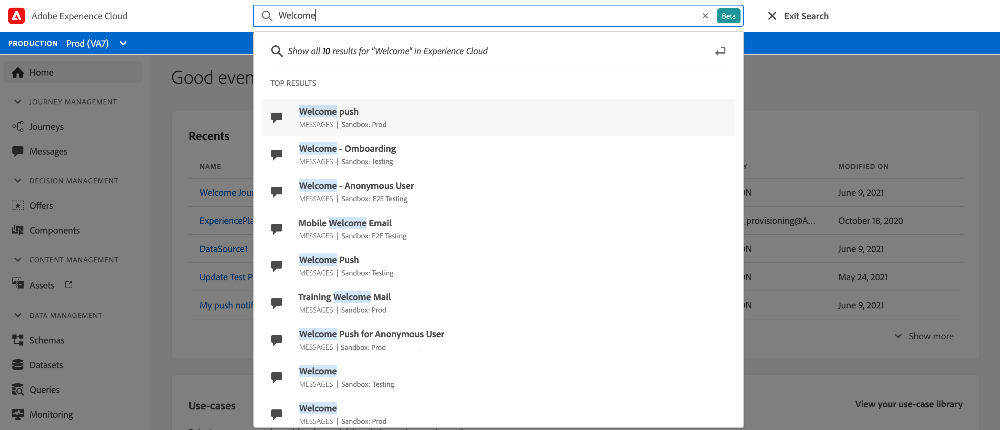
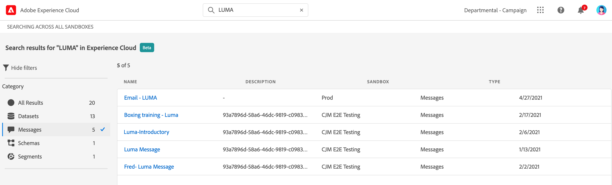
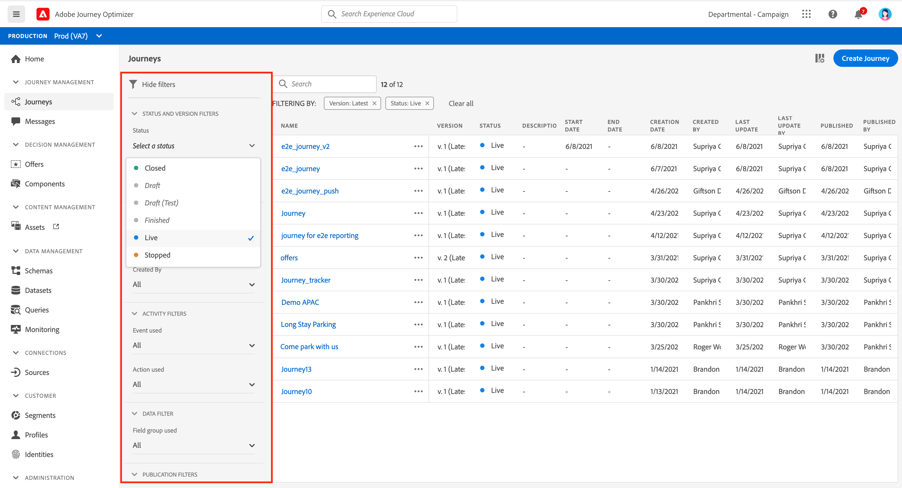
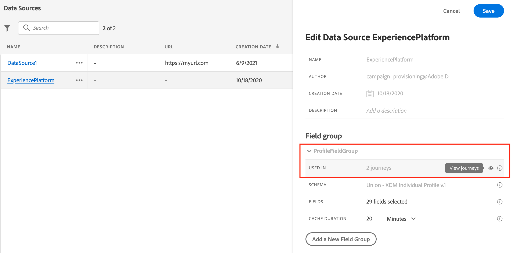
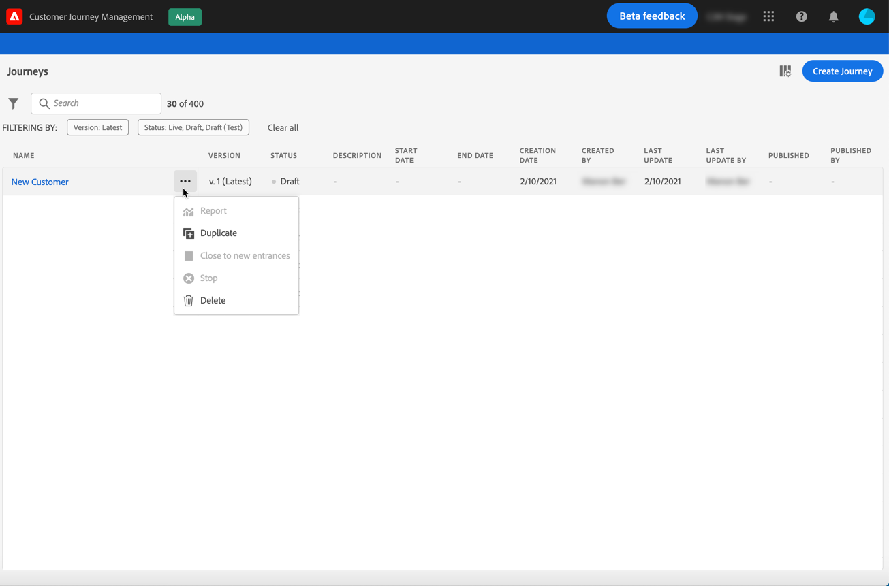

# User interface {#cjm-user-interface}

Once connected to [Adobe Experience Cloud](http://experience.adobe.com), browse to [!DNL Journey Optimizer].

>[!NOTE]
>
>* Key concepts when browsing the user interface are common with Adobe Experience Platform. Refer to [Adobe Experience Platform documentation](https://experienceleague.adobe.com/docs/experience-platform/landing/platform-ui/ui-guide.html?lang=en#adobe-experience-platform-ui-guide){target="_blank"} for more details.
>
>* This documentation is frequently updated to reflect latest changes in the product user interface. However, some screenshots can slightly differ from your user interface.
>
> * Components and capabilities available in the UI depend on your permissions and on your licencing package. For any question, reach out to your Adobe Customer Success Manager.

## Left navigation

Use the links on the left to browse capabilities. 

>[!NOTE]
>
>Available capabilities may vary depending on your permissions and licence agreement.

You can find below the full list of services and capabilities available in the left navigation and links to associated documentation.

**Home**

[!DNL Journey Optimizer] home page contains key links and resources to start. The **[!UICONTROL Recents]** list provides shortcuts to the recently created or updated messages, events and journeys. This list shows their creation and modification dates and status.

**[!UICONTROL JOURNEY MANAGEMENT]**

* **[!UICONTROL Journeys]** - Create, configure and orchestrate your customer journeys. Learn more [in this section](building-journeys/journey-gs.md#jo-build)

* **[!UICONTROL Messages]** - Create, design, test and publish email and push messages. Learn more [in this section](create-message.md)
        
**[!UICONTROL DECISION MANAGEMENT]**

* **[!UICONTROL Offers]** - Access your recent sources and datasets from this menu. Use this section to create new offers. [Learn more](offers/offer-library/creating-personalized-offers.md)

* **[!UICONTROL Components]** - Create placements, rules and tags. Learn more in [this section](offers/offer-library/key-steps.md)

**[!UICONTROL CONTENT MANAGEMENT]**

* **[!UICONTROL Assets]** - [!DNL Adobe Experience Manager Assets Essentials] is a centralized repository of assets that you can use to populate your messages. Learn more in [this section](assets-essentials.md)

**[!UICONTROL DATA MANAGEMENT]**

* **[!UICONTROL Schemas]** - Use Adobe Experience Platform to create and manage Experience Data Model (XDM) schemas in an interactive visual canvas called the Schema Editor. [Learn more in this documentation](https://experienceleague.adobe.com/docs/experience-platform/xdm/tutorials/create-schema-ui.html){target="_blank"}

* **[!UICONTROL Datasets]** - All data that is ingested into Adobe Experience Platform is persisted within the Data Lake as datasets. A dataset is a storage and management construct for a collection of data, typically a table, that contains a schema (columns) and fields (rows). [Learn how to preview and create a dataset in this documentation](https://experienceleague.adobe.com/docs/experience-platform/catalog/datasets/user-guide.html){target="_blank"}

* **[!UICONTROL Queries]** - Use Adobe Experience Platform Query Service to write and execute queries, view previously executed queries, and access queries saved by users within your organization. [Learn more in this documentation](https://experienceleague.adobe.com/docs/experience-platform/query/ui/overview.html){target="_blank"}

* **[!UICONTROL Monitoring]** - Use this menu to monitor your data ingestion within Adobe Experience Platform user interface. [Learn more in this documentation](https://experienceleague.adobe.com/docs/experience-platform/ingestion/quality/monitor-data-ingestion.html){target="_blank"}

**[!UICONTROL CONNECTIONS]**

* **[!UICONTROL Sources]** - Use this menu to ingest data from a variety of sources - such as Adobe applications, cloud-based storages, databases, and more -, and structure, label and enhance incoming data. [Learn more in this documentation](https://experienceleague.adobe.com/docs/experience-platform/sources/home.html){target="_blank"}

**[!UICONTROL CUSTOMER]**

* **[!UICONTROL Segments]** - Create and manage Experience Platform segment definitions and leverage them into your journeys. Learn more in [this page](segment/about-segments.md)

* **[!UICONTROL Profiles]** - Real-time Customer Profile creates a holistic view of each of your individual customers, combining data from multiple channels including online, offline, CRM, and third-party data. [Learn more in this documentation](https://experienceleague.adobe.com/docs/experience-platform/profile/ui/user-guide.html){target="_blank"}

* **[!UICONTROL Identities]** - Adobe Experience Platform Identity Service manages the cross-device, cross-channel, and near real-time identification of your customers in what is known as an identity graph within Adobe Experience Platform. [Learn how to create an identity namespace in this documentation](https://experienceleague.adobe.com/docs/experience-platform/identity/namespaces.html?lang=en#manage-namespaces){target="_blank"}

**[!UICONTROL ADMINISTRATION]**

* **[!UICONTROL Journey Administration]** - Use this menu to configure [events](event/about-events.md), [data sources](datasource/about-data-sources.md) and [actions](action/action.md) to use in your journeys.

* **[!UICONTROL Sandboxes]** - Adobe Experience Platform provides sandboxes which partition a single instance into separate virtual environments to help develop and evolve digital experience applications. [Learn more about sandboxes in this documentation](https://experienceleague.adobe.com/docs/experience-platform/sandbox/ui/user-guide.html){target="_blank"}

## In-product use cases

Leverage [!DNL Adobe Journey Optimizer] use cases from the Home page, and provide a few quick inputs to create a customer journey.

Available use cases are:

* **Create test profiles**, to create test profiles using our CSV template to test personalized messages and journeys. Learn how to implement this use case [in this page](building-journeys/creating-test-profiles.md#use-case-1).
* **Send a birthday message to customers**, to automatically send an email to wish your customers around their birthday. (coming soon)
* **Send emails to onboard new customers**, to easily send up to two emails to welcome your newly registered customers. (coming soon)
* **Send push messages to imported list of customers**, to quickly send a push notification to a list of customers imported from a CSV file. (coming soon)

Click **[!UICONTROL View details]** to learn more about each use case.

Click the **[!UICONTROL Begin]** button to start the use case.

You can access executed use cases from the **[!UICONTROL View use case library]** button.

## Find help and support

Access Adobe Journey Optimizer key help pages from the lower section of the home page.

Use the **Help** icon to access help pages, contact support and share feedback. You can search help articles and videos from the search field.

## Supported browsers

Adobe [!DNL Journey Optimizer] interface is designed to work optimally in the latest version of Google Chrome. You might have trouble using certain features on older versions or other browsers.

## Language preferences

User interface is currently available in the following languages:

* English
* French
* German

Your default interface language is determined by the preferred language specified in your user profile.

To change your language:

* Click **Preferences** from your avatar, on the top right.
    
* Then click the language displayed under your email address
* Select your preferred language and click **Save**. You can select a second language in case the component you are using is not localized in your forst language.
    

## Search

Anywhere from Adobe Journey Optimizer interface, use the Adobe Experience Cloud search on the center of the top bar to find assets, journeys or messages across your sandboxes. Start entering content to display top results.

Press **Enter** to access all results and filter. 

## Filter lists{#section_lgm_hpz_pgb}

In most of the lists, a search bar allows you to search for a specific item and select filtering criteria.

Filters can be accessed by clicking on the filter icon on the top left of the list. The filter menu allows you to filter the displayed elements according to different criteria. You can choose to display only elements of a certain type or status, the ones you created, or the ones modified in the last 30 days. Options differ depending on the context.

In the list of journeys, you can filter journeys according to their status, type and version from the **[!UICONTROL Status and version filters]**. The type can be: **[!UICONTROL Unitary event]**, **[!UICONTROL Segment qualification]**, **[!UICONTROL Read segment]**, **[!UICONTROL Business event]** or **[!UICONTROL Burst]**. You can choose to display only journeys which use a specific event, field group or action from the **[!UICONTROL Activity filters]** and **[!UICONTROL Data filters]**. The **[!UICONTROL Publication filters]** let you select a publication date or a user. You can choose, for example, to display the latest versions of live journeys that were published yesterday. [Learn more](building-journeys/using-the-journey-designer.md).

>[!NOTE]
>
>Note that columns displayed can be personalized using the configuration button on the top right of the lists. Personalization is saved for each user.

Use the **[!UICONTROL Last update]** and **[!UICONTROL Last update by]** columns to check when happened the last update of your journeys and who saved it.

In the Event, Data source and Action configuration panes, the **[!UICONTROL Used in]** field displays the number of journeys that use that particular event, field group or action. You can click the **[!UICONTROL View journeys]** button to display the list of corresponding journeys.

In the different lists, you can perform basic actions on each element. For example, you can duplicate or delete an item.

